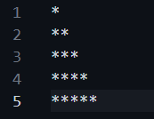
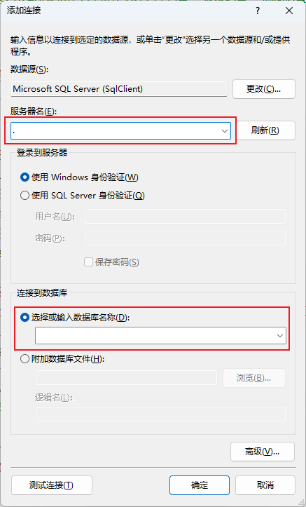
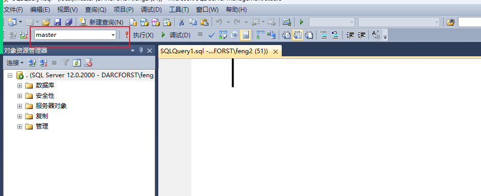

# 上课笔记

## 1. MarkDown文档

**这个文档是程序员要求必会的内容**

### 1.1 MarkDown 语法

#### 1.1.1 标题语法

这个语法与之前接触过的html语言类似，都是有6级，其中1级标题字体最大，6级标题字体最小

标题的语法： #空格 标题内容，我们想写几级标题就写几个#

例如： 我们现在想要写一个五级标题 \##### 标题内容 

效果如下：


#### 1.1.2 文本设定

##### 1.1.2.1 文本倾斜

语法：\*要斜体的文字* 

例如：\*斜体文字*,具体效果如下：


##### 1.1.2.2 文字加粗

语法：\**要加粗的文字**

这种内容我们是用于强调

例如：\**这个内容要进行加粗处理**,效果如下：


##### 1.1.2.3 文字即加粗又倾斜

语法：\*\*\*要加粗和倾斜的文字***

例如：\*\*\*加粗和倾斜***,效果如下


**我们上面语法书写的时候使用了一个'\\',这个符号叫做编译符，作用是把原来带有功能的符号或者内容，变成正常的文本，进行显示**

##### 1.1.2.4 文字上标功能

这个功能主要是让我们给某个词语进行注释。

语法：\[^上标文本]

例如： 乔布斯\[^1],效果如下：


##### 1.1.2.5 脚注

这个功能一般会与上面的上标功能连用，用于给上标设定提示信息的

语法：\[^上标的标识]：脚注的内容

例如：

乔布斯\[^1]

\[^1]:苹果公司的创始人

效果如下：


当中鼠标悬停在上标的时候，提示我们在脚注当中写入的文本信息，效果如下：


#### 1.1.3 超链接

用于我们在文档中，可以通过Ctrl+鼠标点击跳转到对应的网址

语法：\[要进行显示的文本](要进行跳转到的网址)

例如：我们现在想要跳转到CSDN

\[全国最大的程序员聚集地--CSDN](https://www.csdn.net)

实现效果如下：


#### 1.1.4 插入图片

语法：\!\[我们对图片的起名](图片的路径)

路径：

(1) 绝对路径: 带有盘符的，这种路径就是绝对路径，他会指明当前文件所在的固定位置

(2) 相对路径: 不带有盘符，并且书写的习惯是根据当前文档虽在位置进行对比的路径

我们现在插入的图片默认都是居中的


#### 1.1.5 表格

语法：

\|列名1|列名2|...|列名n|

我们一般不推荐这么写，有点累，我们一般是通过鼠标右键选择插入，之后选择表格

#### 1.1.6 代码块

语法: \```空格输入我要进行编辑的语言名称,语言名称指的是java,C#,python

例如: 我们现在想要在这个地方插入一个可以书写java代码的代码

\``` java,输入之后效果如下:

``` java
public static void main(String[] args){
    
}
```

#### 1.1.7 备注块

语法: > 备注内容

效果如下:

> 这个是一个备注块


## 2. Java基础

1. 背单词 

| 序号 | 单词         | 读音             | 翻译                       |
| ---- | ------------ | ---------------- | -------------------------- |
| 1    | public       | pa bu li ke      | 公开的                     |
| 2    | static       | si tai ti ke     | 静态的                     |
| 3    | void         | wo ao yi de      | 无返回值的                 |
| 4    | main         | man              | 主要的                     |
| 5    | string       | si jun           | 字符串                     |
| 6    | args         | a ge si          | 参数                       |
| 7    | system       | sei si te mu     | 系统                       |
| 8    | out          | ao te            | 外面                       |
| 9    | print        | pu run te        | 打印                       |
| 10   | int          | yin te           | 整型，整数                 |
| 11   | float        | fu lao te        | 漂浮，单精度浮点型         |
| 12   | double       | da bao           | 双倍，双精度浮点型         |
| 13   | char         | cha              | 字符                       |
| 14   | class        | ke la si         | 班级，类                   |
| 15   | scanner      | si gan ner       | 扫码仪                     |
| 16   | input        | yin pu te        | 输入                       |
| 17   | boolean      | bu len           | 布尔值，这个指的是真或者假 |
| 18   | switch       | si wi chi        | 开关                       |
| 19   | case         | kei si           | 案例                       |
| 20   | break        | bu rui ke        | 打断                       |
| 21   | random       | ran de mu        | 随机                       |
| 22   | if           | yi f             | 如果                       |
| 23   | else         | ai ao si         | 否则,其他                  |
| 24.  | while        | wai ao           | 虽然,在...期间             |
| 25.  | do           | du               | 做...                      |
| 26.  | for          | fao              | 为....                     |
| 27.  | length       | len si           | 长度                       |
| 28.  | array        | er rui           | 数组                       |
| 29.  | sort         | shao te          | 分类,整理                  |
| 30.  | continue     | kang ti niu      | 继续                       |
| 31.  | object       | ao bo zhai ke te | 对象                       |
| 32.  | method       | mai ser de       | 方法                       |
| 33.  | set          | sai te           | 设置                       |
| 34.  | get          | gai te           | 得到                       |
| 35.  | return       | rui ten          | 返回                       |
| 36.  | upper        | a per            | 大写                       |
| 36.  | lower        | lou wer          | 小写                       |
| 37.  | index        | yin dai ke si    | 索引                       |
| 38.  | last         | la si te         | 最后                       |
| 39.  | substring    | sa bo si jun     | 截取字符串                 |
| 40.  | split        | si bai li t      | 拆分                       |
| 41.  | trim         | chui mo          | 修剪                       |
| 42.  | replace      | ri pu lei si     | 替换                       |
| 43.  | stringbuffer | si jun ba fer    | 字符串增强                 |
| 44.  | append       | e pan de         | 追加                       |

2. 准备开始背语法了

``` java
public static void main(String[] args){
    //这个是主方法，是程序的入口
}
```

``` java
System.out.print(要打印的内容); //这个是Java当中的输出语句，可以实现我们后面代码往控制台(cmd)输出内容
```

``` java
Scanner input = new Scanner(System.in); //这个是在程序内容创建一个新的扫描仪对象，这个扫描仪对象的作用是允许我们往控制台(cmd)输入内容
```

``` java
switch(要进行对比的值){   //这个是用于判断的,判断某个值与下面case后的值是否相等
    case 值1:
        代码块
        break; 
    case 值2:
        代码块
        break; 
    ...        
}
```

``` java
if(判断条件){ // 这个也是用于判断的,判断小括号当中的条件是否成立,里面的条件可以是1 > 2
    代码块
}
else{
    代码块
}
```

``` java
public class java源文件名字{ //这个代表的是java文件当中的代码存在形式
    public static void main(String[] args){
        代码块
    }
}
```


### 1. Java环境搭建

jdk --> 这个就是Java运行环境

现在所有的语言都是发布二种版本内容:

1. 短期支持版,一般只支持1~2 , 这个是做某些语法测试的
2. 长期稳定版,一般支持3~4年 ,这个是针对于企业的,让我们书写的项目更加稳定,短期支持版的语法也会更新到下一个长期支持版当中

例如: 微软公司 每年更新一次,长期支持版和短期测试版是交替更新的

**JDK java的运行环境,主要起到能让我们的当前电脑运行Java代码指令**

**配置电脑的环境变量**

让我们自己的电脑可以运行Java内容

(1) 安装JDK

我们需要点击jdk安装包,之后选择安装路径:例如: D:/Java/jdk1.8

其中java文件夹是用于标明当前文件夹下的所有内容都是java配置信息

jdk1.8 文件夹指定的是我们安装的jdk软件是java8这个版本内容

安装到一半的时候会提示让我们再去安装个jre,这个是java运行时,这个内容也需要我们安装到上面的java文件夹下,并且我们需要给他创建一个新的文件夹,文件夹名jre

(2) 我们需要配置系统环境变量

计算机 鼠标右键选择属性 -->选择高级系统设置 ---> 选择里面的环境变量   

最终我们会打开如下的效果


我们要紧操作的是系统变量当中的内容

1. 找到变量名是Path的选项,之后鼠标双击,我们进行设定变量值,需要把我们安装的jdk的这个安装目录下bin文件夹的路径添加,Path变量的值当中

2. 选择系统变量下面的新建,我们去新建一个变量,变量名为JAVA_HOME,变量值为JDK的安装路径


### 2. 书写Java源文件

#### 2.2.1 什么是java源文件

以.java为扩展名的文件,我们管它叫做java源文件,这个java源文件就是让我们程序员进行输入写java代码的文件

> java源文件的命名规则
>
> (1) 不能是中文
>
> (2) 不能书写特殊符号,除了_
>
> (3) 不能是纯数字,也不能以让数字为开头
>
> (4) 要求起名时,首字母必须大写

> 例如我们以后考试题: 以下哪些文件名命名形式不正确( AB )
>
> ​                                     A. sAge    B. 23Jack   C. Jack123  D. Watch

>  以后出去工作的时候,公司的要求是名字都要有含义,必须是英语单词,如果我们说不出来这个单词,去找翻译网站或者翻译软件

> 我们在电脑该如果查看当前文件的扩展名,该如何设定显示出这个文件的扩展名
>
> Win 7 系统设定:
>
> (1) windows键+ e 打开资源管理器
>
> (2) 点击上面文件,选择其中查看
>
> (3) 选择显示/隐藏已知文件的扩展名
>
> Win10 系统设定:
>
> (1) windows键+ e 打开资源管理器
>
> (2) 在上面找到查看选项卡,把里面的扩展名选中即可
>
> Win11系统设定:
>
> (1) windows键+ e 打开资源管理器
>
> (2) 选择查看 
>
> (3) 选择显示,选中里面的文件扩展名

#### 2.2.2 源文件当中的代码

当我们创建完java源文件之后,我们鼠标右键,选择打开方式,选择记事本,通过这种形式打开源文件

``` java
public class java源文件的名称{
    public static void main(String[] args){
        
    }
}
```

Java代码书写规范:

(1) Java对单词的大小写特别敏感

(2) 花括号的写法也有讲究,开始的花括号要求必须在那一行代码的最后,结束的花括号要求独占一行

(3) 花括号当中的代码要求与花括号开始那行的代码相比要进行缩进处理,缩进的标准是每次缩进都是4个空格位

> 每次按下tab键默认都是4个空格位  ---> 这种说法不对,因为tab按下之后,空出位置不一定是4个空格位,它需要根据软件的设定来进行识别, 在记事本里面一个tab键等于6个空格位


命名规则是有2种

(1) 驼峰命名法: 是Java代码内部起名的一种方式,它要求整个名字首个字母要求小写,之后每个相连接的单词的首字母大写

  例如: firstName

(2) Pascal(帕斯卡)命名法: 要求整个名字的首字母大写,之后每个相连接的单词首字母也大些

  例如: FirstName

Java 的注释: 注释就是对某段代码或者某个内容进行解释的一种写法

Java当中包含3种注释:

(1) 单行注释: 用于注释掉符号后面的内容,让其变成说明文本,编译的时候不会进行编译,符号是://

``` java
public static void main(String[] args){
    aa//这个就是注释内容
}
```

单行注释的作用:对某一行的代码进行注解

(2) 多行注释:这个是让我们可以注释掉一段内容,主要用于注释掉某些代码块,用测试其他的代码功能

``` java
public static void main(String[] args){
    /* -->这个是多行注释的开头内容
    	这个就是多行注释,
    这个是多行注释的结尾  --> */
    
}
```

(3) 文档注释: 用于声明当前Java文件所属问题的注释

``` java

/** -->这个是注释开始
	开发者:xxx
	开发时间:xxxx年xx月xx日
	当前类的描述:xxxxxxxxxx
注释结尾 --> */
public class java文件名{
    
    
}

```

#### 2.2.3 Ide工具

什么是Ide工具?

ide一般指的是带有调试功能的编程工具,例如: idea , MyEclipse , Visual Studio

**新版本的idea是不支持32位系统,并且要求jdk版本必须jdk16以上**

idea工具是有2个版本的

idea 企业版   --> 功能比较全,但是收费

idea 社区版  --> 免费的,但是只有基础功能

我们需要知道的快捷键

ctrl+shift+F10  运行

第一次运行软件界面如下:


我们点击Create New Project,去创建一个新的项目,之后会打开下面的界面


我们要求红框当中的内容必须选择成我们电脑安装的jdk,如果下拉列表没有,我们需要去点击后面的new按钮去选择jdk的安装路径.例如我的电脑 D:\Software\Java\jdk1.8,我们点击完new按钮,界面如下:


当我们创建完项目,项目结构如下:


我们以后所写的代码都需要存放到src文件夹当中,这个文件夹是用于存放Java源文件的

我们创建java源文件的步骤

(1) 选中Src文件夹,鼠标右键,选择new,去选择里面Package


当我们选择完Package,会让我们创建包,


包的起名要求:

(1) 只能是小写英文字母,数字和小数点组成

(2) 数字不能开头

(3) 小数点不能开头,结尾

(4) 不能是关键字

例如: lession01

(2) 我们选择自己新建的包(文件夹),鼠标右键,选择New,选择Java Class


点击之后会打开一个新的界面


类的命名:

(1) 只能是英文字母,数字,下划线,$组成

(2) 数字不能为开头

(3) 要求开头的英文字母与之后每个相连单词的首字母必须大写

(4) 不能是关键字

### 3. 变量

#### 3.1 什么是变量

变量就是我们用于存储临时数据的载体,变量会把我们存储的内容保存到内存当中

#### 3.2 常用数据类型

我们一般会根据值的特性来进行分类

(1) 数值类型 :   整数 --> 整型(int),  小数 --> 双精度浮点型(代表精度较高的小数)(double) , 单精度浮点型(float)

(2) 非数值类型 : 单个字符(要求值的两侧必须带有单引号) --> 字符 (char),

​                            一串字符(要求值的两侧必须带有双引号) --> 字符串(String)

​							用于书写真和假的    --> 布尔类型(boolean)

> double 与 float值的区别:
>
> double的值就是正常的小数,但是float的值要求在正常小数的后面需要带有一个f
>
> 3.14  --> double
>
> 3.14f --> float

> 布尔类型的值只有两个 真true 或者是 假false 

#### 3.3 变量的使用

变量的使用分为2种形式:

(1) 先声明,后赋值

(2) 再声明的同时直接赋值

**声明: 这个就代表我们要创建一个变量,创建变量的过程就是在 内容当中开辟出一个空间,让我们后面存入数据**

例如: 创建一个变量用于存储年龄

(1) 明确我们要存入的值是 int类型

(2) 我们需要给这个变量起个名字:

变量的命名规则:

(1) 只能是 英文字母,数字,下划线和$组成

(2) 数字不能开头

(3) 不能是关键字

(4) 需要遵守 驼峰命名法

> 驼峰命名法: 要求整个内容的首字母小写,之后每个相连单词的首字母大写
>
> firstName

**我们采用先声明,后赋值的方式创建变量**

语法如下:

``` java
数据类型 变量名; //这个代表的是声明变量
变量名 = 值; //这个是给这个变量进行存值
```

案例的代码如下:

``` java
int nianling; //这个代表我们创建了一个整数的变量,变量名是nianling
nianling = 15; //这个是给nianling变量存入15这个值
```

第二种使用方式:

``` java
数据类型 变量名 = 值;
```

案例代码:

``` java
int nianling = 15;
```

##### 运算符

赋值运算符

| 符号 | 含义                             |
| ---- | -------------------------------- |
| =    | 把符号右侧的内容赋值给左侧的变量 |

算数运算符

| 符号    | 含义                     |
| ------- | ------------------------ |
| +       | 计算两个值相加之后的结果 |
| -       | 计算两个值相减后的结果   |
| *       |                          |
| /       | 取整                     |
| %       | 取余                     |
| ++ / -- | 让自己本身+1             |

关系运算符

| 符号 | 含义     |
| ---- | -------- |
| >    | 大于     |
| <    | 小于     |
| ==   | 等于     |
| !=   | 不等于   |
| >=   | 大于等于 |
| <=   | 小于等于 |

逻辑运算符

| 符号 | 含义                                                         |
| ---- | ------------------------------------------------------------ |
| &&   | 并且,要求符号两边的表达式的结果必须都是真的才能是真          |
| \|\| | 或者，要求符号两边的表达式结果只要有一个是真的，那么最终结果就是真 |
| !    | 非，取原有结果的相反值                                       |

这个运算符只能存在与结果为布尔类型的表达式当中

**逻辑运算符要求符号两边的表达式结果必须是真或者假**

**代码当中不允许声明两个名字相同的变量，否则会报错**

一个表格当中查找年龄在18岁以上，性别是男的

``` java
int nianling = 16;
int xingbie = '男';

boolean jg = nianling > 18 &&  xingbie == '男';
```

```java
 System.out.println(a +"+"+ b+ "="+ c);
 System.out.printf("%d+%d=%d",a,b,c);
//如果我们想要输出灵活改变值的效果，
//我们需要拼接字符串
//printf 这个方法是java继承自c语言一个语法
//主要是帮助我们来做字符串拼接，使用的是占位符写法
/*
* int   --->   %d
* String -->   %s
* char   -->   %c
* float  -->   %f
* */
```

##### 输入语句

主要作用就是从控制台输入一个内容，并且能够把这内容存入对应的数据类型的变量当中

使用步骤：

(1) 导包，需要写在类的上面 import java.util.Scanner;

(2) 创建扫描仪

``` java
Scanner 扫描仪名称 = new Scanner(System.in);
```

(3) 在每次我们要输入内容的时候，最好使用输出语句进行提示，输入语句在控制台当中是没有任何效果的

(4) 根据我们要进行存储变量的数据类型来确定，我们输入语句怎么写

``` java
String s = input.next();
int a = input.nextInt();
double b = input.nextDouble();
float c = input.nextFloat();
char d = input.next().charAt(0);
boolean e = input.nextBoolean();
```

> 字符串用于判断两个值相等的方式：
>
> 我们需要使用的是equals方法，语法如下：
>
> 字符串变量名.equals(要进行对比的值);
>
> ``` java
> String a = "admin123";
> String b = "admin";
> boolean result = a.equals(b); //这个地方就是用于判断a是否与b相等，不相等得到的值是false,相等是true
> ```
>
> 字符串当中使用 == 判断相等的时候，判断的内容是内存地址而不是里面存储的值，equals判断的是字符串的值相等。


##### 随机数

###### (1) Math的方法

语法:

``` java
Math.random()
```

这个随机的是0 ~ 1 之间任意长的小数,如果我们要求随机的是 0 ~ 99 之间的整数,我们需要把这个小数先扩大100倍,之后把它**强制转换**成整数

> 强制转换的方式,在我们要转换的值前面加上(要转换的类型)

``` java
(int)(Math.random()*100) //这个就是随机 0 ~ 99
```

###### (2) Random的方法

这种写法与Scanner的用法类似,并不是我们当前java当中可以直接写的,需要额外的引入

(1) 导入随机数的包

``` java
import java.util.Random;
```

(2) 创建一个随机数的对象

``` java
Random 自己起一个变量名 = new Random();
```

(3) 用我们自己起的随机数变量,来生成一个随机数,并且需要我们来输入范围

``` java
int 变量名 = 自己起的变量名.nextInt(最小值,最大值);
```

我们把生成的随机数存入到前面的变量当中


> 如果我们现在想要把一个int类型的变量转换为小数double并且存储到另一个变量当中,我们该如何实现
>
> 按照我们刚才讲的: 
>
> ``` java
> int a = 5 ;
> double b = (double)a; //这个是按照我们刚才的逻辑想的,但是我们一般不会这么写,因为小数本身就包含整数,所以我们需要额外的记一下
> // double 转 int 需要用强制转换的,但是 int 转double 不需要
> double c = a;
> ```

> 我们现在思考一下:  变量的变字体现在哪里
>
> 变量当中的值可以让我们随意更改

##### 常量

再声明的时候,存入值之后再也不允许更改的内容

``` java
final 数据类型 变量名 = 值; //这个是我们声明常量的语法 final是常量的修饰符
```

例如: 我们要声明 数学当中π 

``` java
final double pi = 3.14;
```


### 4. 选择结构

#### 4.1 if选择结构

if选择结构主要的作用是用于判断的,根据我们书写的表达式来判断是否满足条件

##### 4.1.1 基础if选择结构

语法: 

``` java
if(要做判断的表达式){
    代码块
}else{
    代码块
}
```

上面的就是基础if的语法,代码执行的顺序是如果我们写的表达式结果为真,那么我们去执行if后面花括号当中的代码,如果我们写的表达式结果为假,则执行else后面花括号里面的代码内容

> 代码块:指的就是我们平常写的代码内容,例如声明变量,输出语句,输入语句等等

案例1: 让我们输入性别,之后根据输入的内容进行输出,如果输入的是男,则输出你是一个男孩,如果是女,则输出你是一个女孩

``` java
package lession03;
import java.util.Scanner;
public class Demo01 {

    public static void main(String[] args){
        Scanner input = new Scanner(System.in);
        System.out.println("请输入一个性别");
        char c = input.next().charAt(0);

       if(c == '男'){ //判断我们输入的内容是否是男,
           System.out.println("你是一个男孩");
       }else{
           System.out.println("你是一个女孩");
       }
    }
}
```

案例2: 要求我们输入一个账号,输入一个密码,之后判断账号是否与admin相等,同时密码是否与admin123相等,如果都相等则输出登入成功,否则输出账号或者密码错误

``` java
package lession03;
import java.util.Scanner;
public class Demo02 {
    public static void main(String[] args){
        Scanner input = new Scanner(System.in);
        System.out.println("请输入一个账号");
        String zh = input.next();
        System.out.println("请输入一个密码");
        String mm = input.next();
        
        if(zh.equals("admin") &&  mm.equals("admin123")){
            System.out.println("登入成功!");
        }else{
            System.out.println("账号或者密码错误,请重新登入");
        }
    }
}
```

案例3: 要求我们输入一个数字,之后判断这个数字是否为偶数,如果是偶数,则输出该数字是偶数,否则输出该数字为奇数

``` java
package lession03;
import java.util.Scanner;
public class Demo03 {
    public static void main(String[] args){
        //偶数: 能够被2整除的数字都是偶数
        Scanner input = new Scanner(System.in);
        System.out.println("请输入一个数字");
        int a = input.nextInt();
        //下面我们开始进行判读奇偶数
        if(a % 2 == 0){ //如果我们输入的数字能够被2整除,这个数字就是偶数
            System.out.println("我们输入的数字是一个偶数");
        }else{
            System.out.println("我们输入的数字是一个奇数");
        }
    }
}

```

基础if选择结构的特点: 只能做简单的判断,就是结果只能是真或者假的内容,不能判断条件较为复杂或者条件分支较多的情况

##### 4.1.2 多重选择结构

这种判断是用于判断多种分支条件,或者说结果有多种情况的内容

例如:  100 ~ 90 奖励 iphone 14   89 ~ 80 奖励 iphone 13  79 ~ 70 奖励 华为p40  69 - 60 奖励小米13  59 ~ 0 奖励 大逼斗

语法:

``` java
if(判断条件){  // 如果...
    代码块
}else if(判断条件2){ //否则 如果...
    代码块
}else if(判断条件3){
    代码块
}
...
else{
    代码块
}    
```

案例: 要求输入一个月份,判断这个月份所处的季节

3,4,5 春季

6,7,8 夏季

9,10,11 秋季

12,1,2 冬季

```java
import java.util.Scanner;
public class Demo{
    public static void main(String[] args){
        Scanner input = new Scanner(System.in);
        System.out.println("请输入一个月份1 ~ 12");
        int m = input.nextInt();
        if(m == 3 || m == 4 || m == 5){
            System.out.println("春季");
        }else if(m >= 6 && m <= 8){
            System.out.println("夏季");
        }else if(m >= 9 && m <= 11){
            System.out.println("秋季");
        }else if(m == 12 || m == 1 || m == 2){//(m >= 1 && m <= 2)
            System.out.println("冬季");
        }else{
            System.out.println("输入错误!");
        }
    }
}


```

提高: 输入3个整数分别存入a,b,c变量当中,判断这个三个数字之间的关系,最后以"x > x >x"进行输入

``` java
package lession03;
import java.util.Scanner;
public class Demo02 {
    public static void main(String[] args){
        Scanner input = new Scanner(System.in);
        System.out.println("请输入第一个数字");
        int a = input.nextInt();
        System.out.println("请输入第二个数字");
        int b = input.nextInt();
        System.out.println("请输入第三个数字");
        int c = input.nextInt();

        //下面开始判断三个数字之间的关系   ---> 这么写逻辑有点绕,不推荐
        if(a > b && b > c){ //a > b > c
            System.out.println(a +">"+b+">"+c);
        }else if(a > c && c > b){ // a > c > b
            System.out.println(a +">"+c+">"+b);
        }else if(b > a && a > c){ // b > a > c
            System.out.println(b +">"+a+">"+c);
        }else if(b > c && c > a){ // b > c > a
            System.out.println(b +">"+c+">"+a);
        }else if(c > a && a > b){ //c > a > b
            System.out.println(c +">"+a+">"+b);
        }else if(c > b && b >a){ // c > b > a
            System.out.println(c +">"+b+">"+a);
        }
    }
}
```

另外的一种写法: -- if嵌套,

**if嵌套: 指在一个if语句当中书写另一个if语句**

``` java
if(判断条件1){
    if(判断条件2){
        代码块
    }
}
```

``` java
package lession03;
import java.util.Scanner;

public class Demo03 {
    public static void main(String[] args){
        Scanner input = new Scanner(System.in);
        System.out.println("请输入第一个数字");
        int a = input.nextInt();
        System.out.println("请输入第二个数字");
        int b = input.nextInt();
        System.out.println("请输入第三个数字");
        int c = input.nextInt();

        //下面开始if嵌套
        if(a > b && a > c){//1.先书写a最大的情况
            //这个里面输入写a最大的两种情况
            if(b > c){
                System.out.println(a+">"+b+">"+c);
            }else if(c > b){
                System.out.println(a+">"+c+">"+b);
            }
        }else if(b > a && b > c){ //2. b最大的情况
            if(a > c){
                System.out.println(b+">"+a+">"+c);
            }else if(c > a){
                System.out.println(b+">"+c+">"+a);
            }

        }else if(c > a && c > b){ //3. C最大的情况
            if(a > b){
                System.out.println(c+">"+a+">"+b);
            }else if(b > a){
                System.out.println(c+">"+b+">"+a);
            }
        }
    }
}
```

>  案例: 要求: 输入性别,身高(cm),体重(kg),之后根据我们输入的值来给出意见
> 标准体重(男,kg) = 身高 - 105
> 标准体重(女,kg) = 身高 - 100
>
> 标准提示 是标准体重,请保持
> 胖了提示 胖了,请减肥
> 瘦了提示 瘦了,请注意营养

``` java
package lession03;
import java.util.Scanner;
public class Demo04 {

    public static void main(String[] args){
        Scanner input = new Scanner(System.in);
        System.out.println("请输入性别");
        char c = input.next().charAt(0);
        System.out.println("请输入身高");
        double sg = input.nextDouble();
        System.out.println("请输入体重");
        double tz = input.nextDouble();
        //通过if语句判断性别
        if(c == '男'){
            double bz = sg - 105;
            if(tz == bz){ //如果我们的体重 等于 标准体重
                System.out.println("是标准体重,请保持");
            }else if(tz > bz){ //否则自己的体重大于了 标准体重
                System.out.println("胖了,请减肥");
            }else{ //否则 自己的体重小于了标准体重
                System.out.println("瘦了,请注意营养");
            }

        }else if(c == '女'){
            double bz = sg - 100;
        }
        //当我们变量在声明的时候是在]花括号当中的时候,这个变量只能在这个换括号当中找到,出了这对花括号是找不到
        //上面这种变量我们叫做局部变量
    }
}
```

#### 4.2 switch选择结构

用于等值判断

``` java
switch(要判断的变量){
    case 要与上面变量进行对比的值:
        代码块
        break; 
    case 要与上面变量进行对比的值:
        代码块
        break;
    ...
    default:
        代码块
        break;    
}
```

switch语法需要注意的:

(1) case当中判断的值不能相同

(2) case下面的break是可以不写的,如果不写,代码会一直运行到switch代码结束,或者碰到下个break关键字为止

(3) default可以写在最上面也可以写在最后面,如果是写在最上面的时候,一定要带有break,写到下面的时候可以省略,default也是可以省略的与if语句当中的else一样

**(4) switch语句只能判断 int , char , String  (只在我们所学过的数据类型)**

> 如果我们电脑使用的jdk是1.7版本以下的,那么switch语句不能判断String类型的变量

案例: 根据成绩判断学员的评分,优秀,良好,中等,及格,不及格

``` java
package bdqn; //这个用于声明当前类文件所在的文件夹,这条语句必须是整个类文件首行
import java.util.Scanner; //导入扫描仪
public class Demo{
    public static void main(String[] args){
        Scanner input = new Scanner(System.in); //创建扫描仪
        System.out.print("请输入成绩");
        int score = input.nextInt();
        if(score < 0 || score > 100){
            System.out.println("输入错误");
        }else{
            //下面我们需要判断我们输入的成绩属于哪个范畴
            int a = score / 10;
            switch(a){
                case 10:
                case 9:
                    System.out.println("优秀");
                    break;
                case 8:
                    System.out.println("良好");
                    break;
                case 7:
                    System.out.println("中等");
                    break;
                case 6:
                    System.out.println("及格");
                    break;
                default:
                    System.out.println("不及格");
            }
        
        }
    }
}
```

#### 4.3 三元表达式(额外的)

这个书上应该是没有,但是S1考试的时候会考,这个是让我们做简单判断,结果只是真和假的

语法:

``` java
数据类型 变量名 = 表达式 ? 值1 : 值2;
```

使用要求:

(1) 表达式的结果必须是真或者假

(2) ? 代表true  , : 代表false

(3) 值1,值2的数据类型必须与前面变量的数据类型一致

例如: 判断变量a是否大于变量b,如果大于输出a>b 否则输出a<= b

``` java
public static void main(String[] args){
    int a = 5;
    int b = 3;
    String jg = a > b ? "a > b" : "a <= b";
    System.out.print(jg);
}
```


### 5.  循环结构

1. 现在要求打印1 ~ 100 之间的所有数字

``` java
public static void main(String[] args){
    System.out.println(1);
    System.out.println(2);
    System.out.println(3);
    System.out.println(4);
    ....
    System.out.println(100);    
}
```

上面的内容太累了,代码太多了,所以编程当中为了解决这种做重复工作的内容,有一个新的语法,这个语法名字:循环

#### 1. while循环

语法:

``` java
while(循环条件){
    要进行循环代码
}
```

循环条件要求必须是真或者假的结果的表达式

循环语法使用的步骤:

(1) 设定一个循环的起始量

``` java
int num = 1;
```

(2) 书写循环语法,设定循环条件

``` java
while(num <= 100){
    System.out.println(num);
}
```

(3) 设定循环变量的增长情况

``` java
while(num <= 100){
    System.out.println(num);
    num++; //每次循环执行到这个位置的时候,都要让num的值增加1,之后去判断增加之后的值是否还小于等于100
}          //如果还是小于等于的,我们继续循环,如果不满足了,则退出循环  
```

> 案例: 打印出 100 ~ 500 之间所有的 7的倍数或者数字当中包含7的    ----->  敲7
>
> ``` java
> package lession05;
> 
> public class Demo02 {
>     public static void main(String[] args){
>         int a = 100; //这个是设定我们要进行循环的变量
>         while(a <= 500){ //循环,让我们设定的循环变量a的值小于等于500即可
>             //里面我们需要对这个数字进行判断 7的倍数或者数字当中包含7的
>             //数字当中是否包含7,这个语法是变量当中的拆分数字
>             int gw = a % 10;
>             int sw = a / 10 % 10;
>             if(a % 7 == 0 || (gw == 7 || sw == 7 ) ){
>                 System.out.println(a+"这个数字是危险数字");
>             }
>             a++;//让我们的数字a每次增长1
>         }
>     }
> }
> ```


> 提高: 输入一个字符串的值到变量s当中,我们要求判断这个字符串当中是否包含逗号,有就输出包含逗号,没有就输出不包含
>
> ``` java
> package lession05;
> import com.sun.org.apache.xpath.internal.SourceTree;
> 
> import java.util.Scanner;
> public class Demo04 {
>     public static void main(String[] args){
>         Scanner input = new Scanner(System.in);
>         System.out.println("请输入一个字符串");
>         String s = input.next();
>         //hello world  ==  我们需要去每个字符的进行查看,查看每个字符是否等于逗号
>         //只要有一个等于了,就是存在 charAt(n)
>         int index = 0 ; //这个变量用于控制我们查看字符串当中哪个位置上的字符
>         boolean cz = false; //设定一个变量用于记录是否存在逗号,如果存在值改为true,默认不存在
>         while(index < s.length()){ //s.length()代表字符串s的长度
>             if(s.charAt(index) == ',') { //判断字符串当中第index位置上的字符串是否等于逗号
>                 cz = true; //更改是否存在的默认值
>             }
>             index++; //控制台输入的内容 遇到空格了默认代表结束
>         }
>         if(cz == true){
>             System.out.println("存在");
>         }else{
>                 System.out.println("不存在");
>         }
>     }
> }
> 
> ```
>
> 

**while循环是先去判断是否满足循环条件,满足了才能进入循环,不满足则不能进入循环**

#### 2. do-while循环

 使用时,基本与while相同,语法改变比较大

语法:

``` java
do{
    要进行循环的代码块
}while(循环条件);
```

案例: 打印 1 ~100之间的偶数

``` java
public static void main(String[] args){
    //1. 设定循环的起始变量
    int a = 1;
    //2. 书写循环语法,判断循环条件
    while(a <= 100){
        //3. 判断当前数字是否偶数
        if(a % 2 == 0){
            System.out.println(a);
        }
        a++; //4. 让循环的变量发生改变
    }
}
```

do-while循环的写法:

``` java
 //1. 设定循环的起始变量
        int a = 1;
        //2. 书写循环的语法
        do{
            if(a % 2 == 0){
                System.out.println(a);
            }
            a++;
        }while(a <= 100);
```

> 考试特别爱考的内容:
>
> **while循环与do-while循环之间的区别:**
>
> while循环是先执行判断,只有在满足循环条件的时候才能执行要循环的代码,do-while是先无条件的去执行一次循环代码,之后再去判断是否满足条件,如果满足条件,则进入下一次的循环代码,不满足则退出循环


案例: 通过循环打印下面的图形



``` java
public class Demo{
    public static void main(String[] args){
        int hs = 1; //设定一个起始变量,用于控制行数
        while(hs <= 5){ //循环每一行
            int xs = 1; //声明一个用于控制星数的变量,从第一行的第一个星开始
            while(xs <= hs){ //通过观察,发现每行星的个数与当前的行数相等,所以通过第二个循环用于控制每行打印的星的数量
                System.out.print("*");
                xs++; //每次打印一个星星之后,让星星的数量+1
            }
            System.out.println(); //当星星打完之后,我们让它换行
            hs++; //每次执行完成都会让行数+1
        }
    }
}
```

案例: 猜数字(只玩一次的情况)


``` java
package Lession08;
import java.util.Scanner;
public class Demo01 {
    public static void main(String[] args) {
        Scanner input = new Scanner(System.in);
        //1. 我们让计算机自动生成一个1 ~ 100 之间的数字
        int rand = (int)(Math.random()*100+1);
        int count = 0; //这个是让我们用于计数

        while(true){
            System.out.println("请输入你猜的数字");
            int cai = input.nextInt();
            if(rand == cai){
                System.out.println("恭喜你答对了!!");
                break; //这个起到让我们退出循环的作用
            }else if(rand < cai){
                System.out.println("大了");
                count++;
            }else{
                System.out.println("小了");
                count++;
            }
            //下面是判断我们猜的次数是否大于等于4,因为第一回我们是从0开始的
            if(count >= 4){
                System.out.println("游戏结束!!");
                System.out.println("正确的答案是"+rand);
                break; //跳出循环
            }
        }

    }
}

```

运行效果如下:


案例: 完整版的猜数字


实现代码:

``` java
package Lession08;
import java.util.Scanner;
import java.util.Random; //这个是让我们导入随机
public class Demo02 {
    public static void main(String[] args) {
        Scanner input = new Scanner(System.in);
        Random rand = new Random(); //这个是用于创建随机数的
        char yes = 'y';//设定一个变量,用这个变量来控制是否能够进入下一次循环
        //我们暂时不去想,当我们选择是否继续游戏的时候,输入除了 Y/N以外的值
        do{
            //1. 让计算机自动生成一个随机数,我们之前用的是 Math方法做的,除了这种写法以外
            //我们还有第二种写法: 1. 我们需要添加一个包,相当于我们导入输入扫描仪,我们去导入随机数
            int num = rand.nextInt(1,100); //这个是让我们随机生成1~100之间的随机数
            //2. 我们开始进行输入自己猜的内容 *** 注意,我们输入自己猜的数字时,因为存在次数的问题,所以还需要写一个循环
            int count = 0; //这个是让我们来统计错误次数的
            while(true){
                System.out.println("请输入你猜的数字");
                int cai = input.nextInt();
                if(cai == num){
                    //当我们随机的数字与自己猜的数字相等时
                    System.out.println("恭喜,猜对了");
                    break;
                }else if(cai > num){ //当猜的数字大于电脑随机的数字
                    System.out.println("大了");
                    count++;
                }else{ //否则就剩下一种情况,我们猜的数字小于电脑随机的数字
                    System.out.println("小了");
                    count++;
                }
                if(count >= 4){ //当我们猜的次数大于4(因为我们是从0开始统计的,到数字4的时候是5次)
                    System.out.println("游戏结束");
                    System.out.println("正确答案是:"+num);
                    break;
                }

            }
            System.out.println("是否继续游戏Y/N"); //这个地方让我们输入是否继续游戏
            yes = input.next().charAt(0);

        }while(yes != 'N'); //只要输入的不是N就能继续
    }
}

```


案例: 打印一个等腰三角形


思路: 当我们要打印这个图形的时候,

​        (1) 行数与每行的星数之间有什么关系

​              每行的星数 = 2 * 当前的行数 - 1

​        (2) 等腰三角形前几行是存在空格的,所以我们需要思考下空格位于行数之间的关系

​                 行数         空格数

​                  1               3                   空格总数 =     总行数 - 当前行数

​                  2               2

​                  3               1

​                  4               0

**我们需要按照每一行的规律去写:  先写空格内容,之后是打印对应的星数,星数完成之后要带有换行**

实现代码如下:

``` java
package Lession08;

public class Demo04 {
    public static void main(String[] args) {
         int hs = 1; //这个用于存储行数,从第一行开始
         while(hs <= 4){ //让我们循环4次,因为我们现在这个图形是有4行
             //1.我们需要在每一行上先去做空格的打印
             int kong = 1; //这个变量用于统计空格数
             while(kong <= (4-hs)){ //让我们空格的数量最多等于 总行数 - 当前行数的值
                 System.out.print(" ");
                 kong++; //没打印一次空格数+1
             }
             //2.打印完空格之后,打印*
             int xing = 1; //这个是让我们用于控制每行打印星星的个数
             while(xing <= (2*hs-1)){
                 System.out.print("*");
                 xing++;
             }
             //3. 带有换行
             System.out.println();
             hs++; //让我们行数发生改变
         }

    }
}

```


案例: 实现打印如下图形


``` java
public static void main(String[] args)
    {
        int hs = 1;
        while(hs <=4){ //我们把唯一出现的第四行,算在上半部分了
            int shangKong = 1; //上班部分的空格
            //循环上半部分的空格数
            while(shangKong <= (4-hs)){ //这个是让我们来打印星前面的空格的
                System.out.print(" ");
                shangKong++;
            }
            int shangXing = 1; //上半部分的星
            while(shangXing <= (2*hs-1)){ //这个是我们观察出来的规律
                System.out.print("*");
                shangXing++;
            }
            System.out.println();
            hs++;
        }
    
    // ---------------------------------------------------------------------
		//从这个部分开始我们进行打印下半部分的星,因为唯一的那行算在上面了,所以这个下半部分就不算那行了,但是在下面写空格的时候还是从那个部分开始弄的,这个部分的书写是与上半部分的书写完全相反的
        int xiaHang = 3; //假设我们下半部的第一行是最后一行 
        while(xiaHang > 0){ //要求我们的行数最少是1行
            int xiaKong = 1; //用于记录下半部分的空格的
            while(xiaKong <= (4-xiaHang)){
                System.out.print(" ");
                xiaKong++;
            }
            int xiaXing = 1; //这个是下半部分的星数的
            while(xiaXing <= (2*xiaHang-1)){
                System.out.print("*");
                xiaXing++;
            }
            System.out.println();
            xiaHang--;
        }
    }
}
```


案例: 猜拳游戏


``` java
package lession10;
import java.util.Scanner;
import java.util.Random;
public class Demo02 {

    public static void main(String[] args){
        Scanner input = new Scanner(System.in); //创建扫描仪
        Random rand = new Random(); //创建随机数对象
        System.out.println("请输入自己的用户名");
        String name = input.next();
        do{
            System.out.println("请选择要进行对战的电脑: ");
            System.out.println("1. 刘备");
            System.out.println("2. 关羽");
            System.out.println("3. 张飞");
            System.out.println("4. 孙权");
            System.out.println("5. 曹操");
            int chooseCom = input.nextInt(); //我们选择
            int count = 1; //这个是用于记录是第几轮游戏的,从第1轮开始
            int mineScore = 0; //这个是用于记录玩家得分的
            int comScore = 0; // 这个是用于记录电脑得分的
            while(count <= 5){ //这个地方是让我们开始5轮的挑战
                //(1) 电脑随机出一个,1. 石头 2. 剪刀  3. 布
                int com = rand.nextInt(3)+1; //这个代表的是我们随机一个1 -3 之间的数字
                //rand.nextInt(我们输入的一个数字); 代表我们随机生成一个从0开始到我们输入这个数字之前的一个数字位置
                System.out.println("请输入你要出的内容:");
                System.out.println("1. 石头");
                System.out.println("2. 剪刀");
                System.out.println("3. 布");
                int myChoose = input.nextInt();
                //下面开始进行 胜负关系的判断,并且开始计算积分
                if(myChoose == 1){ //这个是我们出石头的情况
                    if(com == 1){ //电脑随机出的也是石头时
                        //平局关系
                        System.out.println("平局");
                        comScore++;
                        mineScore++;
                    }else  if(com == 2){
                        System.out.println("玩家"+name+"胜利加2分");
                        mineScore +=2;
                    }else{
                        System.out.println("玩家"+name+"输了,不计分,电脑胜利加2分");
                        comScore+=2;
                    }
                }else if(myChoose == 2){ //这个是我们出剪刀的情况
                    if(com == 1){ //电脑随机出的也是石头时
                        System.out.println("玩家"+name+"输了,不计分,电脑胜利加2分");
                        comScore += 2;
                    }else  if(com == 2){
                        System.out.println("平局");
                        comScore++;
                        mineScore++;
                    }else{
                        System.out.println("玩家"+name+"胜利加2分");
                        mineScore +=2;
                    }
                }else if(myChoose == 3){ //这个是我们出布的情况
                    if(com == 1){ //电脑随机出的也是石头时
                        System.out.println("玩家"+name+"胜利加2分");
                        mineScore +=2;
                    }else  if(com == 2){
                        System.out.println("玩家"+name+"输了,不计分,电脑胜利加2分");
                        comScore += 2;
                    }else{
                        System.out.println("平局");
                        comScore++;
                        mineScore++;
                    }
                }
                count++;
            }
            System.out.println("游戏结束");
            System.out.println("玩家"+name+"共计积分:"+mineScore+",电脑积分:"+comScore);
            if(mineScore == comScore){
                System.out.println("平局");
            }else if(mineScore > comScore){
                System.out.println("玩家胜利");
            }else{
                System.out.println("电脑胜利");
            }
            System.out.println("是否继续游戏 Y/N");
            char c = input.next().charAt(0);
            if(c == 'N'){
                System.out.println("谢谢使用,再见");
                break;
            }
        }while(true);
    }
}
```


do-while外面用的比较少,while循环用的稍微多点,这两种循环可以循环多种的内容,循环条件的判断可以是非数字取范围的,可以是字符串或者字符用于判断是否相等的这种.

这两种循环在写的时候一定要注意**循环条件当中的值的改变**,如果值并没有改变,那么这个循环会进入到死循环当中.


#### 3. for循环

这种循环是所有循环当中效率最快的,这种循环只能循环与数字相关的内容,例如数字范围的条件

**for循环与上面两个while,do-while循环对比有什么优点?**

(1) 效率快

(2) for循环会把我们所有与循环相关的内容存放到一行,不容易少内容(不容易形成死循环)

for循环的语法:

``` java
for(声明循环的起始变量;循环的判断条件;循环变量的增长){
    
}
```

**在for循环当中声明的循环起始变量,它只能在当前的for循环当中才能找到,出了这个for是找不到的**

案例: 打印1 ~ 100 之间的数字

**while循环的写法**

``` java
//1. 设定循环的起始变量
int a = 1;
//2. 书写循环语法,并且写明循环条件
while(a <= 100){
    System.out.println(a);
    a++; //3. 让循环变量进行增长
}
```

**for循环的写法**

``` java
for(int a = 1;a <= 100;a++){
    System.out.println(a);
}
```


**for循环当中分号一定不能写错了**

``` java
while(true){ } //while的死循环
for(;;){} //for的死循环
```


案例:用for循环实现直角三角形的打印


``` java
package lession11;

public class Demo01 {
    public static void main(String[] args){

        for(int hs = 1;hs <= 5;hs++){ //这个是声明行数的循环变量hs默认为1,判断条件是最多执行5次,每次执行
            //完成,行数都会自动加1
            for(int xing = 1;xing <= hs;xing++){ //这个是控制星星的数量的
                System.out.print("*");
            }
            System.out.println(); //每次打印完成星星之后,都需要进行换行
        }
    }
}

```


案例: 打印等腰三角形


``` java
package lession11;
public class Demo02 {
    public static void main(String[] args){
        for(int i = 1; i <= 4;i++){ //设定变量i用于控制我们行数
            for(int k = 1; k <= 4-i;k++){ //这个循环我们用于打印星星前面的空格数
                  //通过观察我们发现空格数与行数之间的关系是 空格数 = 最大行数 - 当前行数
                System.out.print(" ");
            }
            for(int x = 1; x <= 2*i-1;x++){ //设定变量x用于控制每行星星个数打印,通过观察发现
                //行数与星星的个数之间关系是 星星的个数= 2* 行数 -1
                System.out.print("*");
            }
            System.out.println();
        }
    }
}

```


案例: 猜数字

``` java
package lession11;
import java.util.Scanner;
import java.util.Random;
public class Demo03 {

    public static void main(String[] args){
        Scanner input = new Scanner(System.in);
        Random rand = new Random();
        char cz = 'y'; //用于存储我们游戏结束之后,是否继续游戏的选项值
        do{
            int randNum = rand.nextInt(100)+1; //这种写法是让我们随机生成1 到100之间的随机数
            System.out.println("已经生成一个1 到 100 之间的任意数");
            int count = 0; //设定一个变量count用于 存储我们猜的次数,从0开始
            for(;count < 4;count++){ //这个是让我们用于控制猜数字的次数的,当我们猜4次之后,就终止循环
                System.out.println("请输入你猜的数字:");
                int guess = input.nextInt();
                if(guess == randNum){
                    System.out.println("恭喜你猜对了!!!");
                    break; //这个起到终止for循环的,进入到外面的do-while循环
                }else if(guess < randNum){
                    System.out.println("小了");
                }else {
                    System.out.println("大了");
                }
            }
            if(count >= 4){
                System.out.println("游戏结束");
                System.out.println("正确答案是"+randNum);
            }
            System.out.println("是否继续游戏(y/n)");
            cz = input.next().charAt(0);
        }while(cz == 'y');
    }
}

```

#### 4. break与continue 关键字

break关键字: 主要用于循环和switch语法当中,用在循环当中的作用是终止该循环,用在switch当中的意思是终止case代码往下运行

continue关键字: 主要用于的是循环当中,起到终止当次循环,之后进入到下一次循环当中


案例: 跑圈问题: 小明在绕着操场跑圈,跑10圈,当跑到第5圈时,跑不动了,不跑了

``` java
package lession11;

public class Demo04 {
    public static void main(String[] args){

        for(int i = 1;i <= 10;i++){
            if(i == 5){
                System.out.println("跑不动了,不跑了");
                break;
            }
            System.out.println("小明正在跑第"+i+"圈");
        }
    }
}

```

我们把上面的案例改一下: 当跑到第5圈的时候,跑不动了,休息一圈,之后接着跑

```java
package lession11;

public class Demo04 {
    public static void main(String[] args){
        for(int i = 1;i <= 10;i++){
            if(i == 5){
                System.out.println("跑不动了,休息一圈");
                continue; //终止当次循环,之后进入下一次循环
            }
            System.out.println("小明正在跑第"+i+"圈");
        }
    }
}
```

运行效果如下:


**break与continue的区别:**

break会彻底终止掉循环的运行,但是continue不会,continue只会终止掉当次的循环,然后进入下一次循环

**当我们代码当中有break和continue关键字的时候,我们不能直接在这个关键字下面添加代码.如果写代码了,会报错.**

**但是,如果我们break和continue与下面的代码并不在同一个代码块当中,那么下面的代码没有影响**

**break与continue不要直接写在主方法的代码当中,一定要写在循环代码块当中,break还可以写在switch代码块里**

### 6. 数组

#### 6.1 什么是数组

数组的概念其实与变量类似,数组是在内存当中开辟出一个连续的空间用于存值,换句话说,一个变量我们每次只能往里面存储一个值,但是数组一次我们可以存储多个值

``` java
String name = "张三";
```

#### 6.2 数组的声明方式

> 变量的声明方式一共有2种, (1) 先声明后赋值  (2) 再声明的同时直接赋值

数组的声明方式一共3种: 

(1) 在内存当中开辟出一个n个长度的连续空间,但是空间内没有值

数据类型[ ] 数组名 = new 数据类型[n];  

> 要求n > 1

例如: 我们现在要声明一个长度为10的int类型的数组

``` java
int[] arr = new int[10];
```

往数组当中存值,我们需要通过下标来进行存值

``` java
arr[下标] = 值;
arr[0] = 1;
```

> 下标: 要求从0开始,数组当中最后一位的下标是数组的长度-1


**数组当中要求必须掌握的 循环存值**

我们在for循环当中声明一个循环变量,这个循环变量是用于设定当前数组当中每个值的下标的

``` java
for(int i = 0; i < 数组的长度;i++){
    //里面写数组存值的内容
    arr[i] = input.nextInt();
}
```


**查看数组当中每个位置上的值**

专业术语: 遍历数组   ---> 以后只要看到遍历这两个字,就代表要用循环

``` java
for(int i = 0; i < 数组的长度;i++){
    System.out.println(arr[i]);
}
```


思考题: 使用数组技术,计算下面的值:

1,1,2,3,5,8 ..... 求第30位的值是多少   ---> 斐波那契数列


数组查值: 1. 判断某个值是否存在  2.  找数组当中的最大值与最小值

``` java
package lession15;
import java.util.Scanner;
public class Demo01 {
    public static void main(String[] args){
        //现在设定一个长度为5的int类型数组,手动存入值,之后找到其中的最大值与最小值

        int[] haha = new int[5];
        Scanner input = new Scanner(System.in);

        for(int i = 0; i< 5; i++){
            System.out.println("请输入一个数字");
            haha[i] = input.nextInt();
        }

        //找到最大值的步骤: 1. 我们用一个变量,存储数组当中首位上的值,假设这个值是最大值
        //之后用这个值与数组里每一个位置上的内容进行对比,如果碰到了比这个值大的,我们就把
        //那个值赋值给这个变量
        //4 ,3 ,6, 2, 7
        int max = haha[0];
        for(int i = 1;i< 5;i++){ //因为首位的值是我们现在存储的,所以不需要判断第一位的值
            if(max < haha[i]){  //4 < 3 , 4 < 6 , 6 < 2 , 6 < 7
                max = haha[i];  // 把6 存入到max           把7存入max
            }
        }
        System.out.println("最大值是"+max);

    }
}

```


还是上面的那个数组,我们现在要求数组当中的内容按照从小到大进行排序输出

**数组排序**

排序分为两种写法:

(1) 使用Array对象提供的自动排序方式,这个排序只能是从小到大排

``` java
Arrays.sort(要进行排序的数组名);
```

上面的方法是存在于 import java.util.Arrays; 这个包下的 ,如果写完Arrays.sort() , Arrays 变红了,就需要手动导包,这个方法是不支持汉字的排序


(2) 在内存当中声明一个数组,数组当中的值为....... , 这种声明方式往里存储多少个值,就代表这个数组的长度为多少

数据类型[ ] 数组名 = new 数据类型[ ]{ 值1,值2,....};

例如: 我们现在要往数组arr1当中存入 1,2,3,4,5

``` java
int[] arr1 = new int[]{1,2,3,4,5};
```

(3) 这种方式是对第二种声明方式的简化

数据类型[ ] 数组名 = {值1,值2, ....};

例如: 我们现在要往数组arr1当中存入 1,2,3,4,5

``` java
int[] arr1 = {1,2,3,4,5};
```

**当数组声明完成之后,声明的长度是多少这个数组长度就固定到多少,后面是无法更改的**


但我们按照第二种,第三种方式声明数组的时候,我们该如何获取数组的长度信息, 使用下面的方式

``` java
数组名称.length //我们可以通过这个属性得到数组的长度
```


#### 6.3 第一种声明方式的使用

##### 6.3.1 2个属性

(1) length 用于获取数组的长度

使用方式如下: 数组名.length  ,这个内容最后得到的值是int类型,会把数组的当中当做一个int类型的值来进行操作

(2) 下标: 这个用于找到数组当中第几个位置上值,下标就是这个值所在的位置

``` java
String name = "Hello";
char c = name.charAt(2); // 其中charAt当中数字2就是下标
System.out.print(c);
```

下标的计算方式是从0开始的,数组的使用方式与字符串的方式不同,数组方式如下:

``` java
int[] arr = new int[10];
//我们现在要往下标为3的位置上存入20,下标的使用方式如下:
arr[3] = 20; //这个写法就是给数组arr当中下标为3的位置上存入20
```


##### 6.3.2 数组排序

###### (1) Sort方法排序

语法: 

``` java	
Arrays.sort(要进行排序的数组名);
```

> Arrays 是Java里面自己带有的数组类,这个数组类是需要我们进行导包(Idea的默认会自动导入) import java.util.Arrays;

特点:

> (1) 这种排序只能按照从小到大的排序
>
> (2) 这种排序无法看到数组当中每个数组下标的更改

###### (2) 冒泡排序

这种写法是我们从学习到以后找工作的时候必须会的,这种排序出现在面试的笔试题当中的概率80%左右

 **这种排序也是我们接触到第一个算法**

``` java
for(int i = 0 ; i < 数组名.length;i++){
    for(int j = 0 ; j < 数组名.length - 1 -i;j++){ 
        //代码块实现对比两个相邻的数字,判断他们之间的关系
    }
}
```


#### 6.4 剩余2种声明方式

> 这两种都是在声明的同时直接赋值

###### (1) 写法较全的声明方式

语法:

数据类型[] 数组名 = new 数据类型[]{ 值1,值2,值3,  .... , 值n};

例如:

``` java
int[] arr = new int[]{1,2,3,4,5,6};
```

**注意: 在在上面数组声明的语法当中,第二个中括号里是没有长度内容的,这种声明会根据我们初始存入的值来确定长度**

``` java
int[] arr = new int[]{}; //这个代表长度为0的int类型数组,里面是不允许添加值的
```

###### (2) 简略写法

语法:

数据类型[ ] 数组名 = {值1,值2,值3,  .... , 值n};


**注意: 上面三种声明方式的数组长度是不可改变的**


#### 6.5 高级for循环

> 这个高级for循环,现在我们只能用于遍历(循环查看)数组

语法:

``` java
for(数据类型 变量名 : 数组名){
    
}
```

(1) 前面变量的数据类型必须与数组的数据类型一致

(2) 变量名可以自己起

(3) 中间冒号不能省略

上面语法当中的冒号,代表的是在...里,它其实就是英文当中的in,高级for查询的含义就是 查看数组当中每个位置上的内容,并且把这个内容存入到前面的变量里,用于操作

例如:

``` java
package lession18;

public class Demo01 {
    public static void main(String[] args){
        int[] arr = {1,3,5,7,9};

        for(int a : arr){
            System.out.print(a+" ");
        }
    }
}
```


> 这种循环当中是没有下标的


> 请问: 高级for循环与for循环,他两个谁的效率高?
>
> 答: for循环的效率高


### 7. 类和对象

类：    用于描述具有相同特征的事物的集合

对象：是一类事物当中的具体某一个

**类和对象的关系： 类是对象的抽象，对象是类的实例**

创建类：

``` java
public class 类名{
    
}
```

> public 这个单词 他属于 权限修饰符当中的一个，是其中权限最大的，代表我们可以在任意的位置上找到这个
>
> 权限修饰符包括： public  公开的, protected 受保护的 ，default 默认的 ， private 私有的 

类的组成：

（1）静态特征： --》 属性：用于描述这类事物说具有的直观特征  ---》 类成员变量 **它是带有默认值的，与数组相同**

（2）动态特征 ： --》方法：这类事物说能够做的一些事情，或者所能做一些事情  ---》 事件，函数

方法的声明：

（1）无参无返回值

``` java
public void 方法名(){
    
}
```

（2） 有参无返回值

``` java
public void 方法名(参数列表[参数列表是：数据类型 参数名1,数据类型 参数名2,...]){
    
}
```

**参数的作用：用于给方法进行传值的**

（3）无参有返回值的

``` java
public 数据类型 方法名(){
    return 对应数据类型的值;  //return 代表返回，作用是把我们后面写的值，返回到我们调用这个方法的位置上
}
```

 例如：

``` java
public class Users{
    
    public int getAge(){
        return 18;
    }
    
}

public class TestUsers{
    public static void main(String[] args){
        Users users = new Users(); //创建对象
        int age = users.getAge(); //这个代表我们可以把它当做数字18来进行使用
    }
}

```

**带有返回值的方法我们要求把它当做变量的值进行使用**

**当我们的方法是带有返回值的，并且方法里带有多分支的选择结构，要求每个分支，或者叫做每种情况必须都带有返回值，少一个就报错**

（4）**有参有返回值的**

``` java
public 数据类型 方法名(参数列表){
    return 对应数据类型的值;
}
```

> 返回值上面的数据类型只能是基础数据类型么？
>
> 答：不是，只要是我们学过的数据类型都可以进行使用
>
> 数据类型分类：
>
> （1）数值类型  （2）非数值类型
>
> （a）基础数据类型 ： int,double ,float , boolean ,byte , short ,long , char
>
> （b）引用类型: String , 数组 ， 对象（Object）

我们该如何创建对象？

我们采用实例化进行创建对象

``` java
类名 自己起的对象名=  new 类名();
```


**static关键字**

**有static修饰的方法或者属性 与 没有static修饰的属性和方法区别：**

（1）有static修饰的方法或者属性可以直接通过类名.方法名或者属性名进行调用，而不需要实例化对象，没有这个修饰的，必须实例化之后才能调用

（2） static修饰的内容那么不管我们如何去创建对象，调用的这个内容永远是一个

（3） 当我们在同一个类当中，没有static修饰的方法调用有static修饰的方法，我们只需要写方法名();进行调用即可，当我们有static修饰的方法来进行调用没有static修饰的方法时，不能直接写，我们需要键实例化之后才能调用。


> 问题： 当我们的属性与方法的参数同名时，该如何区分方法中使用的是参数还是成员变量
>
> 答： 在这种情况下，成员变量前面必须带有this. , 否则其他写法都是调用的参数

面向对象笔试题当中最爱考的问题

``` java
public class TestA{
    
    public void show(int b){
        b++;
    }
}

public class TestB{
    public static void main(String[] args){
        TestA a = new TestA();
        int num = 10;
        a.show(num);
        System.out.print(num);
    }
}
```

  A. 10  B . 11  C. 编译错误  D. 运行错误


**封装**

封装是面向对象的三大原则之一

> 面向对象的三大原则：封装，继承 ， 多态

封装的作用是提升我们代码创建类属性时的安全性的，让我们在 其他类当中无法直接使用属性，而是必须通过我们设定的验证才可以

Java的封装是把属性设为private权限，之后通过我们书写的2个方法来实现存值与调用

例如： 我们在Student类当中封装一个姓名属性

``` java
public class Student{
    
    private String name; //设定私有的属性（字段）
    
    //书写存值的方法
    public void setName(string name){ //起名的要求必须是set开头，后面跟上我们封装属性的名字，参数就是我们要存入的值
        this.name = name; // this.name 代表的是我们上面声明的属性，  = 右边的name是传递过来的参数
    }
    //调用时获取值的方法
    public String getName(){ // 起名的要求必须是get开头，后面跟上封装属性的名字，这个方法的返回值必须要求与封装属性的数据类型相同
        return name; //这个是返回上面属性当中存储的值
    }
    
    
}
```

封装的语法：

``` java
private 数据类型 属性名;
//存值方法
public void set属性名(数据类型 参数名){ //要求参数的数据类型必须与属性的数据类型相同
    this.属性名 = 参数名；
}
//取值方法
public 数据类型 get属性名(){ //要求返回值的数据类型必须与属性的数据类型相同
    return 属性名;
}
    
```


### 8. String方法

#### 8.1 length()

这个是用于获取字符串的长度的，使用方式如下：

``` java
int changdu = 字符串变量名.length();
```

#### 8.2 equals()

用于判断字符串的值相等

``` java
boolean jieguo = 字符串变量名.equals(要对比的值或者要进行对比的变量);
```

例如：

``` java
String a = "admin123";
boolean jieguo = a.equals("admin"); // false
String b = "admin";
jieguo = a.equals(b); // false
```


#### 8.3 charAt()

用于查看字符串当中某个位置上的值的，

``` java
char zf = 字符串变量.charAt(位置的索引（要求从0开始）);
```


#### 8.4 toCharArray()

用于把字符串当中的内容转换为字符数组

``` java
char[] zfarr = 字符串变量.toCharArray();
```


> 我们在外面看到的验证码有的提示英文字母不区分大小写，这个怎么实现

#### 8.5 toLowerCase()

这个方法是把字符串当中所有的英文字母转换为小写字母

``` java
String newStr = 字符串变量.toLowerCase();
```


#### 8.6 toUpperCase()

这个方法是把字符串当中所有的英文字母转换为大写字母

``` java
String newStr = 字符串变量.toUpperCase();
```


> 我们如果想要在字符串当中查找某个字符是否存在，并且返回这个字符的所在位置

#### 8.7 indexOf()

这个是用于查找字符串当中某个字符所在位置的，如果这个字符串存在则返回这个字符的位置，如果不存在则返回 -1

``` java
int index = 字符串变量.indexOf(要进行查找的字符);
```

**这个方法只会在字符串当中查找从左往右数碰到第一个正确的字符，返回它的所在位置**


#### 8.8 lastIndexOf()

这个是用于查找字符串当中某个字符所在位置的，如果这个字符串存在则返回这个字符的位置，如果不存在则返回 -1，不同点，这个是从右往左找，但是字符串的字符所在位置不变

 ``` java
 int index = 字符串变量.lastIndexOf(要进行查找的字符);
 ```


#### 8.9 substring()

这个方法做的是截取字符串

用法1：

``` java
String newStr = 字符串变量名.substring(开始截取字符串的位置);
```

上面的方法是从我们指定的这个位置开始一起截取到字符串当中最后一位上的值

例如：

``` java
String str = "HELLO World,Everyone";
String newStr = str.substring(1);
System.out.println(newStr); //结果是ELLO World,Everyone
```

用法2：

``` java
String newStr = 字符串变量名.substring(开始截取字符串的位置,要截取到的终止字符的位置);
```

我们截取的时候，并不能包含第二个参数所写的位置上的值

``` java
String str = "HELLO World,Everyone";
String newStr = str.substring(1,3);
System.out.println(newStr); //结果是EL , 注意，并不能包含位置是3的那个L
```

> 练习： 现在我们从键盘上输入一个邮箱地址，之后判断它是属于哪个邮箱，126 邮箱， 163邮箱， qq邮箱，outlook邮箱，输入其他内容，我们提示输入的不是合法的邮箱地址
>
> qucanghao@126.com , hahah@163.com , 123153521@qq.com ,hongruigao@outlook.com

``` java
package bbb;
import java.util.Scanner;
public class Demo03 {
    public static void main(String[] args){
        Scanner input = new Scanner(System.in);
        System.out.println("请输入一个邮箱地址");
        String email = input.next();

        int at = email.indexOf('@'); //查找@所在位置
        int dian = email.lastIndexOf('.'); //查找. 所在位置
        if(at == -1 || dian == -1){
            System.out.println("邮箱格式不正确");
        }else{
            // 下面代码开始截取@与.之间的内容
            String name = email.substring(at+1,dian);
            switch (name){
                case "126":
                    System.out.println("126邮箱");
                    break;
                case "163":
                    System.out.println("163邮箱");
                    break;
                case "qq":
                    System.out.println("qq邮箱");
                    break;
                case "outlook":
                    System.out.println("outlook邮箱");
                    break;
                default:
                    System.out.println("邮箱格式不正确");
                    break;
            }

        }
    }
}

```

> 练习2 ： 现在要求输入一个密码，密码的要求为：
>
> (1) 长度必须是6 ~ 16位
>
> (2) 里面只能是英文字母（允许大小写），数字，下划线
>
> 现在判断你输入的内容是否合法
>
> 下面的写法是因为我们现在所学的知识点有限，所以写的有点累

``` java
package bbb;
import java.util.Scanner;
public class Demo04 {
    public static void main(String[] args){
        /*
         字符      阿斯科码表的值
        * a   -- > 97
        * z   -->  122
        * A   -->  65
        * Z   -->  90
        * 0   -->  48
        * 9   -->  57
        * _   -->  95
        *
        * */
//        char c = '1';  // char类当中不管里面存储的是 数字还是字母，强制转换之后都是 阿斯科码表
//        System.out.println((int)(c));
        Scanner input = new Scanner(System.in);
        System.out.println("请输入密码");
        String pwd = input.next();
        if(pwd.length() >= 6 && pwd.length() <= 16){
            boolean yz = true; //这个地方我们用于设定结果假设是合法的
            char[] c = pwd.toCharArray(); //把字符串的每个位置上的值出入到字符数组当中一会用判断
            for(int i = 0 ; i < c.length;i++){ //遍历字符数组
                int askmb = (int)c[i];
                //下面的值为验证密码合法的条件
                boolean rs = (askmb >= 97 && askmb <= 122) || (askmb >= 65 && askmb <= 90) || (askmb >= 48 && askmb <= 57) || askmb == 95;
                if(rs == false){
                    yz = false;
                    break;
                }
            }
            if(yz == true){
                System.out.println("密码合法");
            }else{
                System.out.println("密码不合法");
            }

        }else{
            System.out.println("密码长度不足");
        }

    }
}


```

#### 8.10 split()

用于拆分字符串，在字符串当中以某个字符为拆分点进行分离

``` java
String[] strArr = 字符串变量名.split(要进行拆分时的字符串)
```

例如：

``` java
String str = "张三，李四，王五，曲牛";
String[] strArr = str.split("，");
```


#### 8.11 trim()

这个是让我们去除字符串前后空格的

``` java
String newStr = 字符串变量名.trim();
```


#### 8.12 replace()

这个是让我们来替换掉字符串当中的某个内容

``` java
String newStr = 字符串变量.replace(要替换掉的内容,替换后的内容);
```


> StringBuffer sb = new StringBuffer() ; 这个是java的字符串增强，做的也是字符串拼接，用法与C#相同


## 3. Html5+CSS3

HTML(Hyper Text Markup Language, 超文本标记语言)

W3C 标准： 这个是互联网的网页开发标准，主要负责引导web开发人员的代码书写规范

（1）所有标签内容全都小写（因为后面我们学习的内容有对大小写区分明显的地方）

（2）要求所有标签必须带有结束符

（3）代码不要缺失缩进

HTML5与HTML4相比有什么优点：

提升了html兼容性，并且去除了HTML当中兼容性不是很好的插件（Flash）以及标签（Font,frameset,frame）

HTML的优点：

（1）跨平台（Windows,Mac,Linux）

（2）免安装

**需要大家记标签**

### 3.1 标签

标签是HTML当中用于书写网页信息的一种代码形式，它分为2种写法：

（1）双标签

``` html
<标签名></标签名>
```

开始标签<>

结束标签</>

它们中间让我们来书写标签包含的内容

（2）单标签

``` html
<标签名 />
```

这种标签是既带有开始又带有结束

### 3.2 创建HTML文件

步骤1： 创建一个存放文件的文件夹

步骤2： 创建一个记事本文件，并且把扩展名.txt改为.html

> .html 与.htm之间的区别：
>
> .htm这个是html4 之前的网页文件扩展名，当我们html更新到html5版本的时候，扩展名换为.html了

步骤3：点击文件，鼠标右键，选择打开方式，选择记事本打开

### 3.3 HTML基础框架

``` html
<!DOCTYPE	html>
<html lang="en"> <!-- lang 代表当前页面默认的语言  en代表是英文，我们需要使用中文  zh-cn -->
	<head> <!-- 这个是让我们用于设置当前页面信息的 -->
		<title></title>
	    <meta charset="utf-8" /> <!-- 这个是用于设定当前文件的字节码，utf-8为国际编码，utf-8是美国人进行书写的编码，对中文支持并不是特好，特殊汉字不识别 国内编码：（1）支持繁体字 gbk （2）不支持繁体字 gb2312 -->
		<meta name="viewport" content="width=device-width,initial-scale=1.0" />
	</head>
	<body> <!-- 网页上我们能看到的效果一定要写在这个里面 -->
    </body>
</html>
```

> html当中的注释写法：
>
> \<!--  注释内容  -->

### 3.4 基础标签

#### 3.4.1 文本标签

用于设置文本效果的

##### （1）加粗

``` html
<strong>要加粗的文本信息</strong>
```

``` html
<b>要加粗的文本信息</b>
```

> strong与b标签的区别：
>
> strong的加粗带有强调功能，在浏览器识别网页时，会加快网页被搜索引擎收录的速度，b标签没有这个功能

##### （2）倾斜

``` html
<em>要倾斜的文本信息</em>
```

``` html
<i>要倾斜的文本信息</i>
```

> 区别同上，em带有强调功能。
>
> i标签现在我们大部分时间不是用于倾斜，而是用于导入一些字体图标

##### （3）下划线

``` html
<u>要加上下划线的文本信息</u>
```

> 现在假如我想要给 “杨智岩” 加上加粗，倾斜，下划线的效果该如何实现
>
> ``` html
> <strong><em><u>杨智岩</u></em></strong>
> ```

##### （4）段落

 ``` html
 <p>段落的文本</p>
 ```

会带有换行效果，而且这个标签的上下会带有段落间距

##### （5）标题标签

这个标题标签指的是网页内容当中的标题内容,html当中标题分为6档，字体最大的是标题1，字体最小的为标题6

``` html
<h1>标题内容</h1>
```

h后的数字代表标题的等级，这个等级1 ~ 6

##### （6）小字体

``` html
<small>小字体内容</small>
```

与正常的字体相比会缩小一号

##### （7）上标

例如： 写一个x的平方

``` html
<sup>上标内容</sup>
```

##### （8）下标

一般用于化学元素，例如： 水的化学公式

``` html
<sub>下标内容</sub>
```

##### （9）超链接

``` html
<a href="要跳转的路径或者网址" target="打开方式">超链接显示的文本</a>
```

路径的分类：

(1) 绝对路径：

带有盘符的路径，例如：c:\Program Files\Microsoft\Office\

(2)**相对路径**:

相对于当前文件所在的位置，这个写法是我们最常用的

target属性：主要用于设定当前超链接跳转的时候浏览器的打开方式的

_self:   self 代表自己本身，这个跳转是最常见的效果，以自己本身界面来实现跳转（默认值）

_blank: 这个是重新打开一个界面进行跳转，每点击一次都会打开一个新的选项卡（页面）

_block: 这个也是重新打开一个界面进行跳转，但是它点击一次之后，剩下所有点击都会在第一次点击打开的页面跳转(只能打开一次界面)


> 块级元素与行内元素
>
> 块级元素： 标签带有自动换行，这种标签我们管它叫做块级元素
>
> 行内元素：不带有换行功能的，这种标签叫做行内元素


> visual studio code创建项目的步骤
>
> (1) 先去创建项目的文件夹
>
> (2) 在该文件夹的地址栏上输入cmd,回车，之后会打一个控制台界面
>
> (3) 在这个界面输入 code . , 用这个命令让vs code 打开当前文件夹所在的位置
>
> vs code 需要我们安装插件(自己有电脑的,并且联网的)
>
> (1) HTML  CSS Support
>
> (2) HTML Snnipets
>
> (3) Live Server
>
> **学校电脑不能联网的，我们只能到文件夹当中双击文件运行**

> 超链接的使用分为几种形式：
>
> （1）页面跳转
>
> （2）功能性链接： tel:xxxx , mailto:xxxx
>
> （3）锚链接：让我们可以实现自定义跳转到的位置，可以是自己本身跳转
>
> 锚链接实现步骤：
>
> (1) 在要跳转到的位置上，设定标识（在那个标签上添加一个id属性，并且存入值）
>
> (2) 在href属性当中，写跳转路径，要求以#为开头后面加上我们刚才自己起的标识名


##### （10）字体符号 

  特殊标签：

**（1） 水平线：**

``` html
<hr />
```

**（2）换行**

``` html
<br/>
```

特殊符号

**（1）空格**

``` html
&nbsp;
```

每一个符号代表空一个格

**（2）大于号**

``` html
&gt;
```

**（3）小于号**

``` html
&lt;
```

**（4）版权符号**

``` html
&copy;
```

**（5）引号**

``` html
&quot;
```

**（6）&符**

``` html
&amp;
```

**（7）人民币符号**

``` html
&yen;
```

##### （11）跨度标签

``` html
<span>文本内容</span>
```

这个标签不带有任何特殊功能，这个标签是为了以后方便我们找到一篇文章当中某些特殊字体的

##### （12）普通标签

``` html
<label>文本内容</label>
```

这个标签也是不带有任何特殊功能，这个标签是以后为了提示我们能够输入的信息

#### 3.4.2 媒体标签

##### （1）图片标签

``` html

```

src : 引入图片的路径

title: 图片的标题，只有鼠标悬停在图片上的时候才会进行显示

alt :  代表图片加载失败时，要显示的内容

width: 设定图片的宽度

height: 设定图片的高度

##### （2）音频标签

``` html
<audio src=""  controls></audio>
```

src当中存放音频路径，controls属性代表显示控制面板

##### （3）视频

``` html
<video src="" controls autoplay loop></video>
```

src当中存放视频路径，controls属性代表显示控制面板, autoplay代表自动播放，但是浏览器现在带有自动拦截，

loop代表循环播放。

**音频标签或者视频标签只要不写controls属性，我们就无法操作这个控件，所以要求必带controls**

**音频与视频这两个我们需要记每个浏览器对格式支持**

video标签每个浏览器支持的视频格式如下：


audio标签每个浏览器支持的音频格式如下：


因为每个浏览器对视频，音频格式支持的不同，为了确保所有用户都能进行使用，所以我们需要一次设定多种的视频或者音频格式，语法如下：

音频：

``` html
<audio controls>
	<source src="" type="audio/格式" />
	<source src="" type="audio/格式" />
</audio>
```

source标签代表源，里面主要用于引入不同格式视频的，type用于标明当前视频的格式

视频：

``` html
<video controls>
	<source src="" type="video/格式" />
	<source src="" type="video/格式" />
</video>
```


#### 3.4.3 表格和列表

##### （a） 列表

列表分为3种，分别是无序列表，有序列表，自定义列表

> 列表其实就是我们之前学习的word当中的项目符号

###### （1）无序列表

``` html
<ul type="">
    <li></li>
</ul>
```

上面的标签是无需列表，ul就是无序列表的意思，li代表是列表项这个内容是可以写多个，其中type属性是让我们用于设定列表项前面的符号的，默认是实心圆。type属性我们可以书写4个值：

（a）square  实心方块

（b）circle     空心圆

（c）什么也不写  默认实心圆

（d）none     不带有项目符号 

###### （2）有序列表

``` html
<ol type="">
    <li></li>
</ol>
```

上面标签是有序列表，type属性值，默认是 1 ，我们可以存储进去 A , a , I , i

A,a是让我们以26个字母顺序进行排列

I,i 是让我们以罗马数字的顺序进行排列 

none 不带有项目符号

###### （3）自定义列表

``` html
<dl>
    <dt></dt>
    <dd></dd>
</dl>
```

dl代表自定义列表，dt这个是列表的标题，dd这个是该标题下的列表项

##### （b）表格

``` html
<table width="" border="" cellspacing="" cellpadding="">
    <thead>
    	<tr>
        	<th></th>
        </tr>
    </thead>
    <tbody>
    	<tr>
        	<td></td>
        </tr>
    </tbody>
</table>
```

上面的是表格的基础语法：

其中table当中带有的属性：

（1）width   用于设定表格的宽度

（2）border 用于设定表格是否带有边框，里面的值只能写2个，（a）0 不带有边框 （b）1带有边框

（3）cellspacing 这个是让我们用于设置单元格与单元格之间间距的

（4）cellpadding 这个是让我们设定单元格内，内容与单元格边框之间的间距的

thead,这个代表的是表格头部，一般指的就是表头信息，这个标签其实是可以省略的

tbody,这个代表的是表格主体部分，就是我们表格当中主要的内容，这个标签其实也是可以省略的

tr 这个代表表格当中的行，每有一行数据，我们就需要写一个tr标签

th 这个代表的是标题列那个单元格，里面文本会有加粗效果，一个表格当中只能存在一行的th

td 这个代表的是列的普通单元格，里面没有特殊效果，没有一列数据，就需要带有一个td


因为td当中内容并不是居中，所以我们需要添加一个属性对齐进行设定，让这个单元格的内容进行排版布局

这个属性是 align,它包含的属性值：left , center , right

bgcolor属性： 用于给某行添加背景色，这个颜色要求书写颜色单词

colspan属性：跨列合并

rowspan属性：跨行合并

**colspan,rowspan 合并的必须是相邻的单元格，并且要求单元格的大小必须一致**

**行内元素不能嵌套块级元素**

#### 3.4.4 布局标签

##### （1） iframe

这个是内连框架标签，主要用于在一个网页内插入另一个页面信息

``` html
<iframe width="" height="" src=""></iframe>
```

##### （2）div

这个是层标签，用于常见的网页布局，该标签本身没有任何效果，但是该标签结束的时候自带换行功能，是一个块级元素

``` html
<div>网页内容</div>
```

##### （3）nav

该标签是html5新增的导航标签，用于在网页当中制作导航条，该标签属于块级元素，本身不自带特殊效果

``` html
<nav>网页内容</nav>
```

##### （4）article

该标签是文章标签，里面用于存放一些文字内容，该标签是html5新增标签，该标签属于块级元素，本身不自带特殊效果

``` html
<article></article>
```

##### （5）section

该标签是部分标签，主要用于局部布局，该标签是html5新增标签，该标签属于块级元素，本身不自带特殊效果

``` html
<section></section>
```

##### （6）main

该标签是用于设定当前网页内主要内容的，该标签是html5新增标签，该标签属于块级元素，本身不自带特殊效果

``` html
<main></main>
```

##### （7）footer

该标签是网页底部标签，主要用于存储网页最下面的版权信息等内容，该标签是html5新增标签，该标签属于块级元素，本身不自带特殊效果

``` html
<footer></footer>
```

##### （8）header

该标签是让我们用于制作网页头部信息的，里面用于存放网站的开头信息,该标签是html5新增标签，该标签属于块级元素，本身不自带特殊效果。

``` html
<header></header>
```


#### 3.4.5 表单和表单元素

##### （1）表单

表单是用于我们进行提交数据的，例如：我们登入注册的时候，就需要用表单把我们输入的内容传递给服务器做登入验证。

``` html
<form action="" method="">
    
</form>
```

其中action属性是用于设定数据要提交到的路径的，method用于设定提交的方式。

method的提交方式分为两种（暂时）

get提交：这种提交广泛的被用于查询功能，因为这种提交会把我们查询的值显示在地址栏上

post提交：这种提交用于要求保密度较高的地方，因为这种提交不会在地址栏上显示我们输入的值

##### （2）表单元素

表单元素是指在表单当中可以用于数据传递的标签，例如我们登入时，用于输入账号密码的那个框框。

语法：

``` html
<input type="" name="" value="" [min="" max="" step="" checked] />
```

其中大部分的表单元素需要满足上面的语法内容，主要通过其中type属性来区别对应的表单元素。

| type属性值     | 说明                                                         |
| -------------- | ------------------------------------------------------------ |
| text           | 文本框，用于让我们输入一些内容的框框                         |
| password       | 密码框，用于让我们输入密码内容，输入的内容会被替换成小圆点   |
| radio          | 单选框，让我们做选择的，相同name属性值的标签当中我们只能选择一个 |
| checkbox       | 复选框，这个让我们做多种选择的，相同name属性值的标签当中我们可以选择多个内容 |
| file           | 文件筐，这个是让我们可以选择文件，之后进行上传文件的         |
| search         | 搜索框，这个就是我们在网页当中常见的用于进行搜索的，该框输入内容之后，后面会出现一个X图标用于清除该框内容 |
| tel            | 电话框，这个用于输入电话信息                                 |
| email          | 邮件框，这个用于输入邮件地址，这个框是带有验证的             |
| numer          | 数字框，这个是让我们输入数字的，当我们选中这个框的时候，会在右侧出现上下箭头，用于增加或者减少框当中的值，我们可以通过min,max属性设定最小值和最大值，step属性设定每次增长几 |
| date           | 这个是让我们用于存储日期的                                   |
| datetime       | 这个是让我们用于存储日期和时间的                             |
| datetime-local | 这个是让我们用于存储日期和时间的，后面会有日历的图标，可以让我们进行选择 |
| range          | 这个是滑块，可以让我们实现调节电脑音量的效果，我们可以通过min,max属性设定最小值和最大值，step属性设定每次增长几 |

除了上面的这些常规的表单元素以外，我们还需要额外的去记住下面的两个表单元素

(1) 下拉列表

``` html
<select name="">
    <option value="" [selected]>显示的文本</option>
</select>
```

select为下拉列表标签，option为列表选项标签，value为当前选项的值，selected这个属性可以省略，代表选中

(2) 富文本框(文本域)

``` html
<textarea name="" row="" col=""></textarea>
```

这个是富文本框，可以让我们在这个标签当中存入多行的数据内容，row设定该文本域有多少行数据，col代表每行多少个列（其实就是设置宽度和高度）

(3) 按钮

``` html
<button type="">按钮显示文本</button>
```

这个是html5带出来的新版的按钮标签，我们可以通过其中的type属性来设定当前按钮属于哪种按钮

type属性值

| 属性值 | 说明                           |
| ------ | ------------------------------ |
| submit | 提交按钮，带有提交功能         |
| reset  | 重置按钮，起到清空效果         |
| button | 普通按钮，不带有任何功能的按钮 |

> 在html4之前我们一般采用input标签里面type属性来设定按钮，属性值与上面相同，通过value属性设定按钮显示时的文本信息，例如：
>
> ``` html
> <input type="submit" value="提交按钮" />
> ```


##### （3）表单验证

表单验证主要是对表单元素做的验证

###### （a）非空验证 required

该验证是用于验证表单元素当中是否存在值，如果存在值，则通过验证，不存在值，则不能通过，并且进行提示

``` html
<input type="text" name="" requied />
```

###### （b）提示信息（占位符）placeholder

``` html
<input type="text" name=“” placeholder="提示信息内容" />
```

###### （c）禁用 display

这个属性起到让表单元素失去功能

``` html
<input type="button" value="提交按钮" display />
```

###### （d）只读 readonly

这个属性用于设定表单元素当中用于输入的框只读，不允许输入

``` html
<input type="text" value="" readonly />
```

###### （e）规则验证 pattern

这验证用于与**正则表达式**连用，用于复杂验证，正则表达式是用于各个语言，它是一种新的机制，我们可以通过正则表达式的元字符来进行拼写要做的验证实现功能。

正则表达式要求：以^为开头，$为结尾，中间写上元字符进行验证。

元字符包括如下：

| 元字符 | 描述                            |
| ------ | ------------------------------- |
| \d     | 0-9之间的任意数字               |
| \D     | 非0-9之间的数字                 |
| \s     | 匹配不可见字符，例如：\n,\t等等 |
| \S     | 匹配可见字符                    |
| \w     | 英文字母，数字，下划线          |
| \W     | 非英文字母，数字，下划线的内容  |
| []     | 包含                            |
| [^]    | 不包含                          |
| {}     | 用于设定字符长度                |

上面的不全，只是需要我们必须知道的，用法如下：

假如我们需要在文本框当中输入长度为6 ~ 16位的数字，我们可以按照下面的形式进行书写

``` html
<input type="text" name="" value="" pattern="\d{6,16}" />
```

> 注意： 
>
>   （1）pattern属性自带正则表达式的开头和结束符
>
>   （2） 表达式当中不要随意添加内容

### 3.5 CSS3

CSS 是叠层样式表，主要用于美化网站，让我们写的网页效果更好。

#### 3.5.1 样式表的导入

网页当中样式表的导入分为3种，分别是： 1. 行内（嵌入） 2. 内连    3. 外连（这种是我们最常使用的）

##### （a）行内样式表的引入

我们只需在标签的后面空格加上style属性即可。

``` html
<span style="color:red;">跨度标签</span>
```

其中style代表我们要引入行内样式表，里面的color代表我们要设定的样式是颜色（文本颜色），：代表对颜色这个属性进行数字，red代表color这个属性的值。

这种写法因为写在标签内部会造成标签内容过多不容易别人阅读代码，不方便多次进行使用这个相同的样式，所以我在工作的时候基本不会使用这种。

##### （b）内连样式表

我们需要在head标签下（指的是在这对标签当中），添加一对style标签

``` html
<html>
    <head>
        <style>
        	书写样式内容即可
        </style>
    </head>
</html>
```

例如：刚才让span标签变成红色

``` html
<!DOCTYPE html>
<html lang="en">
<head>
    <meta charset="UTF-8">
    <meta http-equiv="X-UA-Compatible" content="IE=edge">
    <meta name="viewport" content="width=device-width, initial-scale=1.0">
    <title>Document</title>
    <style>
        span{ color:red; }
    </style>
</head>
<body>
    <span>跨度标签</span>
</body>
</html>
```

因为内连样式需要写在head标签，当我们一个页面当中要设定的样式过多的时候，这么书写会把我们整个页面代码变多，需要我们进行上下滚动书写代码，进行调试，十分不方便，所以这种写法外面用的也不是特多

##### （c）外连样式表

这种写法我们需要额外的创建一个新的文件，来进行存储样式，这种文件是以.css为扩展名的文件，因为我们额外的创建文件所以现在需要对html项目结构进行更改，我们需要在项目结构当中添加一个文件用于专门存储样式文件，这个文件夹一般都叫做css。

之后我们只需要在对应的css文件夹当中创建以.css为扩展名的文件即可。


创建完文件之后，我们还需要到html页面当中，在head标签里通过下面的语句进行引入。

``` html
<!DOCTYPE html>
<html lang="en">
<head>
    <meta charset="UTF-8">
    <meta http-equiv="X-UA-Compatible" content="IE=edge">
    <meta name="viewport" content="width=device-width, initial-scale=1.0">
    <title>Document</title>
    <link href="要引入的样式表文件路径" rel="stylesheet" />
</head>
<body>
    <span>跨度标签</span>
</body>
</html>
```

>通过@import方式导入外部样式表
>
>``` html
><!DOCTYPE html>
><html lang="en">
><head>
>    <meta charset="UTF-8">
>    <meta http-equiv="X-UA-Compatible" content="IE=edge">
>    <meta name="viewport" content="width=device-width, initial-scale=1.0">
>    <title>Document</title>
>    <style>
>    	@import url(样式表的路径);
>    </style>
></head>
><body>
>    <span>跨度标签</span>
></body>
></html>
>```
>
>这种不常用，但是学校考试的时候会考
>
>区别： 
>
>（1）link的引入方式是完全采用的XHTML的形式进行书写的，但是import形式不是，import是CSS提供的另一种引入方式
>
>（2）加载时间以及顺序不一样
>
>link语句是先要进行加载，之后去进行编译，import是先去加载页面架构之后再去加载样式


**三种样式表引入的优先级**

> 优先级：指的是当我们写这三种样式的时候对同一个标签进行设定，并且这三种引入对同一个内容进行设置存在差异时，例如：我们要对span标签内部的文本设定，行内样式设定成红色，内连样式设定成紫色 ， 外连样式设定成粉色，问题：那么这个标签是什么颜色。这种就是优先级问题

**行内样式表 > 内连样式表 > 外部样式表**

#### 3.5.2 样式表的基本选择器

基本选择器分为3种：标签选择器、类选择器、id选择器

选择器：是指我们在样式表当中对那些内容进行设置的筛选器（识别器），这内容一般是样式表当中花括号前面的

##### （a）标签选择器

以标签名的形式进行书写的，这种选择器方式，只要设定了，那么网页相同的标签都会带有这种样式

``` css
标签名{ 样式内容 }
```

例如：

``` css
span{ color:red; }
```

##### （b）类选择器

**这种选择器我们使用的最多**

我们需要在样式表文件或者style标签内书写下面语法内容：

``` css
.自己的起的名字{ 样式内容 }
```

例如：

``` css
.aaa{ color:red; }
```

除了上面的写法之外，我们还需要在要引入这个样式的标签上添加一个class属性，之后属性值为我们自己起的名字，例如:

``` html
<span class="aaa">跨度标签</span>
```

这种写法的好处：

（1）只有在引入了这个类选择器的标签才能发生改变

（2）这种写法我们可以实现大量的重复引入，这个样式写一次之后，我们可以在多个标签上实现效果

（3）一个标签当中是可以引入多个类选择器的内容，只要class属性当中写上要引入的样式名字即可，每个名字之间用空格来分隔

> 我们学到现在一个网页项目当中，正常的项目架构是存在2个文件夹和网页文件的，2个文件夹分别是：images(img)用于存储当前网页所需要使用的图片
>
> css 用于存储当前网页项目所需要使用的样式内容

##### （c）id选择器

我们需要在样式表当中按照下面的语法进行书写：

``` css
#自己起的名字{ 样式表内容 }
```

例如：

``` css
#sp{ color:red;}
```

 我们除了上面这个内容以外，还需要到html页面内，找到要引入这个样式的标签，给他加个id属性，属性值为我们刚才起的名字

``` html
<span id="sp">跨度标签</span>
```

我们这种写法每个页面只能用一次，因为一个页面当中id的值不能出现重复的，如果有重复的，只能识别其中第一个


**三种选择器的优先级顺序：**

id选择器 > 类选择器 > 标签选择器 


#### 3.5.3 样式表的高级选择器

##### （a）层次结构选择器

###### （1）后代选择器		

语法：

``` css
E F{ 样式内容 }
```

E和F可以是任意一个基础选择器

例如：

``` html
<!DOCTYPE html>
<html lang="en">
<head>
    <meta charset="UTF-8">
    <meta http-equiv="X-UA-Compatible" content="IE=edge">
    <meta name="viewport" content="width=device-width, initial-scale=1.0">
    <title>Document</title>
    <style>
        div a{ /*这个就是后代选择器，代表div标签内部所有的a标签*/
            text-decoration: none;
            color:red;
        }
    </style>
</head>
<body>
    <div>
        <h3>哈哈哈</h3>
        <p>
            <a href="#" >百度</a>
        </p>
        <a href="#" >京东</a>
        <a href="#" >CSDN</a>
        <a href="#" >Lecode</a>
        <a href="#" >GitHub</a>
    </div>
    <a href="#">Gitee</a>
    <!-- 我现在要求 把div标签里面的所有超链接标签去掉下划线，并且文字颜色改为红色  
        上面的这种情况我们不建议使用类选择器
    -->
</body>
</html>
```

效果如下：


###### （2）子代选择器

  语法：

``` css
E>F{ 样式内容 }
```

例如:

``` html
<!DOCTYPE html>
<html lang="en">
<head>
    <meta charset="UTF-8">
    <meta http-equiv="X-UA-Compatible" content="IE=edge">
    <meta name="viewport" content="width=device-width, initial-scale=1.0">
    <title>Document</title>
    <style>
        div>a{
            text-decoration: none;
            color:red;
        }
    </style>
</head>
<body>
    <div>
        <h3>哈哈哈</h3>
        <p>
            <a href="#" >百度</a>
        </p>
        <a href="#" >京东</a>
        <a href="#" >CSDN</a>
        <a href="#" >Lecode</a>
        <a href="#" >GitHub</a>
    </div>
    <a href="#">Gitee</a>
</body>
</html>
```

效果如下：


  要求：必须是E当中直接能够找到的F内容，不能把F内容嵌套在其他的标签里

###### （3）同辈选择器

语法:

``` css
E~F{ 样式内容 }
```

例如：

``` html
<!DOCTYPE html>
<html lang="en">
<head>
    <meta charset="UTF-8">
    <meta http-equiv="X-UA-Compatible" content="IE=edge">
    <meta name="viewport" content="width=device-width, initial-scale=1.0">
    <title>Document</title>
    <style>
        div~a{
            text-decoration: none;
            color:red;
        }
    </style>
</head>
<body>
    
    <a href="#">AAA</a>
    <div>
        <h3>哈哈哈</h3>
        <p>
            <a href="#" >百度</a>
        </p>
        <a href="#" >京东</a>
        <a href="#" >CSDN</a>
        <a href="#" >Lecode</a>
        <a href="#" >GitHub</a>
    </div>
    <a href="#">Gitee</a>
    <a href="#">BBB</a>
    <a href="#">CCC</a>
    <a href="#">DDD</a>
    <a href="#">EEE</a>
</body>
</html>
```

效果：


要求：识别的是E内容下所有的同等级的F内容

###### （4）相邻选择器 

语法：

``` css
E+F{ 样式内容}
```

例如：

``` html
<!DOCTYPE html>
<html lang="en">
<head>
    <meta charset="UTF-8">
    <meta http-equiv="X-UA-Compatible" content="IE=edge">
    <meta name="viewport" content="width=device-width, initial-scale=1.0">
    <title>Document</title>
    <style>
        div+a{
            text-decoration: none;
            color:red;
        }
    </style>
</head>
<body>
    
    <a href="#">AAA</a>
    <div>
        <h3>哈哈哈</h3>
        <p>
            <a href="#" >百度</a>
        </p>
        <a href="#" >京东</a>
        <a href="#" >CSDN</a>
        <a href="#" >Lecode</a>
        <a href="#" >GitHub</a>
    </div>
    <a href="#">Gitee</a>
    <a href="#">BBB</a> 
    <a href="#">CCC</a>
    <a href="#">DDD</a>
    <a href="#">EEE</a>
</body>
</html>
```

效果如下：


要求：只更改E内容紧挨着下面的F内容，要求必须是相邻的

##### （b）结构伪类选择器

我们需要在正常的选择器后面加上英文的冒号（:）来进行添加结构伪类选择器，结构伪类选择器具体内容如下：

| 选择器           | 说明                                              |
| ---------------- | ------------------------------------------------- |
| E:first-child    | 选择父元素的第一个子元素E                         |
| E:last-child     | 选择父元素的最后一个子元素E                       |
| E:nth-child(n)   | 选择父元素的第n个子元素E,n从1开始进行计算         |
| E:first-of-type  | 选择父元素下同种标签的第一个元素                  |
| E:last-of-type   | 选择父元素下同种标签的最后一个元素                |
| E:nth-of-type(n) | 选择父元素下同种标签的第n个元素，n从1开始进行计算 |

例如：

``` html
<!DOCTYPE html>
<html lang="en">
<head>
    <meta charset="UTF-8">
    <meta http-equiv="X-UA-Compatible" content="IE=edge">
    <meta name="viewport" content="width=device-width, initial-scale=1.0">
    <title>Document</title>
    <style>
        ul>li:first-child{
            color:red;
        }

        ul>li:last-child{
            color:green;
        }
        ul>li:nth-child(3){
            color:yellow;
        }
    </style>
</head>
<body>
    <ul>
        <li>AAA</li>
        <li>BBB</li>
        <li>CCC</li>
        <li>DDD</li>
        <li>EEE</li>
    </ul>
</body>
</html>
```

效果如下：


除了上面的内容，我们还有一些特殊的伪类选择，用于特殊效果，主要与超链接标签进行连用

| 选择器    | 说明                                                         |
| --------- | ------------------------------------------------------------ |
| a:link    | 这个是给超链接标签设定初始样式的，只能用于超链接标签。它与a标签选择器的效果相同，所以我们一般用a标签选择器来进行设定 |
| a:visited | 这个是给超链接标签设定点击后的效果的，只能用于超链接标签。   |
| a:hover   | 这个是用于设定鼠标悬停时的效果，这个伪类选择器并不是专门与超链接标签连用的，它可以与任何标签进行使用。 |
| a:active  | 这个是用于设定鼠标点击超链接时，超链接标签说产生的效果的     |

这个四个伪类选择器如果是与超链接标签连用，那么使用顺序不能更改，必须是按照上面的表格顺序走。

例如：

``` html
<!DOCTYPE html>
<html lang="en">
<head>
    <meta charset="UTF-8">
    <meta http-equiv="X-UA-Compatible" content="IE=edge">
    <meta name="viewport" content="width=device-width, initial-scale=1.0">
    <title>Document</title>
    <style>
        a:link{ color:aqua;}
        a:visited{ color: orange; }
        a:hover{ font-size: 32px; color:hotpink;}
        a:active{ color:greenyellow;}
    </style>
</head>
<body>
    <a href="#">哈哈哈</a>
</body>
</html>
```


##### （c）属性选择器

**（1）这个通过我们写正常的选择器之后加上[带有属性]来进行识别**

``` css
E[属性名]{ 样式内容 }
```

例如：

``` html
<!DOCTYPE html>
<html lang="en">
<head>
    <meta charset="UTF-8">
    <meta http-equiv="X-UA-Compatible" content="IE=edge">
    <meta name="viewport" content="width=device-width, initial-scale=1.0">
    <title>Document</title>
    <style>
        a[target]{ color:hotpink;}
    </style>
</head>
<body>
    
    <a href="https:\\www.jd.com">京东</a>
    <a href="www.baidu.com">百度</a>
    <a href="www.csdn.net">CSDN</a>
    <a href="www.msdn.cn">MSDN</a>
    <a href="y.qq.com" target="_blank">qq音乐</a>
</body>
</html>
```

效果如下：


**（2）要求属性当中的值必须是。。。的时候**

语法：

``` css
E[属性名=值]{ 样式内容 }
```

通过这种写法我们要求，E这个标签必须带有当前的这个属性，并且属性值必须是我们写的值。

例如：

``` html
<!DOCTYPE html>
<html lang="en">
<head>
    <meta charset="UTF-8">
    <meta http-equiv="X-UA-Compatible" content="IE=edge">
    <meta name="viewport" content="width=device-width, initial-scale=1.0">
    <title>Document</title>
    <style>
        a[target=_blank]{ color:hotpink;}
    </style>
</head>
<body>
    
    <a href="https:\\www.jd.com">京东</a>
    <a href="www.baidu.com">百度</a>
    <a href="www.csdn.net">CSDN</a>
    <a href="www.msdn.cn">MSDN</a>
    <a href="y.qq.com" target="_blank">qq音乐</a>
    <a href="m.qq.com" target="_block">qq视频</a>
</body>
</html>
```

效果如下：


**（3）要求带有...属性，并且是以...为开头的**

语法：

``` css
E[属性名^=值]{ 样式内容 }
```

例如：

``` html
<!DOCTYPE html>
<html lang="en">
<head>
    <meta charset="UTF-8">
    <meta http-equiv="X-UA-Compatible" content="IE=edge">
    <meta name="viewport" content="width=device-width, initial-scale=1.0">
    <title>Document</title>
    <style>
        a[href^=https]{ color:hotpink;} /*带有href属性并且以https为开头的*/
    </style>
</head>
<body>
    
    <a href="https:\\www.jd.com">京东</a>
    <a href="www.baidu.com">百度</a>
    <a href="www.csdn.net">CSDN</a>
    <a href="www.msdn.cn">MSDN</a>
    <a href="y.qq.com" target="_blank">qq音乐</a>
    <a href="m.qq.com" target="_block">qq视频</a>
</body>
</html>
```

效果如下：


**（4）要求带有...属性，并且以...为结尾**

语法：

``` css
E[属性名$=值]{ 样式内容 }
```

例如：

``` html
<!DOCTYPE html>
<html lang="en">
<head>
    <meta charset="UTF-8">
    <meta http-equiv="X-UA-Compatible" content="IE=edge">
    <meta name="viewport" content="width=device-width, initial-scale=1.0">
    <title>Document</title>
    <style>
        a[href$=net]{ color:hotpink;}
    </style>
</head>
<body>
    
    <a href="https:\\www.jd.com">京东</a>
    <a href="www.baidu.com">百度</a>
    <a href="www.csdn.net">CSDN</a>
    <a href="www.msdn.cn">MSDN</a>
    <a href="y.qq.com" target="_blank">qq音乐</a>
    <a href="m.qq.com" target="_block">qq视频</a>
</body>
</html>
```

效果如下：


**（5）要求带有...属性，并且属性值当中带有...内容**

这种只要值当中包含了我们写的内容就有对应的样式

``` css
E[属性名*=值]{ 样式内容 }
```

例如：

``` html
<!DOCTYPE html>
<html lang="en">
<head>
    <meta charset="UTF-8">
    <meta http-equiv="X-UA-Compatible" content="IE=edge">
    <meta name="viewport" content="width=device-width, initial-scale=1.0">
    <title>Document</title>
    <style>
        a[href*=s]{ color:hotpink;}
    </style>
</head>
<body>
    
    <a href="https:\\www.jd.com">京东</a>
    <a href="www.baidu.com">百度</a>
    <a href="www.csdn.net">CSDN</a>
    <a href="www.msdn.cn">MSDN</a>
    <a href="y.qq.com" target="_blank">qq音乐</a>
    <a href="m.qq.com" target="_block">qq视频</a>
</body>
</html>
```

效果如下：


#### 3.5.4 常见的样式

##### （1）文本样式

###### （a）文字颜色

   我们color进行设定的

``` css
color:颜色;
```

> 颜色：
>
> （1） 直接写颜色单词 
>
> ``` css
> color:red;
> ```
>
> （2）颜色编码
>
> 一般颜色编码是以#为开头，后面是颜色对应的代码，我们一般只需记住两个常用
>
> #000000（#000）  这个代表黑色，
>
> #ffffff （#fff）这个代表白色
>
> ``` css
> color:#ffffff;
> ```
>
> （3）rgb来进行书写
>
> rgb对应的是三原色，r 代表红色，g 代表 绿色  b 代表 蓝色，之后我们只需要写三原色的数值就可以更改不同的颜色，三原色的值都是从0开始到255结束
>
> ``` css
> color:rgb(a,b,c)
> ```
>
> 我们的颜色可以通过颜色吸取器来提取-- colorMania

###### （b）字体族

这个是更改文字字体的，一般我们html开发时，字体族文档设动都是自己电脑当中有的字体，如果设定字体当前电脑没有，显示的时候会以默认的宋体进行显示。

``` css
font-family:'字体名字'
```

###### （c）字体大小

字体大小我们一般采用的是像素(px)为单位的

``` css
font-size: 字体大小;
```

 常规网页的文字大小基本都是14px

###### （d）字体加粗

``` css
font-weight:字体的粗细;
```

字体粗细是范围的：100 - 900 ， 一般我们还可以直接写bold实现字体加粗效果,bold的加粗效果就是默认的900

``` css
font-weight:500;
font-weight:bold;
```

###### （e）字体倾斜

``` css
font-style: italic;
```

###### （f）字体下划线（\****）

``` css
text-decoration: none | underline | line-through
```

none             代表没有任何线

underline     代表下划线

line-through 代表删除线

###### （g）文本对齐

这个文本对齐指的是水平对齐,这个样式是用于设定**块级元素**当中的文本对齐方式的

```css
text-align: left  | center | right ;
```

###### （h）列表符

``` css
list-style-type: 类型值;
```

这个是让我们设置列表的符号的，尤其是无序列表

类型值如下：

| 类型值               | 说明                                     |
| -------------------- | ---------------------------------------- |
| none                 | 不带有任何的列表符号，**这个是最常用的** |
| disc                 | 默认，以空心圆为主                       |
| circle               | 实心圆                                   |
| square               | 实心方块                                 |
| decimal              | 数字                                     |
| decimal-leading-zero | 这个是以0开头的数字，例如：01,02         |
| lower-roman          | 小写罗马数字                             |
| upper-roman          | 大写罗马数字                             |
| lower-alpha          | 小写英文字母                             |
| upper-alpha          | 大写英文字母                             |
| lower-greek          | 小写希腊字母                             |
| lower-latin          | 小写拉丁字母                             |
| upper-latin          | 大写拉丁字母                             |
| hiragana             | 标记为日本平假名字符                     |

##### （2）边框

这个只能给块级元素添加，行内元素是不能添加

``` css
border: 线的粗细（以像素为单位） 颜色 线的类型;
```

边框的线是可以分为：

（1） 实线：solid

（2）虚线：（a）圆点虚线：dotted

​                      （b）短横线虚线：dashed


**当我们只需要添加某个方向上的边框时，可以用下面的写法**

``` css
border-方位名词:线的粗细（以像素为单位） 颜色 线的类型;
```

方位名词：上：top  右：right  下：bottom   左：left

##### （3）宽度和高度

样式当中宽度和高度只能给块级元素进行设定，行内元素是无法设置的

``` css
width: 数值;  /*宽度*/
height: 数值; /*高度*/
```

数值：（1）像素

​            （2）百分比

##### （4）行高

这个样式的要求也是必须是块级元素

这个一般用于的是文字的垂直居中，只要这个样式的值与高度样式 的值相同我们就可以做到垂直居中效果

``` css
line-height:数值（以像素为单位）;
```


##### （5）背景

###### a. background

这个样式可以直接设定背景色和背景图

语法如下：

``` css
background:背景色 [背景图 背景图定位 背景图填充方式 背景图的定位区域 背景图的绘画区域 背景图是否固定或者随着页面的其余部分滚动]
```

例如：

（1）我们要给页面当中的div标签添加一个背景色

html页面的代码如下：

``` html
<!DOCTYPE html>
<html lang="en">
<head>
    <meta charset="UTF-8">
    <meta http-equiv="X-UA-Compatible" content="IE=edge">
    <meta name="viewport" content="width=device-width, initial-scale=1.0">
    <title>Document</title>
    <link rel="stylesheet" href="css/styles.css" />
</head>
<body>
    <div class="firstDiv"></div>
</body>
</html>
```

css代码如下:

``` css
.firstDiv{
    height: 50px;
    border: 1px red solid;
    background: hotpink;
}
```


（2）我们需要给上面的div添加一张背景图

css代码更改如下：

``` css
.firstDiv{
    height: 200px;
    border: 1px red solid;
    background: url(../img/avatar1.jpg)  no-repeat;
}
```

background当中的url是用于引入背景的路径的 ， 后面的no-repeat是用于设置背景图的重复填充问题，no-repeat是不重复，除了这个以外还有repeat-x用于横向填充，repeat-y 用于纵向填充

**背景色和背景图是可以一起写的**

``` css
.firstDiv{
    height: 200px;
    border: 1px red solid;
    background: hotpink url(../img/avatar1.jpg)  no-repeat;
}
```


###### b. 把上面的使用内容根据功能进行拆分

**（1）background-color**

这个是专门让我们设定背景色的，注意：这个样式我们只能设定背景色

``` css
background-color:颜色内容;
```

**（2）background-image**

这个是让我们专门引入背景图，注意：这个样式我们只能设定背景图

``` css
background-image:url(图片路径);
```

默认情况下，引入的背景图都是以浏览器或者你要引入的那个元素的左上角为基点。

> background-image 除了背景图以外，我们还可以用这个样式设置渐变色
>
> linear-gradient()这个内容是用于设置背景色线性渐变的
>
> ``` css
> background-image:linear-gradient(to 方位名词,颜色1,颜色2);
> ```
>
> 例如：
>
> ``` css
> .firstDiv{
>     height: 200px;
>     border: 1px red solid;
>     background-image: linear-gradient(to right bottom,#fff,#31A6ED);
> }
> ```

>  to right bottom： 这个告诉我们渐变色是从左上角开始渐变到右下角的，to 代表到哪，从哪开始是与我们设定方位完全相反的
>
> 颜色1：设定的是起始位置上的颜色
>
> 颜色2：设定的是渐变之后的最终的颜色

当我们设定背景图之后还可以用下面的属性对这个背景图进行设定

| 属性名              | 属性说明                                                     |
| ------------------- | ------------------------------------------------------------ |
| background-position | 用于设置背景图像的位置，属性如下：<br />left top : 这个用于指定左上<br />left center: 这个用于指定左中<br />left bottom：这个用于指定左下<br />right top : 这个用于指定右上<br />right center: 这个用于指定右中<br />right bottom：这个用于指定右下<br />center top : 这个用于指定中上<br />center center: 这个用于指定中间<br />center bottom：这个用于指定中下<br /> |
| background-size     | 用于指定背景图的大小，其中可以设置两个值，第一个值为宽度，第二个值为高度 |
| background-repeat   | 用于设置背景图的重复填充的，它有三个值：<br/>repeat：默认值，带有横向和纵向的填充<br/>repeat-x：这个是水平位置上的填充<br/>repeat-y：这个是垂直位置上的填充<br/>no-repeat：这个是不带有任何位置的填充 |

##### （6）边框圆角化

这个是让我们给某个块级元素的四个角做圆角化设定，当然我们也可以通过这个内容来制作一个圆形的块级元素

``` css
border-radius: 圆角化的值;
border-radius: a b c d; /*分别设定四个角的圆角化的元的半径是多少，这个是以顺时针的形式设定的 左上，右上，右下，左下*/
border-radius: a b c; /*分别设置的是四个角的，左上，设置的是对角的（右上和左下） ， 右下 */
border-radius: a b; /*分别设置的是四个角的， 左上和右下 ， 右上和左下 */
border-radius: a; /*这个是代表一个值设定4个角内容*/
```

##### （7）阴影

阴影里面一般分为2种：（a）文字阴影 （b）盒子阴影

阴影的考点： 一般考的是阴影的所在的位置

###### （a）文字阴影

采用的样式是text-shadow

语法：

``` css
text-shadow:h-shadow v-shadow blur color;
```

| 值       | 说明                                                         |
| -------- | ------------------------------------------------------------ |
| h-shadow | 必须写的，用于设置水平阴影所在的位置，这个里面写的是数值，是允许写负数的，单位一般都是px |
| v-shadow | 必须写的，用于设置垂直阴影所在的位置，这个里面写的是数值，是允许写负数的，单位一般都是px |
| blur     | 可选，用于设置阴影的模糊度，值越大越模糊                     |
| color    | 可选，用于设置阴影的颜色                                     |

> 当我们水平阴影的值为正数时，阴影出现在原始内容的右侧，如果我们这个值为负数时，阴影会出现在左侧
>
> 当我们垂直阴影的值为正数时，阴影出现在原始内容的下面，如果我们这个值为负数时，阴影会出现在上面

###### （b）盒子阴影

盒子阴影在基础使用上是与上面一致，但是也会有不同点。

采用的样式为：box-shadow

语法：

``` css
box-shadow: h-shadow v-shadow blur spread color inset;
```

| 值     | 说明                             |
| ------ | -------------------------------- |
| spread | 可选，用于设置阴影的大小         |
| inset  | 可选，用于设置盒子阴影为内部阴影 |

> 盒子：其实就是指的是我们块级元素


##### （8）盒子模型

盒子模型的作用就是让我们实现网页布局的，所有的html元素都可以看作是一个盒子。

CSS盒子模型封装了周围的内容，这个内容包括：边距，边框，填充和实际内容。

例如：


###### （a） display  显示

这个样式用于控制html元素显示时的效果的，或者设置html元素本身的属性（块级元素或者行内元素）

语法：

``` css
display: none | block | inline | inline-block;
```

| 属性值       | 说明                                                         |
| ------------ | ------------------------------------------------------------ |
| none         | 无，隐藏带有该样式的元素，并且这种隐藏是不会留有该元素本身位置的，但是在浏览器检查代码的时候会看到这行代码 |
| block        | 块级元素，把带有这个样式的元素变成一个块级元素，块级元素可以设置宽和高 |
| inline       | 行内元素，把带有这个样式的元素变成一个行内元素，行内元素的宽和高是以内部的内容为准 |
| inline-block | 行内块级元素，带有这个样式的元素它会具有行内元素与块级元素的特点，带有这个样式的元素不会带有换行效果，并且它可以自己去设置宽度和高度 |

当我们通过上面的样式进行更改元素自带的属性（行内元素或者块级元素）时，可能会引发内容溢出效果，这个效果是因为我们改变之后的宽度或者高度不能满足内容的大小了所导致的，例如：


为了解决上面的内容溢出效果，我们可以通过下面的样式实现：

**overflow**

这个样式主要是解决溢出效果的，语法如下：

``` css
overflow: visiable | hidden | scroll | auto;
```

| 属性值   | 说明                                                         |
| -------- | ------------------------------------------------------------ |
| visiable | 显示，这个还是默认值，当我们不写这个样式的时候就是这个内容   |
| hidden   | 隐藏，这个是把超出元素宽度或者高度的内容进行隐藏             |
| scroll   | 滚动条，给这个元素带有滚动条效果，如果内容宽度或者高度超出了元素的宽度和高度，那么超出的内容会让我们通过滚动滚动条来进行查看 |
| auto     | 自动，如果内容宽度或者高度超出了元素的宽度和高度，它会自动加上滚动条效果，如果内容没有超出，则不会带有滚动条效果 |

> display样式在做 “图文混排”的时候效果并不是特别的好，文字会以图标下面的位置为基准，向下进行扩张

###### （b） float 漂浮

这个样式是让我们带有这个样式的元素向上进行浮动，之后以设定的左右进行为基准

``` css
float: left | right | none;
```

这个样式只能给块级元素进行使用，之后相当于让我们带有这个样式的元素漂浮在其他的元素上面，以设定的左右为基准进行停靠，之后这个元素的宽度和高度进行初始化，父级元素不会以子级元素的宽和高来作为自己的宽高。

这个样式是让我们来实现图片混排的效果

写这个样式的时候有个要求：

每个漂浮效果结束后，都需要我们清除掉这个漂浮带来的影响，只要有漂浮了，下面的页面元素都会向上进行挪动

清除漂浮的关键样式：

``` css
clear:both;
```

通过这个样式来清除掉左右两侧的漂浮效果

###### （c） margin 外边距

外边距：元素与元素之间的间距，或者是元素与浏览器边框之间的间距

``` css
margin: a  b  c  d; /*  a: 上（top） b：右（right） c：下（bottom）d：左（left）   */
margin: a  b; /*a：上下 ， b：左右*/
margin: a; /*a：上下左右*/
```

除了上面的使用方式还可以

``` css
margin-方位名称: 间距数值; /*这种写法是让我们用于设置单独某一个方位上的外边距*/
```


###### （d）padding 内边距

内边距：元素内容与元素边框之间的间距

用法与外边距相同


写网站样式的时候，首先我们需要做全局的设定，具体写法如下：

``` css
*{
    margin:0 auto; /*设定所有的标签元素自带的外边距上下为0，左右的外边距自动填充*/
    padding:0; /*设定所有标签自带的内边距为0*/
    font-family:'字体名称';
    font-size:xx px; 
    list-style-type:none; 
    text-decoration:none;
}
```


> 老的盒子模型与新的盒子模型

##### （9）透明效果

######  （1）opacity

这个样式是专门让我们来设置透明的度，属性值是从0.0 ~ 1.0 的数值，值越小，越透明。

``` css
opacity:数值;
```

> 这个透明会让标签当中的内容也随着标签一起透明

###### （2）rgba

rgb是我们之前指定背景时，用的三原色代码，要求每种颜色的代码都是从0 ~ 255

a 代表的就是透明度，与上面的opacity用法相同。

``` css
background-color:rgba(a,b,c,透明度);
```

> 这个透明不会影响到标签内的内容

##### （10）定位

 定位是让我们给块级元素指定其所在位置的一种样式，我们在网页效果当中很多效果都是通过定位来实现的

语法：

``` css
position: relative | absolute | fixed | static;
```

| 样式值   | 说明                                                         |
| -------- | ------------------------------------------------------------ |
| relative | 相对定位，这种定位会保留该元素的原始位置，并且根据原始位置进行定位操作，我们可以使用方位名字来设定距离各个方位的间距 |
| absolute | 绝对定位,这种定位不会保留该元素的原始位置，并且是根据浏览器的左上角来进行定位的 |
| fixed    | 固定定位，这种定位只要设定好了，不会随着浏览器滚动而发生变化，会一直在浏览器定位的位置上不变，一般适用于挂载小广告 |
| static   | 默认值，这种是默认的，当我们不写定位样式时，采用的是这种     |

例如：我们现在有如下的三个div，之后运行

``` html
<!DOCTYPE html>
<html lang="en">
<head>
    <meta charset="UTF-8">
    <meta http-equiv="X-UA-Compatible" content="IE=edge">
    <meta name="viewport" content="width=device-width, initial-scale=1.0">
    <title>Document</title>
    <style>
        div{
            height: 30px;
        }
        div:nth-child(1){
            background-color: aquamarine;
        }
        div:nth-child(2){
            background-color: hotpink;
        }

        div:nth-child(3){
            background-color: seagreen;
        }
    </style>
</head>
<body>
    <div></div>
    <div></div>
    <div></div>
</body>
</html>
```

运行效果如下：


我们现在要添加一个相对定位，要求距离原始位置上方间距100px,左侧间距50px

``` css
div:nth-child(2){
            background-color: hotpink;
            position: relative;
            top:100px;
            left:50px;
}
```

重新运行的效果如下：


当我们把上面的定位属性值改为绝对定位时，效果如下：

``` css
div:nth-child(2){
            background-color: hotpink;
            position: ab;
            top:100px;
            left:50px;
}
```

运行效果图


#### 3.5.5 动画效果

##### （1）变形效果

语法：

``` css
transform: 变形函数;
```

**变形函数**

变形函数共有4种：平移，旋转，缩放，倾斜。

**平移**

``` css
transform:translate(x,y)
```

平移函数，基于X,Y坐标进行平移操作

**旋转**

``` css
transform:rotate(a)
```

旋转函数，取值是一个度数值，单位是deg(度)。

**缩放函数**

``` css
transform:scale(缩放值);
```

缩放值越大，内容就越大，数字越小，内容就越小

**倾斜函数**

``` css
transform:skew(倾斜值);
```

这个里面的倾斜值也是一个度数内容。

##### （2）过渡

transition呈现的是一种过渡，是一种动画转换的成果，如渐现、渐弱、动画快慢等

CSS transition的过渡功能更像是一种“黄油”，通过一些CSS的简单动作触发样式平滑过渡。

语法：

``` css
transition:[transition-property transition-duration transition-timing-function transition-delay]
```

**transition-property** 过渡属性，用于定义转换动画的CSS属性名称(Width,height,background-color等属性等)，或者用all来指定所有元素支持transition-property属性的样式，**一般为了方便都会使用all**。


**transition-duration** 过渡所需的时间， 定义转换动画的时间长度，即从设置旧属性到换新属性所花费的时间，单位以秒为单位。


**transition-timing-function** 指定浏览器的过渡速度，以及过渡期间的操作进展情况，通过给过渡添加一个函数来指定动画的快慢方式：

* ease：速度由快到慢（默认值）
* linear: 速度恒速（匀速运动）
* ease-in: 速度越来越快(渐显效果)
* ease-out: 速度越来越慢（渐隐效果）
* ease-in-out: 速度先加速再减速（渐显渐隐效果）


**transition-delay** 过渡延迟时间， 指定一个动画开始执行的时间，当改变元素属性值后多长时间去执行过渡效果

* 正值：元素过渡效果不会立即触发，当过了设置的时间值后才会被触发
* 负值：元素过渡效果会从该时间点开始显示，之前的动作被截断
* 0：默认值，元素过渡效果立即执行。


**过渡的触发机制分为3种：**

（1）伪类触发：

* :hover   鼠标悬停
* :active   鼠标点击时
* :focus    获得焦点时 
* :checked  控件选中时

（2）媒体查询：通过@media属性判断设备的尺寸，方向等。

（3）JavaScript触发：用JavaScript脚本触发


##### （3）动画

animation实现动画主要由两个部分组成

* 通过类似Flash动画**关键帧**来声明一个动画
* 在animation属性中**调用关键帧**声明的动画实现一个更为复杂的动画效果。

声明关键帧的代码如下：

``` CSS
@keyframes 关键帧名字
{
    执行的进度{样式信息}
}

```

例如：

``` css
@keyframes show
{
    0%{ color:red;}
    25%{ color: orange;}
    50%{ color:yellow;}
}
```

调用关键帧的语法如下：

``` html
animation:animation-name animation-duration animation-timing-function animation-delay animation-iteration-count animation-direction animation-playstate animation-fill-mode
```

animation-name : 由@keyframes创建的动画名称

animation-duration: 动画时间

animation-timing-function: 动画方式

animation-delay: 延迟时间

animation-iteration-count: 动画的播放次数，值通常为整数，默认值为1，特殊值infinite，表示动画无限次播放

animation-direction: 动画的播放方向

* normal ，动画每次都是循环向前播放
* alternate，动画播放为偶数次则向前播放

animation-play-state：动画的播放状态

* running将暂停的动画重新播放
* paused将正在播放的元素动画停下来

animation-fill-mode: 动画开始之前和结束之后发生的操作 

* forwards表示动画在结束后继续应用最后关键帧的位置
* backwards表示会在向元素应用动画样式时迅速应用动画的初始帧
* both表示元素动画同时具有forwards和backwards的效果


## 4. C#

C#是2002年微软公司开发的一门高级的面向对象编程语言，根据C和C++进行改写的，C#最新版的版本是C# 11,C#发展到2015年之后主要有2大版本，运行的平台也是分为2种：

（1）.net framework    从2002年开始的.net framework 1.0 发展到现在 .net framework 4.8,后面微软公司不会再对这个版本进行更新了。 **这个版本写的所有项目，软件，网站必须都运行在Windows系统上。---> 不支持跨平台**

（2）.net core   从2015年开始.net core 1.0 到 2019年 .net core 3.1 这个版本是支持跨平台的，微软公司把之前的C#进行重构，允许其跨平台并且在GitHub上开源了C#代码

从2020年11月更新的.Net 5开始微软公司的C#语言再也部分平台了，它把上面两大平台的内容进行了合并，不管学的是哪种都可以进行平稳过渡。到2022年11月8日，微软推出了.Net 7

> 学校讲课用的版本是：.net framework 4.5  , 用的软件是 vs 2012

**C#里面的语法与之前学习的Java的语法大部分的内容是一样的**

**这个地方我们要涉及到了S1整体来看最难的一个技术了，也是代码量最大的技术 ---- Ado.Net**

软件安装完成之后，打开软件的界面如下：


创建项目分为2种方式进行创建：

（1）在起始页上直接点击新建项目即可

（2）选择导航条上的文件，之后选择新建，在新弹出的界面当中选择项目

**我们现在学习创建的项目为： C#的控制台应用程序**

创建项目的界面如下：


其中左侧Visual C# 代表的是我们当前语言为C#,标红框的地方代表当前C#运行平台的版本，我们要求选择.Net Framework 4.5,项目模板当中我们选择的是控制台应用程序，之后就可以去下面更改名称了，名称是当前项目名称与下面的解决方法名称一致。

当项目创建完成之后的我们观察在解决方案管理器下的项目结构如下：


我们在这里需要知道2件事：

（1） App.config 这个是我们当前的项目配置文件，我们暂时不需要管它

（2）Program.cs 这个是当前项目自带的运行类，里面包含了主方法，.cs 是C#当中的类的扩展名，与Java不同的是，**C#当中要求一个项目当中不管有多少个类只能在Program.cs这个文件当中存在唯一一个主方法 。**

Program.cs类当中代码如下：


我们现在和学习Java的时候一样，暂时先不去想面向对象，所有代码直接写在主方法的花括号当中即可

> C#代码要求： 每个花括号都是独占一行的，方便我们能快速的查看是否缺少花括号。

C#当中常见的文件扩展名如下：

（1）解决方案扩展名： .sln

（2）项目文件扩展名：.csproj

（3）类文件的扩展名:   .cs

### 1. 基础语法

#### 1.1 主方法

``` c#
public static void Main(string[] args)
{
    
}
```


#### 1.2 输出语句

``` C#
Console.Write(要进行输出的内容);   //这个是不带有换行的
Console.WriteLine(要进行输出的内容); //这个是带有换行的
```

当我们在主方法当中写完输出语句之后，可以按快捷键F5进行运行，但是运行之后出现控制台弹窗会自动消失。vs2012是不提供卡住控制台弹窗的，这个地方有2种解决方案：

（1）我们需要在所有的代码最后面添加一行下面代码：

``` C#
Console.ReadKey();
```

添加完成之后，我们再去按F5运行，就可以卡住控制台界面了。

（2）我们更换一下运行的快捷键，用ctrl+F5这种叫做调试，它会自动卡住控制台

###### 注释

**（1）单行注释 //**

**（2）多行注释 /*\*/**

**（3）文档注释 ///**

``` C#
/// <summary>
/// 
/// </summary>
/// <param name="sql"></param>
/// <returns></returns>
```

summary:  这对标签之间的内容是当前类或者方法的名称或者作用是什么

param: 这个是让我们书写对应方法参数的作用的

returns：这个是让我们写返回值的含义


#### 1.3 变量与数据类型

| Java    | C#       | 说明         |
| ------- | -------- | ------------ |
| int     | int      | 整型         |
| double  | double   | 双精度浮点型 |
| float   | float    | 单精度浮点型 |
| char    | char     | 字符         |
| String  | string   | 字符串       |
| boolean | bool     | 布尔类型     |
| Date    | DateTime | 日期类型     |
| X       | decimal  | 十进制数字   |
| long    | long     | 长整型       |
| short   | short    | 短整型       |

上面的数据类型存值时基本与Java的方式一致。

再学C#的时候，微软公司为了程序员在写代码的时候方便，提供了一个弱类型的内容，让我们可以快速的去定义任意类型的变量，具体代码如下：

###### var弱类型

``` C#
var 变量名 = 值;
```

var 代表的就是弱类型，这种类型会根据存储的值不同而改变。如果我们存的值是整数，则这个变量是int类型。

**弱类型的变量都是在初始化的时候直接明确该变量的类型的，之后无法更改类型。**


> 面试题： C#当中共有多少种常用的数据类型？
>
> 答： 2种，值类型与引用类型
>
> 值类型包括： int,double,float,char,bool
>
> 引用类型包括：string, 数组， 类 ，DateTime

C#当中正常的数据类型使用方式：

（1）先声明，后赋值

``` c#
int a;
a = 10;
```

（2）在声明的同时直接赋值

``` C#
int a = 10;
```

**var只能使用第二种方式**

###### 日期类型

``` C#
//1. 创建一个日期类型的变量
                DateTime rq = new DateTime(); //这个是创建一个没有默认值的日期类型

                //我们现在想要创建一个带有默认值 2019-9-11 的日期类型  13:10:20
                DateTime date = new DateTime(2019, 9, 11,13,10,20);


                //2. 创建一个日期类型的变量a,并且把当前的时间存入
               // DateTime a = new DateTime(2023, 01, 06, 10, 58, 20); 这种存储方式秒速是无法估计
                DateTime a = DateTime.Now; // DateTime.Now 这个是让我们用于获取当前时间的

                //现在我们想要从date变量的那天开始充值 3年的 腾讯会员，我想知道过期时间是哪天
                // 这个里面涉及到了日期追加的问题
                //date = date.AddYears(3);

                // 请输入一个年份，输入一个月份，输入一个日期，问这天是这一年的第几天
                //int a =  date.DayOfYear;  这个属性会返回对应的天数

                //如何判断某一年是否为闰年
               // bool rs = DateTime.IsLeapYear(你要判断的年份); 
               // 现在我们想要输出的日期格式是： 2019年9月11日 13:10:20
                //这个地方我们需要设计一个日期格式的转化，因为带有中文，所以我们需要把日期类型的变量转换成字符串类型并且设定成对应的格式
                // C#当中任意数据类型的变量想要转换成字符串类型，只需要用变量名.ToString();即可
               //日期类型转换时是一个特殊的写法，我们日期类型可以小括号当中设定日期显示时的格式
                // y代表年 M代表月 d代日 h(12)/H(24) 代表小数 m代表分钟 s 代表秒 每一个对应的字母代表一个数字

                Console.WriteLine(date.ToString("yyyy年MM月dd日 HH:mm:ss"));
```


> 常量
>
> 常量就是日常生活当中被人们所熟知的，只要在声明之后就不需要在改变的值，例如：π --》3.14
>
> java当中声明常量：
>
> ``` java
> final double pi = 3.14;
> ```
>
> C#的常量声明：
>
> ``` c#
> const double pi = 3.14;
> ```
>
> 
>
> 常量的要求是
>
> （1）必须是在声明的同时直接赋值
>
> （2）常量在初始化之后不允许去修改其中存储的值


#### 1.4 输入语句

C#当中输入语句就一个

语法如下：

``` C#
Console.ReadLine();
```

**C#的输入语句需要我们知道的是不管我们输入的内容是什么，它都会把这个内容识别成字符串类型，所以如果我们想要采用的是其他类型的内容，则要求使用强制转换进行转换操作。**

###### 输出语句当中的占位符

``` C#
                /*
                 java当中占位符的使用:
                 * (1) 必须用的输出语句是System.out.printf();
                 * (2) 要求记每种数据类型说对应的占位符标识，例如： int  ---> %d
                 * 
                 * C#当中占位符的使用：
                 * (1) 使用方式为{占位符的标识号，用于标明当前占位符是第几个占位符，从0开始计算}
                 */

                Console.WriteLine("请输入姓名");
                string name = Console.ReadLine();
                Console.WriteLine("请输入年龄");
                string age = Console.ReadLine();
                Console.WriteLine("请输入性别");
                string gender = Console.ReadLine();

                Console.WriteLine("姓名：{0}，年龄：{1}，性别：{2}",name,age,gender);
```

在C#版本更新到C#8之后，我们还可以把代码改成下面的形式：

> 注意：我们现在创建的.net framework 4.5版本的c#是 C# 5版本的内容无法使用下面的这种写法

``` C#
Console.WriteLine("请输入姓名");
string name = Console.ReadLine();
Console.WriteLine("请输入年龄");
string age = Console.ReadLine();
Console.WriteLine("请输入性别");
string gender = Console.ReadLine();

Console.WriteLine($"姓名：{name},年龄：{age},性别：{gender}");  
```


#### 1.5 数据类型转换

C#的数据类型转换，分为两种

##### 1.5.1 Parse转换

语法如下：

``` C#
数据类型 变量名 = 数据类型.Parse(要进行转换的值);
```

例如：

``` C#
            Console.WriteLine("请输入一个数字：");
            var a = Console.ReadLine();
            int b = int.Parse(a);
            Console.WriteLine(b+1);
```

运行上面代码输出101，代表b的赋值操作成立，转换成功。

**注意：Parse转换要求要转换的值必须是string类型的值，其他的数据类型是不可以使用的**

##### 1.5.2 Convert转换

**这种转换方式可以转换任意的数据类型变量**

语法：

``` C#
数据类型 变量名 = Convert.To数据类型(要进行转换的值);
```

例如：

``` C#
string a = "3.14";
double b = Convert.ToDouble(a); 
```

**这种转换当中唯一的一个特殊的是 转换int类型**

``` C#
string a = "123";
int b = Convert.ToInt32(a);
```

ToInt16 ---> 短整型, ToInt32  ----> 整型,ToInt64 -----> 长整型

#### 1.6 选择结构

##### 1.6.1 if语句

###### a. 基础if

这种用于做基础判断，结果只为两种情况的，例如：真或者假

语法：

``` c#
if(判断条件)
{
    代码块
}
else
{
    代码块
}
```

else是可以省略的，如果在if或者else 花括号当中代码只有1行的情况，这种情况花括号可以省略。

这种情况下的判断，如果代码块当中我们只是用于设定某个变量的值，这种情况下我们可以采用三元表达式来代替if语句。

例如：如果 我们变量a当中的值>= 18我们就把这个值存储到变量age当中，否则我们存储 0 到age变量中

``` C#
int a = Console.ReadLine();
int age;
if(a >= 18)
{
    age = a;
}
else
{
    age = 0;
}
```

上面的代码采用的是if语句来实现的，总体看下来代码量较大，我可以采用三元表达式，代码如下：

``` C#
int a = Console.ReadLine();
int age = a >= 18 ? a : 0;
```

###### b. 多重if

与Java当中用法一致，没有任何区别。

语法：

``` C#
if(判断条件)
{
    代码块
}
else if(判断条件2)
{
    代码块2
}
...
else
{
	代码块    
}    
```

###### c. 嵌套if

与Java当中用法一致，没有任何区别。

语法：

``` C#
if(判断条件)
{
    if(判断条件2)
    {
        代码块
    }
}
```

##### 1.6.2 switch语句

**C# 5.0**

switch在做判断的时候能判断的数据类型有限，它只能判断：int , char , string

**C# 8.0**

switch在判断的时候能判断的数据类型：包含基本我们能够见到的所有数据类型

> S1考试的时候，如果说C#是运行在.net 4.5平台上，这种情况下我们一定注意它是C# 5.0的语法，如果是.net core 3.1这个平台，这种情况下是C# 8 .0的语法 

语法：

``` C#
switch(要进行判断的变量)
{
    case 要进行对比的值1:
        代码块
        break;  
    case 要进行对比的值2:
        代码块
        break;       
    ....
    default:
        代码块
        break;      
}
```

**注意：**

（1）每个case后面的进行对比的值不能出现重复的

（2）C#当中，如果case语句下面代码块有内容，下面的break关键字不能丢，如果没有break则会报错。


#### 1.7 循环

下面三种循环用法与Java当中的用法一致，没有区别

##### 1.7.1 while 循环

语法：

``` C#
while(循环条件)
{
    代码块 
}
```


##### 1.7.2 do-while循环

语法：

``` C#
do
{
    代码块
}
while(循环条件);
```


> while循环与do-while循环的区别：
>
> while循环是先去判断循环条件，只有满足条件的才能进入循环，执行循环当中的代码。
>
> do-while 循环是 先去执行一次循环代码，之后再去判断是否满足循环条件，如果满足则进入循环，执行循环代码，如果不满足，则退出循环。

##### 1.7.3 for循环

语法：

``` C#
for(设定起始的循环变量;循环条件;循环变量的更改)
{
    代码块
}
```

> break,continue,return 三个关键字之间的区别：
>
> break 代表 打断，主要用于退出循环
>
> continue 代表 继续， 主要用于退出当次循环，进入到下一次循环
>
> return 代表 返回， 主要用于类和对象当中的方法，起到返回一个值的作用，如果这个关键字出现在其他代码块当中时，则代表终止代码运行。

#### 1.8 数组

定义数组的语法：

``` C#
数据类型[] 数组名 = new 数据类型[长度]; //这个是让我们用于声明一个数组，但是数组当中没有存值

数据类型[] 数组名 = new 数据类型[]{ 值1,值2,值3,... }; // 这个是再声明的同时直接赋值，数组长度根据初始化时存储的值多少来定

数据类型[] 数组名 = { 值1,值2,值3,... }; // 这个是再声明的同时直接赋值，数组长度根据初始化时存储的值多少来定（这种写法就是上面写法的缩写）
```

上面的三种是我们在讲Java的时候讲过的，不同点：

Java声明的时候数据类型与数组名之间的花括号可以写在数组名的后面，如：

``` java
数据类型 数组名[] = new 数据类型[长度];
```

但是C#不行，**C#要求数据类型与数组名之间的花括号必须写在他们之间，不能放在数组名后。**

除了上面的三种声明方式以外，C#提供了第四种数组声明的方式：

``` C#
数据类型[] 数组名 = new 数据类型[长度]{ 值1,值2,值3,... };  // 我们存储的值的数量要求必须与中括号里面长度的值对应
```

例如：

``` C#
int[] arr = new int[4]{1,2,3,4}; //要求初始化存值的时候必须是4个值，与定义的数组长度对应
```

##### 1. 获取数组的长度

``` C#
数组名.Length
```

>Java与C#之间的区别：
>
>Java当中不管是属性还是方法都是采用的驼峰命名法来进行命名的，例如： nickName
>
>C#当中不管是属性还是方法都是采用的Pascal命名法,例如：NickName
>
>**当我们以后自己去创建属性或者方法时，一定要遵守我们使用的那种语法的命名法**

##### 2. 数组排序

###### a. 数组方法排序

Java当中的方法排序：

``` java
Arrays.sort(要进行数组排序的数组名);
```

C#的与Java的类似，但是不完全一样：

``` C#
Array.Sort(要进行数组排序的数组名);
```

上面的内容我们只能做到升序排序（从小到大）

###### b. 冒泡排序

这种排序方式更加的灵活，能够自己定义是升序还是降序，同时这种也是面试时最爱考的一种简单算法。

这种排序主要做的就是两层循环，之后相邻的两个值不断进行对比之后更改位置

``` C#
for(int i = 0 ; i < 数组长度; i++)  //这个是控制对比的轮数
{
    for(int j = 0; j < 数组长度 - 1 - i; j++) // 这个控制的是用于对比的两个数字 -1去掉的是自己本身对比的这次，-i是去掉已经对比完的次数
    {
        if(数组名[j] > 数组名[j+1]) //这个位置我们需要看是升序还是降序来进行书写 关系符 > --》升序   < --》降序
        {
            //如果满足上面的判断条件，我们在这进行数值的交换  ---》 左手换右手
        }
    }
}
```


##### 3. 遍历数组

我们通过循环来实现遍历数组

``` C#
for(int i = 0 ; i < 数组长度; i++) //i在这里代表数组当中的下标，数组是从0开始
{
    Console.WriteLine(数组名[i]);
}
```


上面遍历的代码内容较多，为了方便我们书写编程语言提供简单方式：

Java提供了一种新的循环方式 ---》 高级for循环：

语法：

``` java
for(数据类型 变量名 : 数组名){  // 要求数据类型必须与数组的数据类型一致
    // : 代表前面的这变量一定是数组当中的值，从首位一直循环到最后一位
}
```

C#当中也是提供了一种新的循环方式 ---》 foreach循环

语法：

``` C#
foreach(数据类型 变量名 in 数组名) // 要求数据类型必须与数组的数据类型一致
{
    // in 代表前面的这变量一定是数组当中的值，从首位一直循环到最后一位
}
```

**C#当中通过foreach循环出来的数组每个位置上的值，他们都是只读变量，不允许通过这种方式来对数组当中的值进行修改**

**foreach循环只用于查看内容**

#### 1.9 类和对象

类： 具有相同特征的一类事物的集合

对象：一类事物当中具体的某一个

类和对象之间的关系： **类是对象的抽象，对象是类的实例**

特征包含2种，它们分别是：

（1）静态特征：一类事物当中所具有的静态属性  ---》 类属性 ---》 C#当中独有的称呼叫做 字段

这个是 我们直接在类的下面创建一个变量

（2）动态特征：一类事物当中它所能做的事 ---》 类方法

这个是我们 在类的下面创建一个方法，创建方法的语法如下：（带有[ ]是可以省略的意思）

``` C#
[权限修饰符] [修饰符] 返回值 方法名([参数列表])
{
    代码块
}
```

**权限修饰符**我们需要知道4种：

公开的  ---》    public: 权限最大的，在任何位置只要带有这个权限修饰符的内容一定能够找到

受保护的 ---》 protected

默认的  ---》    internal

私有的  ---》    private：权限最小的，带有这个权限修饰符的内容只能在这个内容所在的类里面才能找到，其他地方不行。

**C#当中类里面创建的属性或者方法如果不写权限修饰符，默认都是私有的**


**修饰符**我们现在只需要知道1个即可：

static --> 静态的， 带有静态的类，字段或者方法，我们可以直接通过类名进行调用。

> C# 与 Java的不同点： Java当中static无法修饰类，但是c#当中是可以，而且**C#当中带有static修饰的类是无法实例化创建对象的** 如果是类当中的字段，属性或者方法带有static修饰，我们可以直接通过类名. 的方式进行调用
>
> **带有static修饰的变量是整个项目共有的，里面的值所有对象看到的都是一样的值**

**返回值**

**Java,C#一个方法只能存在一个返回值**


无法返回值情况

``` C#
public void 方法名()
{
    代码块
}
```


有返回值情况

``` C#
public int 方法名()
{
    代码块
    return int类型的值;
}
```

int 这个是用于设定返回值的类型，返回值类型可以任意一个我们学过的数据类型，之后要求在方法的代码块里面带有return关键字用于返回一个与返回值类型所对应的值，这个值就是当前方法最后执行完成的结果，我们一般把这种方式当做一个变量值来进行使用。

**返回值的作用就是给我们做提示，提示我们当前方法执行完成之后的结果**

**如果我们代码块当中是由选择结构的，那么我们需要在整个代码结束的最后带有返回值，或者在每个分支当中都带有返回值（这种情况要求必须带有 else分支）**


**参数**

我们在上面写语法的时候叫做参数列表，这个是用于给当前方法传递值的，这个值只能在当前方法当中进行使用。

例如：

``` C#
public int sum(int a,int b) //这个地方的a和b就是对当前sum方法传递的值。这两个字我们只能在这个方法当中进行使用
{
    return a+b;
}

// 调用这个方法的时候，我们需要按照参数列表的顺序来进行传递值，要求值与参数的类型必须对应
sum(1,2);
```

> 一般什么时候用参数： 参数对应的值只是在某个方法当中采会用到，与当前这个类当中其他的方法无关，这种情况下我们使用参数。


**static修饰符**

java static的修饰符只能修饰类属性以及类方法，

static修饰的作用：

（1）让带有static修饰的类属性是整个项目共有的，其中的值是所有内容调用时共同的内容

（2）带有static修饰的类属性与类方法可以不通过实例化，直接用类名.对应属性与方法名进行调用。


c#当中 static 修饰符能够修饰 类属性，类方法以及**类**。

当C#当中某个类被static修饰符修饰了，那么**这个类无法实例化**，那么这类当中的实例成员（就是没有被static修饰的内容无法被调用到）

（1）让带有static修饰的类属性是整个项目共有的，其中的值是所有内容调用时共同的内容

（2）带有static修饰的类属性与类方法可以不通过实例化，直接用类名.对应属性与方法名进行调用。 


> C#当中一般的工具类都是用static修饰的，例如： 帮助我们做数据库连接的类

**值传递**

阅读下面的代码，说结果

``` java
public class A
{
    public void Change(int a){
        a++; //这个地方更改是传递进来的a,但是这个地方更改之后内容不会影响到主方法当中原始变量的值
    }
}
public class TestA
{
    public static void main(String[] args)
    {
        int num = 10;
        A a = new A();
        a.Change(num);
        System.out.print(num);
    }    
}
```

但是我们有的时候要求这个变量的值必须按照方法内的改变进行改变，这种情况下Java没办法解决，但是c#有，这个地方用了一个c#当中新的语法，叫做参数修饰符。


参数修饰符：

（1）ref 

这个关键字的作用：就是让我们参数按照方法内的值改变而改变的，专业术语叫做 **值传递**

``` C#
public class A
{ 
    public void Change(ref int a){ //这个是设定值传递参数，ref是值传递的关键字
        a++; 
    }
}
public class Program
{
    static void Main(string[] args)
    {
        int num = 10;
        A a = new A();
        a.Change(ref num); //调用的时候，值传递的参数要求在值的前面加上ref标识
        Console.WriteLine(num); //这个地方在输出的时候，结果是11，发生了改变
    }    

```

（2）out

（3）params

**封装**

封装的作用：确保存值的合法性。

Java的封装

``` java
public class Student
{
    //1. 设定私有属性
    private int id;
    
    //2. 书写上面属性id的封装，java当中的封装是把属性封装成对应set和get方法
    public void setId(int id){ //这个方法是用于给id属性存值的
        this.id = id;
    }
    public int getId(){ // 用于获取id属性的值
        return id;
    }
    
}
public class TestStudent
{
    public static void main(String[] args){
        Student st = new Student();
        st.setId(13); //调用封装的set方法进行存值
        System.out.println(st.getId()); //这个是调用get方法获取值
    }
    
}
```


C#的封装：

C#的封装分为 （1）显式封装 （2）隐式封装

**（1）显式封装**

这个是在C#从.net framework 2.0 起一直存在于C#当中的一种封装方式。在.net framework 4.5之前一直常见的一种封装方式，这种封装方式采用了与Java封装类似的语法：先去私有化一个字段，只有把这个字段进行封装，与Java不同的，C#是封装对带有get，set两个内容的属性，具体代码如下：

``` C#
public class Student
{
    private int id; // 设定字段

    public int Id //封装成属性
    {
        set{ id = value;}
        get{ return id;}
    }
    
}

public class Program
{
      static void Main(string[] args)
      {
         Student st = new Student();
         st.Name = "张三"; //调用封装属性，进行存值
      }    
}

```

> 微软要求： 字段起名时，以_为开头，之后存放对应的字段名


**（2）隐式封装**

这个是从.net framework 4.5往后一直采用的封装形式，也是.net开发当中较新项目所采用的的唯一一种形式的封装。

``` C#
public class Student
{
    public string Name {get;set;} // 这个是C#的隐式封装
    
}

public class Program
{
      static void Main(string[] args)
      {
         Student st = new Student();
         st.Name = "张三"; //调用封装属性，进行存值
      }    
}
```

隐式封装不需要设定字段，直接书写封装后的属性即可，set与get没有具体内容直接写分号。


#### 1.10 String方法

##### 1.10.1 Length

这个是用于获取字符串长度的

语法：

``` C#
字符串变量或者字符串值.Length
```

##### 1.10.2 Equals( )

这个是让我们做字符串相等的判断，对比的是字符串当中存储的值。

语法：

``` C#
字符串变量或者字符串值.Equals(要进行对比的值或者字符串变量);
```

##### 1.10.3 ToUpper()

这个是让字符串当中所有的英文字符转换为大写字母。

语法：

``` C#
string 字符串变量 = 字符串值或者字符串变量.ToUpper();
```

##### 1.10.4 ToLower()

这个是让字符串当中所有的英文字母转换为小写字母。

语法：

``` C#
string 字符串变量 = 字符串值或者字符串变量.ToLower();
```

##### 1.10.5 Trim()

去除字符串开始和结尾的空格

语法：

``` C#
string 字符串变量 = 字符串值或者字符串变量.Trim();
```

> Trim()方法包含两个变化的方法
>
> （1）TrimStart()   这个是去除开始位置上的空格
>
> （2）TrimEnd()    这个是去除结束位置上的空格

##### 1.10.6 IndexOf()

在字符串当中从左向右进行查找某个字符是否存在于字符串当中，如果存在，则输出这个字符所在的位置(碰到的第一个字符)，如果不存在则返回-1.

语法：

``` C#
int index = 字符串值或字符串变量.IndexOf(‘要查找的字符’);
```

##### 1.10.7 LastIndexOf()

在字符串当中从右向左进行查找某个字符是否存在于字符串当中，如果存在，则输出这个字符所在的位置(碰到的第一个字符)，如果不存在则返回-1. **字符串的位置永远都是从左向右数的**

语法：

``` C#
int index = 字符串值或字符串变量.LastIndexOf(‘要查找的字符’);
```

##### 1.10.8 Substring()

字符串截取方法

主要为两种用法：

（1）小括号当中只输入一个值

``` C#
string 变量名 = 字符串值或字符串变量.Substring(数值);
```

这种语法代表从这个数值位置上往后进行截取，一直截取到字符串的最后。

例如：

``` C#
string s = "abcdefg";
Console.WriteLine(s.Substring(2)); //从字符串s当中找下标为2的字符，从它开始进行截取，一直到最后，输出的是cdefg
```

（2）小括号当中有两个值，

``` C#
string 变量名 = 字符串值或者字符串变量.Substring(数值1，数值2);
```

数值1代表从哪个位置开始截取；数值2代表截取多长，代表长度

例如：

``` C#
string s = "abcdefg";
Console.WriteLine(s.Substring(2,2)); //输出cd
```

##### 1.10.9 Split()

这个是做字符串拆分，要求把字符串当中按照哪个字符来进行拆分，只有得到拆分后的数组值

``` C#
string[] 变量名 = 字符串值或者字符串变量.Split(要进行拆分的字符);
```


> C#当中带有一个字符串增强 StringBuilder, 这个是方便我们用于拼接字符串的，快速组合字符的值，它的效果与字符串的+= 效果相同。
>
> 例如：
>
> ``` C#
> string s = "hello";
> s += " World";
> Console.WriteLine(s); // hello World    
> ```
>
> 上面的代码我们可以用字符串增强来实现。
>
> ``` C#
> StringBuilder sb = new StringBuilder();
> sb.Append("hello");
> sb.Append(" World");
> Console.WriteLine(sb.ToString());// hello World   
> ```


### 2. Ado.Net

Ado.Net 这个是C# 连接数据库（Sql Server）的技术

从这个地方开始我们写的内容要求就是通过C#代码进行逻辑操作，数据存储的方式用数据库进行操作

**从这地方开始才是真正的软件开发**

#### 2.1 要使用的单词

首先，我们需要知道在Ado.Net技术当中需要使用的几个单词分别都是什么含义，单词如下：

| 单词           | 标注读音                   | 含义           |
| -------------- | -------------------------- | -------------- |
| SqlConnection  | se kou kang nai ke shen    | 数据库连接     |
| SqlCommand     | se kou kang man de         | 数据库命令     |
| SqlDataReader  | se kou dei te rui der      | 数据库数据读取 |
| SqlDataAdapter | se kou dei te er de po ter | 数据库适配器   |
| DataTable      | dei te tai bao             | 数据表         |
| fill           | fi you                     | 填充           |
| dispose        | di si pou si               | 释放           |

#### 2.2 技术实现

在整个Ado.Net技术当中，我们主要分为两种方式实现，这两种方式分别对应了增删改 和查询

##### 2.2.1 增删改语句的实现

我们实现该功能主要分为8步

**（1）获取数据库连接的字符串语句**

我们需要在vs2012的菜单栏上找到工具，之后选择其中连接到数据库。


之后会弹出一个新的界面，在这个界面当中我们来选择要连接到的数据库是哪种，我们现在只学了Microsoft Sql Server，所以只需要选择这个就行了，之后点击继续。


点击完继续之后，又会弹出一个新的界面，在这个界面里我们需要配置数据库的服务器名与选择要连接到的数据。



其中我们在服务器名上存入一个小数点，表示本地服务器，之后选择我们的数据库，当这些操作都做完成之后，我们点击高级按钮，这个时候就会弹出一个新的界面，这个界面里是让我们设置高级设置的，我们只需要把确定按钮上面一行的语句复制出来就行了。


这条语句就是我们需要的数据连接语句，当我们复制完成后，所有界面都去点击**取消**按钮。

接下来我们就把复制出来的这条语句粘贴到一个string类型变量的值当中，例如：

``` C#
string constr = "Data Source=.;Initial Catalog=AdoNetDemoDb;Integrated Security=True";
```

> 注意： 因为连接的数据库不同上面的string值也会发生变化。不要完全的照着写。

**（2）添加数据库操作的引用**

在我们真正的书写数据库操作内容时，我们首先需要把数据库操作相关内容的命名空间引入到我们的当前项目当中，需要在当前项目的命名空间上面使用using语句引入System.Data.SqlClient,代码如下：

``` C#
using System.Data.SqlClient;
namespace ConsoleApplication1{ //这个是命名空间
    
}
```


**（3）创建数据库连接对象**

但我们创建了数据库连接语句字符串变量之后，我们就可以去创建数据库连接对象了，这个对象主要的作用就是让我们通过它可以连接到数据库，在创建这个对象的时候我们还需要把刚才的那个字符串存入到连接对象的ConnectionString的属性当中，代码如下：

``` C#
SqlConnection con = new SqlConnection();
con.ConnectionString = constr;
```


当然我们以后每次都是通过对象名.ConnectionString属性进行存储连接字符串的话，有点过于麻烦，所以C#还提供了第二种存入连接字符串的方式，代码如下：

``` C#
SqlConnection con = new SqlConnection(constr);
```

在创建的时候直接把连接字符串的变量存放到小括号当中，即可。


**（4）创建数据库命令对象**

当上面的连接对象创建完成之后，我们就可以开始创建数据库命令对象了，这个对象主要是负责让我们执行SQL语句并且得到结果，所以在创建的时候，我们需要给这个对象存入数据库连接对象以及要执行的sql语句，代码如下：

``` C#
string sql = "数据库当中新增，修改，删除其中一种sql语句";
SqlCommand cmd = new SqlCommand();
cmd.Connection = con;
cmd.CommandText = sql;
```

当然数据库命令对象也可以在创建的时候直接存值，代码如下：

``` c#
string sql = "数据库当中新增，修改，删除其中一种sql语句";
SqlCommand cmd = new SqlCommand(sql,con);
```

需要注意的是，这个数据库操作命令小括号当中书写的内容是有先后顺序的**一个值一定是要进行操作的sql语句，第二个值是连接对象。**


**（5）打开数据库连接**

当我们命令对象配置完成之后，就需要通过连接对象打开数据库连接，让代码与数据库真正的连接上，代码如下：

``` C#
con.Open();
```


**（7）执行命令，得到受影响行数**

``` C#
int rs = cmd.ExecuteNonQuery();
```

其中ExecuteNonQuery()方法是专门用于执行增删改的方法，它是固定的，写的时候需要注意字母的大小写。rs变量是让我们存储返回的受影响行数的值，通过这个值我们可以判断当前的sql语句是否执行成功。


**（8）释放资源**

每次执行完成之后，我们都需要把创建的命令对象和连接对象释放掉，释放的时候是有顺序的，要求先释放操作命令对象，之后在释放数据库连接对象。

``` C#
cmd.Dispose();
con.Dispose();
```


完整实现新增数据的代码如下：

``` C#
using System;
using System.Collections.Generic;
using System.Linq;
using System.Text;
using System.Threading.Tasks;

using System.Data.SqlClient;
namespace AdoNetAll
{
    class Program
    {
        static void Main(string[] args)
        {
            Console.WriteLine("请输入学生姓名");
                    string name = Console.ReadLine();
                    Console.WriteLine("请输入学生年龄");
                    int age = int.Parse(Console.ReadLine());
                    Console.WriteLine("请输入学生性别");
                    string gender = Console.ReadLine();

                    string sql = "insert into Student(name,age,gender) values('" + name + "'," + age + ",'" + gender + "')";
                    string constr = "Data Source=.;Initial Catalog=AdoNetDemoDb;Integrated Security=True";
                    SqlConnection con = new SqlConnection(); //创建连接对象
                    con.ConnectionString = constr; //存入连接语句
                    SqlCommand cmd = new SqlCommand(); //创建命令对象
                    cmd.Connection = con; //存入连接对象
                    cmd.CommandText = sql; // 存入要执行的sql语句
                    con.Open(); // 打开数据库连接
                    int rs = cmd.ExecuteNonQuery(); //执行命令得到结果
                    Console.WriteLine(rs>0 ? "新增成功":"新增失败");
                    cmd.Dispose();
                    con.Dispose();
        }
    }
}
```


##### 2.2.2 查询

查询的写法可以分为两种，第一种是用SqlDataReader方式进行查询，第二种方式是用SqlDataAdapter方式进行查询。

###### （a）SqlDataReader方式查询

该种方式查询到执行命令的代码之前的书写方式与上面增删改的书写方式相同，只是在执行命令的时候与得到的返回值内容不同。

**（1）执行命令**

执行命令的方法更改为ExecuteReader()方法来进行读取数据，得到返回值内容是SqlDataReader,这种内容是逐行逐列进行读取的。

``` c#
SqlDataReader sdr = cmd.ExecuteReader();
```

**（2）读取数据**

我们要通过循环来进行读取数据，通过SqlDataReader对象的Read()方法来判断是否能读取到下一条数据，如果读取到则进入下一次循环，否则终止循环。读取数据的时候，要按照类似数组的形式进行获取，代码如下：

``` C#
while(sdr.Read())
{
    string name = sdr["数据库当中的列名"].ToString(); //这个是获取数据
}
```

**（3）释放资源**

我们需要在循环的外面来进行释放资源，释放的时候有先后顺序，首选需要释放SqlDataReader，之后是SqlCommand,最后是SqlConnection，代码如下：

``` C#
sdr.Dispose();
cmd.Dispose();
con.Dispose();
```

查询的完整代码如下：

``` C#
using System;
using System.Collections.Generic;
using System.Linq;
using System.Text;
using System.Threading.Tasks;

using System.Data.SqlClient;
namespace AdoNetAll
{
    class Program
    {
        static void Main(string[] args)
        {
            string constr = "Data Source=.;Initial Catalog=AdoNetDemoDb;Integrated Security=True";
                    string sql = "select * from Student";
                    SqlConnection con = new SqlConnection();
                    con.ConnectionString = constr;
                    SqlCommand cmd = new SqlCommand();
                    cmd.Connection = con;
                    cmd.CommandText = sql;
                    con.Open();
                    SqlDataReader sdr = cmd.ExecuteReader(); //执行查询命令，得到数据
                    Console.WriteLine("学生学号\t学生姓名\t学生年龄\t学生性别");
                    while (sdr.Read()) // 判断是否能够读取到下一条数据
                    {
                        Console.WriteLine("{0}\t\t{1}\t\t{2}\t\t{3}",
                            int.Parse(sdr["id"].ToString()),sdr["name"].ToString(),
                            int.Parse(sdr["age"].ToString()),sdr["gender"].ToString());
                    }
                    sdr.Dispose();
                    cmd.Dispose();
                    con.Dispose();

                   
        }
    }
}
```

###### （b）SqlDataAdapter方式查询

这种查询是直接获取到整个表的数据，一次直接存到系统虚表当中DataTable,这种数据类型其实就是在c#当中创建的一个虚拟的表格，表头是查询时查询出来的列名。

使用步骤：

**（1）创建适配器对象**

``` c#
SqlDataAdapter sda = new SqlDataAdapter(要执行的语句，数据库连接语句);
```

**（2）创建系统虚表对象**

``` C#
DataTable dt = new DataTable();
```

**（3）把适配当中的数据填充到系统虚表当中**

``` C#
sda.Fill(dt);
```

**（4）循环变量系统虚表得到对应列的数据**

``` C#
for(int i = 0 ; i < dt.Rows.Count;i++)
{
    Console.WriteLine("id:{0}",dt.Rows[i]["id"].ToString());
}
```

系统虚表当中行号与数据下标一样，是从0开始的，我们需要知道获取的是哪行，哪列的值。要求列名必须与数据库当中表的列名一样。

完整代码如下：

``` C#
using System;
using System.Collections.Generic;
using System.Linq;
using System.Text;
using System.Threading.Tasks;

using System.Data;
using System.Data.SqlClient;
namespace AdoNetAll
{
    class Program
    {
        static void Main(string[] args)
        {
            string constr = "Data Source=.;Initial Catalog=AdoNetDemoDb;Integrated Security=True";
            string sql = "select * from Student";
            SqlDataAdapter sda = new SqlDataAdapter(sql,constr);
            DataTable dt = new DataTable();
            sda.Fill(dt);
            Console.WriteLine("学生学号\t学生姓名\t学生年龄\t学生性别");
            for(int i = 0 ; i < dt.Rows.Count;i++) // 判断是否能够读取到下一条数据
            {
                Console.WriteLine("{0}\t\t{1}\t\t{2}\t\t{3}",
                dt.Rows[i]["id"].ToString(),dt.Rows[i]["name"].ToString(),dt.Rows[i]["age"].ToString(),dt.Rows[i]["gender"].ToString()
            }
                    
            sda.Dispose();
        }
    }
}

```


> 想要使用DataTable需要额外添加一个引用 using System.Data;


> 当我们能使用查询语句查询聚合函数的时候，我们需要使用的命令方法需要改变，具体效果如下
>
> ``` C#
> using System;
> using System.Collections.Generic;
> using System.Linq;
> using System.Text;
> using System.Threading.Tasks;
> 
> using System.Data.SqlClient;
> namespace AdoNetAll
> {
>     class Program
>     {
>         static void Main(string[] args)
>         {
>             string constr = "Data Source=.;Initial Catalog=AdoNetDemoDb;Integrated Security=True";
>                     string sql = "select count(*) from Student";
>                     SqlConnection con = new SqlConnection();
>                     con.ConnectionString = constr;
>                     SqlCommand cmd = new SqlCommand();
>                     cmd.Connection = con;
>                     cmd.CommandText = sql;
>                     con.Open();
>                     object ob = cmd.ExecuteScalar(); //执行查询命令，得到数据
>                    //ob当中存储的就是聚合函数查询出来的值
>                     sdr.Dispose();
>                     cmd.Dispose();
>                     con.Dispose();
>         }
>     }
> }
> ```
>
> 


#### 特殊帮助类：SqlHelper类

SqlHelper类： Sql 这个指的就是数据库（Sql Server）Helper 帮助，这个类的作用就是帮助我们去做C#连接Sql Server的操作

SqlConnection: 这个是用于创建我们数据库连接的数据类型，这种数据类型的变量主要负责的就是让我们C#代码连接到Sql Server数据库

SqlCommand：这个是用于执行SQL指令的（SQL语句），这种数据类型的变量主要负责让我们C#代码来执行对应SQL语句并且返回对应的结果

SqlDataAdapter：这个是数据适配器，这种数据类型的变量主要负责把数据库查询时返回的表的数据得到并且存储到C#当中对应的数据类型当中。


``` C#
using System;
using System.Collections.Generic;
using System.Linq;
using System.Text;
using System.Threading.Tasks;

using System.Data;   // 这个是让我们可以使用系统数据，DataSet  DataTable
using System.Data.SqlClient; // 这个是让我们可以使用系统数据当中数据库操作客户端，SqlConnection ,SqlCommand,SqlDataAdapter

namespace FirstCSharpDemo
{
    public static class SqlHelper
    {
        static string constr = "Data Source=.;Initial Catalog=zuoye20230104;Integrated Security=True";
        static SqlConnection con = null;
        static SqlCommand cmd = null;
        static SqlDataAdapter sda = null;
        /// <summary>
        /// 增删改方法  增（Insert） 删（delete）改（update）
        /// </summary>
        /// <param name="sql">我们要执行的语句是什么</param>
        /// <returns>返回受影响行数</returns>
        public static int ExecuteNonQuery(string sql) 
        {
            //1. 创建数据库连接对象,并且告诉这对象我们想在要去连接到哪个数据库
            // 小括号当中的就是数据库连接语句，这个语句我们是复制粘贴出来的，我们去选择工具 --》 连接到数据库 --》选择 Microsoft Sql Server 之后继续
            // 服务器名写 .  ---》下面选择我们要连接到的数据库名 --》 选择高级，高级当中最后一行就是连接语句，把这条语句复制，之后全部点击取消
             con = new SqlConnection(constr);

            // 2. 创建数据库命令操作对象，并且传入要操作的SQL语句，以及连接对象
             cmd = new SqlCommand(sql, con);

            //3. 异常处理，并且打开连接，执行命令
            try
            {
                con.Open(); //打开连接
                return cmd.ExecuteNonQuery(); //这个是执行命令，并且返回受影响行数
            }
            catch (SqlException ex)
            {
                throw ex;
            }
            finally 
            {
                //4. 释放连接对象，以及命令对象，释放顺序是先释放命令对象，之后释放连接对象
                cmd.Dispose();
                con.Dispose();
            }
        }

        /// <summary>
        /// 查询方法：用于执行查询语句，并且返回查询出来的表的数据
        /// </summary>
        /// <param name="sql">我们要执行的语句是什么</param>
        /// <returns>返回的内容是系统虚表</returns>
        public static DataTable Query(string sql) 
        {
            //1. 创建数据的适配器对象，并且存入要执行的SQL语句以及数据库连接语句
             sda = new SqlDataAdapter(sql, constr);
            //2. 创建一个系统虚表对象
            DataTable dt = new DataTable();

            //3. 异常处理以及把查询出来的表格数据填充到系统虚表对象当中
            try
            {
                sda.Fill(dt); // 把查询出来的表格数据填充到系统虚表对象当中
                return dt; 
            }
            catch (SqlException ex)
            {
                throw ex;
            }
            finally 
            {
                //4. 释放数据的适配器对象
                sda.Dispose();
            }

        }
    }
}
```


## 5. Sql Server

### 5.1 什么是数据库

数据库是我们用于存储数据库一个仓库，我们现在所接触到的所有的游戏数据，网站数据，软件数据等等都是存储到数据库当中。

> 为什么要使用数据库，而不是采用变量的形式进行存储？
>
> 变量存储的数据都是临时数据，当程序终止运行，或者程序重新启动，变量当中存储的数据就会清空。数据库存储的数据是持久性的数据，不管程序是否终止运行，或者重启都不会消失。

### 5.2 常见的数据库以及数据库的分类

数据库的分类一共分为2种，分别是

（1）关系型数据库 ： Sql Server , MySql , Oracle , PostgreSQL

（2）非关系型数据库: Hadoop ,  Redis , NoSql , MongoDb

> 关系型数据库与非关系型数据库的区别：
>
> 关系型数据库主要采用的是sql语句进行操作，而非关系型数据库并不是，非关系型数据库主要就是不使用sql语句进行操作的新型数据库内容。

Sql Server 这个是微软开发的一种中型数据库，这种在2016版本之前是不支持跨平台的只能安装到windows平台上，2016版本之后运行跨平台进行使用了。

MySql 这个是Oracle开发的一种中型数据库，这种数据库是支持跨平台的，并且免费使用，这个也是现在全球使用量最大的一个数据库。

Oracle这个是Oracle开发的一种大型数据库，这种数据库是支持跨平台的，但是收费比较贵，一般大型项目采用的都是这种数据库。

PostgreSql 这个是加州大学计算机系开发的，是现在使用量第二大的数据库。

> 什么是SQL语句？
>
> sql(Structed Query Language),结构化查询语言
>
> SQL语句是我们用于操作数据库的基础语句，通过这种语句我们可以用于创建数据库，创建表，以及新增数据等等操作，每种数据库在使用的时候SQL语句都会稍微有些改变，但是改变的幅度并不是特大，也就是只要学会了一种数据库的sql语句，其他数据库的sql语句基本也是会了的


### 5.3 Sql Server数据库

Sql Server数据库是采用T-SQL语言进行操作的一种关系型数据库。

> T-SQL：Transact-SQL,它是SQL的一种实现形式，它包含了标准的SQL语言部分。标准的SQL语句基本都可以在T-SQL上进行执行，它还增加变量，运算符，函数，流程控制和注释等语言因素。所以我们可以把T-SQL看成是SQL语言的升级版。**T-SQL只能在sql server数据库当中进行使用。**


>  数据库操作命令语言分为：
>
> （1）DQL：数据库查询语言
>
> （2）DML：数据库操作语言
>
> （3）DDL：数据库定义语言
>
> （4）DCL：数据库控制语言


#### 5.3.1  sql server 当中的数据类型

| Java    | Sql Server   | 描述                                                         |
| ------- | ------------ | ------------------------------------------------------------ |
| int     | int          | 整型                                                         |
| double  | X            | sql server数据库当中不存在double类型                         |
| float   | float        | 单精度浮点型                                                 |
| char    | char(n)      | 字符，sql server当中的字符里面的n用于设置我们存储字符长度，char(5),代表我们只能输入2个字符每两个长度对应一个字符 |
| char    | nchar(n)     | 字符，nchar在sqlserver 代表的是unicode编码格式，我们输入的内容每个字符都占1个字符长度，nchar(5),这个代表我们能够输入5个字符，unicode编码对中文的支持较好 |
| String  | varchar(n)   | 字符串，varchar代表字符串的意思，它的含义是可变字符串，n的含义与char相同 |
| String  | nvarchar(n)  | 字符串， nvarchar代表字符串的意思，它的含义是可变字符串，这个是unicode编码，具体的内容与nchar一样 |
| boolean | bit          | 其中我们存储0或者1，0代表 false  1代表true                   |
| X       | decimal(a,b) | 这个也是让我们用于存储数字的，其中a代表整个数字的位数，b代表这个数字位数中包含几位小数位，例如：decimal(5,2) 这个代表整个数字最多5位数，其中还必须包含2位的小数，最多整数位可以存储3位数，**这种数据类型一般都是与金钱相关的内容进行设定的，它比float/double精度都高** |
| Date    | datetime     | 这个是日期时间类型，用于存储时间的，里面可以存储年月日时分秒，存储的格式为'yyyy-MM-dd hh:mm:ss',例如: '2022-12-29 09:07:20', **要求存值时必须带有单引号** |
| Date    | date         | 这个是日期类型，也是用于存储时间，但是里面存储的内容是年月日，存储的格式为 'yyyy-MM-dd',例如：‘2022-12-29’ |
| long    | bigint       | 长整型                                                       |

#### 5.3.2 数据库使用过程

每次我们要操作数据库的时候，或者去弄一个新的数据库的时候，我们都需要先去创建数据库，数据库当中我们在用表来做不同数据的区别存储。我们电脑当中并没有sql server快捷方式，想要快速的启动数据库我们可以 window + r 打开运行窗口，输入ssms回车。在这我们来启动数据库，之后我们 把服务器名称改为小数点，并且选择windows身份验证直接登入即可


登入完成的界面如下：


如果我们先要实现代码创建数据库，只要登入进去点击工具栏当中新建查询，就可以打开一个让我们书写数据库代码的界面了。



点击完新建查询之后我们工具栏上的内容会发生点改变，标红框的内容是当前正在使用的数据库，其中master是sql server 自带的数据库，一定记住我们不要在这个里面来进行数据库的操作（创建表，等等内容）。我们在学习数据库的时候首先也是和学习Java一样先去记扩展名，我们在这地方需要记住3个扩展名。

.sql    ----> 这个是我们数据库操作的文件（新建查询文件）的扩展名，这个是让我们书写sql代码的文件

.mdf  ----> 这个是数据库主文件的扩展名（只有创建完数据库之后才会出现）

.ldf    ----> 这个是数据库日志文件的扩展名 （只有创建完数据库之后才会出现）

.mdf和.ldf文件是我们创建数据库之后系统自动创建出来的数据库文件

这两个文件我们需要去数据库安装时候选择的实例路径下进行查找，一般默认的话是C:/Program Flies/Microsoft Sql Server /MSSQLSERVER/MSSQL/DATA

##### （1）创建数据库

``` sql
create database 数据库名
```

> 当我们执行完成这个语句之后，在对象资源管理器当中是看不到我们新建的这个数据库的，我们需要点击数据库，鼠标右键，之后选择刷新，刷新完成之后就能看到了

##### （2）切换到自己创建的数据库

分为2种更改方式：

（1）我们可以直接在工具条的下拉列表当中直接更改到我们自己的数据库上

（2）代码切换

``` sql
use 我们想要切换到的数据库名
```

我们用代码创建数据库和数据表的时候，这条语句千万别丢掉，**如果我们忘记切换了，那么我们创建的表会直接添加到系统数据库当中，这种情况我们创建的内容是无法使用的**

> 考点： sql server 当中，系统数据库都有哪些：
>
> master , model , msdb , tempdb

##### （3）创建数据表

``` sql
create table 表名(
	列名 数据类型 [约束],
    列名2 数据类型 [约束],
    ...
    列名n 数据类型 [约束]
)
```

> 上面语法当中中括号代表可省略，列名要求符合java变量的起名方式


> 数据库与表的关系：
>
> 一个数据库当中可以存在多张数据表，数据表是让我们用于规定存储数据的形式的，或者规定我们在某张表当中能够存储哪些数据，我们需要使用表来对数据进行分类

> 数据库当中也是分为2种注释的
>
> （1）单行注释 -- 注释文本
>
> （2）多行注释 /* 注释文本  */

> Sql Server 当中每条语句结束后，如果下面还有其他的语句，我们最好使用一个连接符进行连接，起到润滑作用，这个连接符是一个关键字:**go**

##### （4）存储数据(插入数据)

我们要求往对应的数据表当中添加数据

``` sql
insert into 表名(列名,列名2,...,列名n) values(值1,值2,...,值n)
```

**存入的值要求数据类型必须与前面的列的数据类型对应**

当我们要进行存储多条数据时，我们之前是存储一条就写一条语句，那么以后存储10条就需要写10条，太麻烦，所以sql语句给我提供了一种简便方式:

``` sql
insert into 表名(列名,列名2,...,列名n) values(值1,值2,...,值n),(值1,值2,...,值n),.....
```

**数据库当中字符串和字符存值时都需要用单引号包括器来**

例如：

``` sql
insert into xuesheng(xuehao,xingming,xingbie,nianling)
values(3,'AAA','男',16),(4,'BBB','男',16)
```


##### （5）全查询

查询表当中带有的所有数据

``` sql
select * from 表名
```

\* 代表 所有，指的是表当中所包含的所有列

如果我们查询时，只想看到某几个列，不是所有列

``` sql
select 列名1,列名2,...列名n from 表名
```

给查看的列起别名用于方便查看人了解每个列的含义

``` sql
select 列名1 as 别名1,列名2 as 别名2,...列名n as 别名n from 表名
```

例如：

``` sql
select xingming as 姓名,nianling as 年龄 from xuesheng
```

##### （6）修改数据(更新数据)

用于修改符合条件的数据当中对应列的值

``` sql
update 表名 set 列名 = 修改后的值,列名2=修改后的值2,...,列名n=修改后的值n where 条件
```

> 在数据库当中相等用的符号是 = ，所以数据库里 = 既是赋值符号，又是相等符号

运算符

| Java | Sql Server | 说明     |
| ---- | ---------- | -------- |
| ==   | =          | 相等     |
| >    | >          | 大于     |
| <    | <          | 小于     |
| >=   | >=         | 大于等于 |
| <=   | <=         | 小于等于 |
| !=   | != 或者 <> | 不等于   |
| &&   | and        | 并且     |
| \|\| | or         | 或者     |
| ！   | not        | 非       |
| =    | =          | 赋值     |

**如果我们写修改语句的时候忘记写条件了，那么这条语句会把所有行的数据的内容全部进行更改，所以我们写修改语句的时候条件必带**

##### （7）删除数据

``` sql
delete from 表名 where 条件
```

这个是删除某一行的数据，这个删除是永久删除，无法还原，如果我们写上面删除语句忘记写条件了，它会把数据表当中的所有数据清空

我们一般清除表当中所有的数据，采用的删除方式是：

``` sql
truncate table 表名
```

> truncate与delete删除之间的区别是:
>
> truncate清除表当中的内容会重置标识列的序号，下次存值的时候又会重头开始进行自增
>
> delete 不会重置标识列的序号，存值的时候还是会存储现有的位置开始自增


##### （8）删除表结构或者删除数据库

``` sql
drop database 要删除的数据库名字 -- 注意：删除数据库之前需要先切换到系统数据库master当中

drop table 要删除的表名 -- 注意： 删除表之前必须进入到对应的数据库当中才能进行删除
```


> 问（面试题）： delete 与drop 之间的区别
>
> 答： delete是用于删除数据的，drop是用于删除数据库结构或者表结构的

我们上面的新增，修改，删除，查询四个语句在外面别人管它叫做增删改查，英文缩写（CRUD）,C --》 新增 ， R --》 查询 ,  U --》 修改  ， D --》删除

##### （9） 复杂查询

###### a. 条件查询

``` sql
select * from 表名 where 条件
```


> 当条件是让我们在某个范围区间来进行设定时，例如：年龄在16 ~ 18之间，这种我们可以采用下面的方式进行书写
>
> ``` sql
> select * from tableA where age >= 16 and age <= 18  -- 这个是传统写法
> select * from tableA where age between 16 and 18    -- 这个是采用between .. and .. 语法来进行书写的，这个语法代表在 .. 与 .. 之间
> ```


**模糊查询**

**模糊查询只能用于字符串类型的列**

例如： 我们想在学生表当中查询姓名叫做“张三”的学生信息

``` sql
select * from Student where name = '张三'
```

现在我们想要查询姓氏是张的学员信息，这种查询我们用等号是无法实现的，所以我们在写条件时，需要更改关键把= 替换成like，like 代表像的意思，除此之外我们在写查询值的时候，还需要使用到一个新的内容----- 通配符

| 通配符 | 含义                                                       |
| ------ | ---------------------------------------------------------- |
| _      | 下划线，每一个下划线代表一个字符的位置                     |
| %      | 这个代表可以有无限个字符                                   |
| [ ]    | 这个代表包含，代表这个位置上的值可以是中括号当中存在的内容 |
| [^ ]   | 这个代表不包含，与上面的含义相反                           |

例如：

现有学生表，里面带有如下数据：


``` sql
select * from Students where name like '张_'
```

这个语句是查询学生表当中名字首位是“张”，并且后面只有一个字符的学员信息，查询完的结果如下：


> 现在我想查询学生表当中姓名以山字为结尾的学员信息，查询语句该怎么写?(名字是两个字的)
>
> ``` sql
> select * from Students where name like '_山'
> ```

现在我们想要查询学员当中所有姓张的学员信息

``` sql
select * from Students where name like '张%' -- %代表张字后面可以有多个字符
```

现在我们想要查看所有学员当中名字里带有“三”字的学员信息

``` sql
select * from Students where name like '%三%'
```

这个代表我们要查的“三”字可以出现在名字的任意位置上，换句话说只要名字当中带有这个字的就行


现在要查询名字是张四。。或者张五。。。的学员信息,如果我们使用上面所学的知识可以写成下面这样

``` sql
select * from Users where name like '张四%' or name like '张五%'
```

除了这写以外我们还可以通过通配符包含来实现，语句如下：

``` sql
select * from Users where name like '张[四五]%'
```

执行效果如下：


###### b. 排序查询

这种查询就是在原始的查询基础上我们自己去设定根据某个列当中的值对齐进行升序或者降序查询

语法：

``` sql
select * from 表名 [where 条件] order by 列名 asc/desc
```

其中order by 是让我们实现排序的主要语法，这种语法要求只能写在一条语句的最后，其中asc 是默认值代表升序排序，desc代表降序排序，asc可以省略不写，但是desc不行

例如：

``` sql
-- 现在我们要求根据注册时间来升序排列
select * from Games order by createTime 
```

效果如下：


我们在排序的时候要求查询其中某几条数据 ----> 我们可以使用查询语句的**top关键字**

语法：

``` sql
select top 要查询的条数 * from 表名 [where 条件] [order by 列名 asc/desc]
```

这种写法就是让我们来进行查询数据当中前几条的数据

例如：查询学生表当中年龄最大的一名学员信息

``` sql
select top 1 * from Students order by bornDate
```

查询效果如下：


**我们还可以在一条语句当中进行多次排序**

语法如下：

``` sql
select * from 表名 [where 条件] order by 列1 asc/desc, 列2 asc/desc
```

例如：

``` sql
-- 查询所有的学生信息并且按照年龄升序排序，如果出生日期相同则再次学号进行升序排序
select * from Students order by bornDate asc , id asc
```

执行效果如下：


###### c. 多表联查

多表联查就是为了查询带有外键关系两个表进行精准显示，让我们或者客户能够直观知道每条外键的数据都对应哪条主键的值

当我们使用多表联查时，如果碰到了2个表里面存在相同列名的情况我们需要用表名.对应的列名来进行区分这个列属于哪个表的

**1. 基础的多表联查**

语法：

``` sql
select * from 表名A,表名B where 两个表之间的关联关系 [and 条件]
```

**两个表之间的关联关系是指：外键表的外键列的值 = 主键表的主键列的值**

例如：班级与学生表之间的多表联查

``` sql
select Students.id,name,bornDate,gender,title from Students,Classes 
where Students.cid = Classes.id
```

代码的执行效果如下：


> 上面的代码当中我们用表名.的方式来识别对应的类，当表名比较长的时候书写比较不方便，所以我们也可以给表起个名
>
> ``` sql
> select s.id,name,bornDate,gender,title from Students s,Classes c 
> where s.cid = c.id -- 学生表当中的外键列cid的值 = 班级表当中主键列id的值
> ```

**2. inner join 内连接查询**

这个也是属于基础的多表联查，上面基本的多表联查在写两个表之间的关系比较容易让我们进行查看，但是当我们有3或者3个以上的关联关系时，上面的写法就比较麻烦了，不容易让我们来进行查看，这种我们用内连接进行查询语句的效果比较好，方便我们后期的维护。

语法：

``` sql
select * from 表名A 别名A inner join 表名B 别名B on 两个表之间的关联关系 [where 条件] [order by 列名 asc|desc]
```

当我们表连接是3个或者3个以上的表时，只需要多写几个inner join .. on ... 就可以了

例如：班级与学生表之间的多表联查

``` sql
select s.id,name,bornDate,gender,title from Students s
inner join Classes c on s.cid = c.id
```

代码的执行效果如下：


**3. left join 左连接查询**

语法：

``` sql
select * from 表A left join 表B on 两表之间的关系 [where 条件] [order by 列名 asc|desc]
```

这个查询是以left join 关键字左边的表A为基表，查询数据

**4. right join 右连接查询**

``` sql
select * from 表A right join 表B on 两表之间的关系 [where 条件] [order by 列名 asc|desc]
```

这个查询是以right join 关键字右边的表B为基表，查询数据


左连接和右连接的案例：

现在有班级表和学生表的数据如下：


根据上面的内容我们来进行左连接和右连接查询

``` sql
select * from Students left join Classes on cid = Classes.id
```

这种查询会以学生表（Students）为基表进行查询，只要满足后面两个表关系的内容都进行正常显示，不满足关系，没法匹配的我们则显示这条学生数据，班级数据的位置用NULL来进行填充，班级表不满足关系的数据则不显示，效果如下：


``` sql
select * from Students right join Classes on cid = Classes.id
```

这个查询会以班级表（Classes）为基表进行查询，只要满足后面两个表关系的内容都进行正常显示，学生表当中不满足关系的数据则不显示，班级表当中不满足关系的，则进行显示班级信息，对应的学生信息位置用NULL进行填充，效果如下：


###### d. 分组查询

语法：

``` sql
select 列名或者聚合函数 from 表名 group by 列名
```

这种就是一个简单的分组查询语句，select关键字后面可以写列名或者聚合函数，当我们写列名的时候，要求这个列必须是我们分组的那个列，如果不是则语句报错、

例如： 有如下表结构和数据

``` sql
create database demo20230103
go
use demo20230103
go
create table Classes
(
	id int primary key identity,
	title varchar(50) not null
)
go
create table Students
(
	id int primary key identity,
	name varchar(50) not null,
	bornDate date not null,
	gender varchar(2) not null,
	cid int references Classes(id) not null
)
go
insert into Classes(title) values('一班'),('二班'),('三班')
go
insert into Students(name,bornDate,gender,cid) values
('张三','2004-03-15','男',1),
('李四','2006-06-12','女',2),
('王五','2005-03-21','男',3),
('马六','2004-07-18','女',1),
('赵奇','2004-09-11','男',2)
```

（1）现在要查询每个班级都有多少名学员

``` sql
select count(id) from Students group by cid
```

（2）现在要查询每个班级都有多少名学员，并且提示对应的班级名称，例如：一班  2

``` sql
select title,count(s.id) from Students s
inner join Classes c on c.id = s.cid
group by c.title
```

（3）现在要查询班级人数在2人以及2人以上的班级名称和班级人数

这个语句现在在分组的基础上还需要通过条件进行筛选，这个是分组后才进行的筛选，所以我们需要把分组语句的语法更改下

``` sql
select 列名或者聚合函数 from 表名 group by 列名 having 分组后的筛选条件
```

 所以上面的要求可以按照下面的这么写

``` sql
select title as 班级名称,count(s.id) as 班级人数 from Students s
inner join Classes c on c.id = s.cid
group by c.title
having count(s.id) >= 2
```

（4）带有排序的分组查询

要求排序的列必须是group by子句的列或者聚合函数，那么我们如果想要排序的列不是分组子句的列，我们就用不了，解决方案就是把这个列加到分组子句中，例如：

``` sql
select title as 班级名称,count(s.id) as 班级人数 from Students s
inner join Classes c on c.id = s.cid
group by c.title,c.id
having count(s.id) >= 2
order by c.id
```

**当我们sql语句当中既有 where 子句又有group by子句，最后还有order by子句，语法写法如下：**

``` sql
select 列名或者聚合函数 from 表名
where 条件
group by 列
having 分组条件
order by 列 asc | desc
```


###### e. 子查询

现在我们要查询学号为1,3,5的学员信息，按照之前我们所讲的内容，可以写成下面的这种

``` sql
select * from Students where id = 1 or id = 3 or id = 5
```

如果碰到我们想要查看的条件值较多的时候按照上面这么写很麻烦，所以我们sql语句当中给提供了一种简单的方式进行书写，简化后的代码如下：

``` sql
select * from Students where id in(1,3,5)
```

在这个语句当中in关键字代表的是在...里，后面小括号里面的值就是我们要查询的对应的值，小括号里面的值一定注意需要用逗号进行分隔

**子查询：**

子查询是指在一个查询语句当中带有另一条的select子句的语法，这种写法sql server当中最主要实现方式： 分页查询

语法如下：

``` sql
select top pageSize * from 表名 where 主键列 not in(
    select top pageSize*(pageIndex-1) 主键列 from 表名 [order by 列名 asc|desc]
) [order by 列名 asc|desc]
```

分页语句要求里面子句的排序与外面主句排序一致，要么都是正序，要么都是倒序

以我们现在所学的知识点来看，子查询语句是所有语句当中代码量最大的

##### （10）约束

###### a. 主键约束

主键约束的作用： 用于起到标识的，能够快速的让我们识别找到对应的数据行的

主键约束的特性： 存值的时候不能为空，存储的值不能出现重复的

语法：

``` sql
create table 表名
(
	列名 数据类型 primary key,
    ...
    列名n 数据类型
)
```

primary key就是主键的意思

例如：

``` sql
create table Classes
(
	id int primary key,
	title varchar(50),
)
```


**以后创建的表都要有主键约束，一个表当中只能存在一个主键约束**

> 主键约束允许我们把多个列联合在一起形成一个主键约束，这种写法我们管它叫做联合主键
>
> ``` sql
> create table 表名(
> 	列名1 数据类型,
>     列名2 数据类型,
>     ...
>     列名n 数据类型
>     primary key(要设置为主键的列名1,要设置为主键的列名2,...,要设置为主键的列名n)
> )
> ```
>
> 设定成联合主键的列，都具有主键的特性
>
> 例如：
>
> ``` sql
> create table Classes1
> (
> 	id int ,
> 	title varchar(50),
> 	primary key(id,title) -- 这个是让我们设置联合主键的方式，代表id列和title列都是主键约束的一部分
> )
> ```

###### b. 标识列

一般与int类型的主键列连用，起到让这个列自动存值，不需要我们再去手动存值了，默认是从1开始，自动存值，每次存储完成之后，下次再存储的时候自动增加1

``` sql
create table 表名
(
	列名 int primary key identity, -- identity代表标识列，自动存储值
    ...
)
```

例如：

``` sql
create table Classes
(
	id int primary key identity, -- primary key 代表的是主键约束 . identity 代表的是标识
	title varchar(50)
)
```


**当我们执行新增语句报错的时候或者删除已有的数据时，identity不会把消失的编号补上，它会接着原始的数值向下进行加1操作**

我们还可以手动设定从几开始增长，并且每次增长几

``` sql
create table 表名
(
	列名 int primary key identity(a,b),
    ... 
)
```

上面的就是我们自动设定从a的位置开始增长，每次增长b

例如：

``` sql
create table Classes
(
	id int primary key identity(1000,2), -- primary key 代表的是主键约束 . identity 代表的是标识
	title varchar(50)
)
```

这个就是代表主键id列从1000开始增长，每次增长2

###### c. 检查约束

检查约束用于设定我们存储的值是否满足我们的要求，例如：性别只能存储男或者女

``` sql
create table 表名
(
	列名 int primary key identity,
    列名2 数据类型 check(要进行设定约束的表达式),
    ....    
)
```

例如：

``` sql
create table Students
(
	id int primary key identity,
	name varchar(50),
	age int ,
	gender varchar(10) check(gender = '男' or gender = '女') 
)
```


###### d. 非空约束

这个是要求某个列必须存储值，不能用NULL来进行填充

``` sql
create table 表名
(
	列名 int primary key identity,
    列名2 数据类型 not null, -- 只要带有not null的列就是要求必须存值的列
    ....    
)
```

> 面试题： 主键约束与非空约束之间的区别？
>
> 主键约束与非空约束都是不能存储NULL,但是主键约束比非空约束多一个约束要求：不能出现重复的值，非空约束没有这个要求

例如：

``` sql
create table Students
(
	id int primary key identity,
	name varchar(50) not null,
	age int not null ,
	gender varchar(10) check(gender = '男' or gender = '女') 
)
```

这个要求gender列存储值时，必须只能是男或者女

######  e. 默认约束

给某个列带有默认的值

``` sql
create table 表名
(
	列名 int primary key identity,
    列名2 数据类型 default 对应数据类型的默认值,
    ...
)
```

例如：

``` sql
create table Students
(
	id int primary key identity,
	name varchar(50) not null,
	age int not null ,
	gender varchar(10) check(gender = '男' or gender = '女') default '男' 
)
```

当我们在存储值的时候，不给gender存储值，这个列会默认把男存入

###### f. 唯一约束

用于约束某个列存值时不能出现重复值，例如：游戏账号

语法：

``` sql
create table 表名
(
	列名 int primary key identity,
    列名2 数据类型 unique, -- 只要带有unique关键字的列就代表这个列存值必须是唯一的
    ...
)
```

> 这个约束现在外面用的比较少，大部分这种情况我们采用的方式是联合主键，这个地方有个面试题
>
> 问： 唯一约束与主键约束之间的区别
>
> 答： （1）一个表当中只允许存在一个主键约束，但是唯一约束可以存在多个
>
> ​		（2）主键约束是不允许存储null的，但是唯一约束可以，带有唯一约束的列里面允许存储一个null值

例如：

``` sql
create table Games
(
	id int primary key identity,
	account varchar(50) unique not null,
	pwd varchar(50) not null check( len(pwd) >= 6 and len(pwd) <= 16), 
	-- 要求密码长度必须是 6 ~ 16位字符组成 
	-- len(列名) 用于查看当前这个列的值长度是多少 这种写法我们管它叫做函数
	nickname varchar(50) not null,
	amount decimal(10,2) not null,
	-- decimal(10,2) 代表整体数字长度为10，其中包含2位小数位 99999999.99
	createTime datetime not null
)

insert into Games values('admin@qq.com','admin123','admin',1000,'2022-12-29 08:14:20')
insert into Games values('admin@163.com','admin123','Allen',3000,'2022-12-28 15:24:40')
```

执行上面的代码之后，查询效果如下：


###### g. 外键约束

外键约束用来在两个表的数据之间建立连接的，用于描述两个表之间的关系。

这种关系分为3种形式：

（1） 一对一关系

（2）一对多关系

（3）多对多关系

上面的关系1,2我们一般用两个表之间的列来进行描述这种关系的存在，这种描述就是外键关系，多对多关系我们之后再说。

首先我们就需要能够分清哪个是主键表，哪个是外键表 ---》 外键的建立是与主键有关的

例如：当我们现在有一对多的关系时，那么一这个内容一定是主键表，多的那个内容一定是外键表，

班级与学生： 班级就是主键表，学生就是外键表，所以我们的外键约束就需要写在学生表当中（**外键约束只存在于外键表**）

我们想要创建外键约束只需要在外键表当中新建一个列用于描述与主键表主键列之间的连接即可。

``` sql
create table 表名
(
	...
    外键列名 数据类型 references 主键表名(主键列名)  -- 这个就是让我们创建的外键表与主键表之间的关系
)
```

外键列创建的要求：

（1）外键列的数据类型必须与主键表的主键列的数据类型相同

（2）外键列当中存储的值必须是主键表当中的主键列里面存在的值

例如：

``` sql
-- 班级表  ---》 主键表
create table Classes
(
	id int primary key identity,
	title varchar(50) not null
)
-- 学生表 ---》外键表：创建一个列用于与主键表当中的主键列进行关联，这个关联就是外键约束实现
create table Students
(
	id int primary key identity,
	name varchar(50) not null,
	bornDate date not null,
	gender varchar(10) check(gender = '男' or gender = '女') not null,
	cid int references Classes(id) not null --  外键列，必须与主键表的主键列数据类型相同
	-- 外键约束 Foreign Key 简称为fk  ，references 代表关联的意思，用于让我们的外键列关联到主键表的主键列
)

```


> 在外面工作的时候，会要求我们来进行数据库设计，一定要把表与表的关系写明白，并且能够标注外键关系。但是，我们在实际创建数据库的时候外键约束基本都不会创建，防止客户找茬

**当我们主键表的数据与外键表数据有关联的时候，想要删除主键表的数据时，需要先去把对应的外键表数据删除掉之后才能操作**

例如：

``` sql
-- 如果我们想要删除一班的数据
-- 1. 在学生表当中先去删除掉一班的学生信息
delete from Students where cid = 1
-- 2. 再去删除一班的班级信息
delete from Classes where id = 1
```


##### （11）函数

###### 1.  len函数

用于查询某个列值的长度的

``` sql
len(列名)
```

###### 2. dateadd函数

这个函数是让我们来进行追加日期的，例如：我们办理的会员，数据库只需要记录充值时间，办理的时长就可以得到过期时间

语法：

``` sql
dateadd(单位,时长,要进行追加的起始日期)
```

假如： 我们现在是2022-12-29 10:01:00 ， 从现在开始办理一个季度的会员，求过期时间

``` sql
select DATEADD(month,3,'2022-12-29 10:01:00')
```

显示效果如下：


###### 3. datediff函数

这个函数是让我们来计算日期差的，

语法：

``` sql
datediff(单位,减数（要进行减去的日期）,被减数（比较大的日期）)
```

单位包含： year -- 年,month -- 月,day -- 天

这个函数最后会返回一个数值

例如： 出生日期日期实 2005年6月10日，计算现在多大

``` sql
select DATEDIFF(year,'2005-06-10',getdate())
```


###### 4. getdate函数

这个函数是让我们用于获取当前时间的函数，一般用于设定某些时间的默认时间

语法：

``` sql
getdate()
```


###### 5. 聚合函数

我们的聚合函数一般放在select的后面，并且每个单词后面都带有小括号，小括号当中用于书写列名

``` sql
select 聚合函数名(要操作的列名) from 表名 [where 条件] [order by 列名 asc|desc]
```

当我们要操作的列里面存在空值的时候，那么聚合函数会跳过这个值，认为这个值不存在。**我们在使用统计函数的时候，一定要找非空的列进行统计，否则数据量无法保证准确性。**

**1. 求和（SUM）**

``` sql
select sum(score) from Users
```


**2. 平局数(AVG)**

``` sql
select avg(score) from Users
```


**3. 最大值(MAX)**

``` sql
select max(score) from Users
```


**4. 最小值(MIN)**

``` sql
select min(score) from Users
```


**5. 统计(COUNT)**

``` sql
select count(score) from Users
```


> 我们的聚合函数是否能够当做条件的内容进行使用
>
> 不能，我们的聚合函数是无法写在where关键字后面当做条件进行使用的


###### 6. 数学函数

**1. ceiling函数**

这个函数是让我们做向上舍入的，例如：

``` sql
select ceiling(3.14) -- 这个地方输出的值为 4
```

**2. floor函数**

这个函数是让我们向下舍入，不管是否存在小数位都会被舍弃掉不会进位

``` sql
select floor(3.94) -- 这个地方输出的值为 3
```

**3. round函数**

这个函数是让我们来进行四舍五入的

``` sql
select round(要进行舍入的值,我们要保留几位小数)
```

**4. sign函数**

判断括号当中的数字是否大于0，如果大于0 返回 1，如果等于0，返回0 ， 如果小于0，返回-1

``` sql
select sign(要进行判断的值)
```


##### （12） 分离，附加，备份，还原

这四个操作要求：版本比较高的Sql Server 内容向下（下：指的是版本低的数据库）不兼容，但是向上（上：指的是版本高的数据库）兼容

这四个操作都是让我们能够把自己电脑当中的数据库内容随身携带，可以随时放到其他的电脑的环境当中

###### 1.  分离和附加

这两个操作是我们S1升学考试上机操作必须会项，如果不会，那么上机操作的数据库得分点为0分。

**分离**

分离指把我们自己电脑上的数据文件（数据库主文件（.mdf）和数据库日志文件（.ldf））能够剪切到任意位置上

分离步骤：

1. 选中要分离的数据库鼠标右键
2. 选择任务，选中弹出框当中分离，点击完成会弹出一个新的界面
3. 把里面的删除..和更新..下面的复选框选中，之后点击确定


> S1升学考试的时候我们要求提交 需要自己的考试文件夹下把数据库两个文件（数据库主文件，数据库日志文件）剪切过去


**附加**

附加的步骤：

1. 选择数据库，鼠标右键

2. 点击菜单中的附加，之后会弹出一个新的界面

   

   点击添加按钮，会让我们去找到我们想要附加的数据库文件所在位置，之后选择确定，确定。

   如果这个时候报错了，是因为我们的数据库文件操作权限不满足要求，我们选中文件鼠标右键，选择其中的属性，选择安全，去这个里面添加对应的权限即可

   > 我们想要附加的数据库一定不要放到电脑桌面上，这个路径是找不到电脑桌面内容的

###### 2. 备份与还原

**1. 备份**

我们sql server数据库备份出来的文件扩展名是.bak

备份的步骤：

1. 选择想要备份的数据库之后鼠标右键，选择任务，点击里面的备份

2. 在新弹出的界面当中，我们先去把自带的备份路径删除掉，之后选择添加，去找到我们要备份的路径，在新弹出的界面当中自己起个备份文件名（注意一定要带上扩展名），之后选择确定即可

   


3. 鼠标点击一次我们自己选择路径，让这个路径被选中，之后去点击确定即可。

**2. 还原**

略。。 

> 观看今天的上课视频


> 数据语法规范：关键字要求大写，方便与我们自己创建的内容进行区分


## 6. Winform

### 6.1 简介

Winform是.Net 制作桌面软件的一种开发技术，现在大量用于 医疗， 工控软件的开发。这种开发技术微软公司采取与VB语言的开发方式，以拖拽式开发为主。我们需要记住每个控件的事件与属性，我们要用这些内容来制作软件的界面。

开发工具： Visual Studio 2012(vs2012)

创建项目：Windows 窗体应用程序

**这个技术要求完全符合我们日常生活软件的使用习惯。**

创建项目之后的项目架构


Form1.cs 是 窗体文件，是winform开发时，主要的软件界面文件

​      Form1.Designer.cs 这个是让窗体的设计文件，里面主要存放了我们要在窗体当中已有的控件内容

​      Form1 这个是当前窗体的属性内容

Program.cs 这个文件是存放主方法的，用于启动项目，告诉项目启动时打开的是哪一个窗体


**Winform项目创建完成之后，我们只需要去工具箱当中拖拽想要使用的控件即可。**


### 6.2 窗体

这个就是我们的软件界面，那么开发的时候，我们需要关注3点：

（1）窗体的属性： 鼠标点击窗体的任意位置（不能是有控件的地方）之后按F4,就会弹出如下图内容


**常见属性：**

| 属性名           | 属性说明                                                     |
| ---------------- | ------------------------------------------------------------ |
| IsMdiContainer   | 这个是让我们用于设定当前窗体为**主窗体**，主窗体是以后打开的所有子窗体都是在这个窗体内部打开的一种技术，这个属性值只有真或者假，默认是假（父窗体） |
| BackColor        | 设定背景                                                     |
| BackgroundImage  | 设定背景图                                                   |
| FormBorderStyle  | 这个是设定窗体的边框样式，我们一般用这个属性来设定边框不可拖拽，默认的时候是可以拖拽的，如果设定成FixedSingle，代表边框不可拖拽，如果设定成None则该窗体没有边框，也不带有最小化，最大化和关闭按钮 |
| MaximizeBox      | 禁用最大化按钮,默认值是true代表不禁用，我们需要更改为False之后禁用 |
| MinimizeBox      | 禁用最小化按钮                                               |
| ContextMenuStrip | 这个属性是让我们来绑定右键菜单控件的                         |
| StartPosition    | 这个是让我们设定窗体在开始时候的位置，CenterScreen，用于设定在屏幕中心 |
| Text             | 文本，用于设置窗体的标题文本                                 |
| WindowState      | 窗体状态，用于设定项目运行时，该窗体展示的大小，如:最大化，最小化，正常窗体，默认正常窗体 |

**常见事件：**


| 事件名      | 事件描述                                                     |
| ----------- | ------------------------------------------------------------ |
| Load        | 这个事件是页面加载事件，主要负责当我们窗体加载时，要做的事，我们只要在窗体的任意位置上双击，就能创建出这个事件，一般事件都是在窗体的代码页面内（在窗体上按F7就能看到） |
| FormClosed  | 窗体关闭事件，这个是窗体后引发的内容                         |
| FormClosing | 窗体关闭事件，这个是窗体关闭时引发的内容                     |


（2）窗体上拖拽的控件内容

​          详见下面的常见控件

（3）窗体之间的跳转

​          我们需要在一个窗体内跳转到第二个窗体界面上，跳转方式分为3种

​         **（a）常规跳转**

语法如下：

``` C#
要跳转到的窗体名称 自己起个名 = new 要跳转到的窗体名称();
自己起的名字.Show();
```

Show() 方法代表展示，是用于打开窗体的方法。

​         **（b）模式化跳转**

语法如下：

``` C#
要跳转到的窗体名称 自己起个名 = new 要跳转到的窗体名称();
自己起的名字.ShowDialog();
```

ShowDialog() 这个方法就是模式化打开窗体的方法

> 正常打开与模式化打开有什么区别？
>
> 自己总结

​         **（c）父窗体子窗体跳转**

语法如下：

``` C#
要跳转到的窗体名称 自己起个名 = new 要跳转到的窗体名称();
自己起的名.MdiParent = this; // MdiParent这个是设定要跳转到的页面，它的父窗体是当前页面，this在这指的是当前窗体
自己起的名字.Show();
```


> 当我们采用**第一种跳转**方式时，是直接打开一个新的窗体，老的窗体还存在，但是我们如果想要只有一个窗体展示，老的窗体需要消失，这个时候我们可以在跳转代码的下面，加上如下代码
>
> ``` C#
> this.Hide(); // this代表当前窗体，Hide代表隐藏
> ```


> winform当中的提示消息：
>
> ``` C#
> MessageBox.Show("提示消息","提示框的标题",提示框按钮的样式，提示框的图标)
> ```
>
> 提示框按钮的样式包含： MessageBoxButtons.OK （这个是只带有确定按钮的），MessageBoxButtons.OKCancel（这个是带有确定和取消按钮的），MessageBoxButtons.YesNo（这个是带有是和否按钮的）
>
> 提示框的图标包含：MessageBoxIcon.Error （错误图标，大红叉）， MessageBoxIcon.Question（错误图标，问号），MessageBoxIcon.Information（信息图标，感叹号（蓝色的）），MessageBoxIcon.Warning（警告图标，感叹号（黄色的））
>
> **后三个内容根据实际情况来进行添加，我们一般只书写第一个内容**，例如：
>
> MessageBox.Show("新增成功");
>
> MessageBox.Show("文本框的值为空！","ABC",MessageBoxButtons.YesNo,MessageBoxIcon.Warning);
>
> 


### 6.3 常见控件

#### 6.3.1 Label控件

Label控件的作用是在Winform窗体的界面上增加提示文字的。

**常见属性**

| 属性名 | 属性说明                                                     |
| ------ | ------------------------------------------------------------ |
| Name   | 用于更改当前控件的名字，方便我们找到这个控件，默认缩写名为lbl,例如：lblStudentName |
| Text   | 用于设定当前控件在窗体内显示的内容                           |

#### 6.3.2 TextBox控件

这个是文本框控件，这个是让我们做输入内容的

**常见属性**

| 属性名       | 属性说明                                                     |
| ------------ | ------------------------------------------------------------ |
| Name         | 用于更改当前控件的名字，方便我们找到这个控件，默认缩写名为txt,例如：txtStudentName |
| Text         | 用于设定当前控件在窗体内显示的内容                           |
| PasswordChar | 用于设置代替显示内容的符号，主要起到安全作用，用于制作密码框 |
| Mulitiline   | 这个是让我们来设定文本框是否为多行文本框的，默认值为false,但我们改为true的时候，允许在这个文本框当中输入多行内容 |


**常见事件**

| 事件名      | 事件说明                                                     |
| ----------- | ------------------------------------------------------------ |
| MouseClick  | 鼠标点击事件，但我们鼠标点击到文本框控件的时候就会触发的事件（单击） |
| TextChanged | 当文本框当中的内容发生改变时触发的事件                       |


> 在后面的代码页里，我们该如何得到当前文本框输入的内容？
>
> 我们只需要在想要得到文本框值的位置上书写： 文本框名字.Text就可得到


#### 6.3.3 Button控件

这个是按钮控件，主要用于我们按钮使用。

**常见属性**

| 属性名 | 属性说明                                                     |
| ------ | ------------------------------------------------------------ |
| Name   | 这个属性是用于更改按钮控件的名字的，一般按钮控件的缩写开头为btn+当前按钮的名字，例如：btnLogin,这个代表登录按钮的名字 |
| Font   | 这个属性是让我们来更改按钮显示文本的字体，大小，颜色等等内容 |
| Text   | 这个是让我们用于设定按钮显示的文本的                         |

**常见事件**

| 事件名 | 事件描述                                                     |
| ------ | ------------------------------------------------------------ |
| Click  | 这个是按钮的点击事件，我们只需要在按钮上双击就可以创建出来这个事件，这个事件是用于描述当按钮被**单击**时所要做的事情 |

#### 6.3.4 DataGridView控件

这个控件一般用于查询，展示数据的，它是采用表格的形式进行展示，所以这个控件用于与数据库连接展示数据，它也是S1上机考试重要考点之一。

控件效果如下：


我们需要点击右上角的黑三角图标，选择 编辑列


会弹出一个新的界面，要求我们进行添加列的操作，这个地方添加列的个数必须与要绑定的数据库当中表里面的列个数相同（要与查询出来的内容列的个数相同）


右侧的属性是专门给对应列进行设定的，我们只需要记2个属性：

| 属性名           | 属性说明                                                     |
| ---------------- | ------------------------------------------------------------ |
| HeaderText       | 这个是让我们输入表头显示的文字的                             |
| DataPropertyName | 这个是让我们绑定数据库当中对应的列的，千万别写错了，要求必须与列名完全相同 |


剩下的我们需要去后台代码当中来绑定数据源，要求按照之前Ado.Net技术正常查看数据库，把查询出来的数据源绑定到该控件当中。

``` C#
        private void Form123_Load(object sender, EventArgs e)
        {
            //假设数据源的名字是dt
            控件名.DataSource = dt; //把查询出来的数据存入到DataGridView控件的数据源当中
        }
```

**去除自动添加列**

``` C#
控件名.AutoGenerateColumns= false;
```

**常见属性**

| 属性名              | 属性说明                                                     |
| ------------------- | ------------------------------------------------------------ |
| AutoSizeColumnsMode | 用于更改单元格的尺寸模式，默认none不带任何效果，我们可以选择Fill让一整行的单元格占满，并且自动分配宽度 |
| Dock                | 用于设定当前控件的在页面中的布局方式，一般为top 依靠到顶端，right 依靠到右端，bottom依靠到底端，left 依靠到左端 ， Fiil 填充整个界面 |
| SelectionMode       | 当我们选中控件当中某个单元格时，选中的效果是什么样的，其中带有FullRowSelect，代表整行选中 |
| ContextMenuStrip    | 这个属性用于绑定右键弹出的菜单栏，一般要求与ContextMenuStrip控件连用 |


#### 6.3.5 MenuStrip控件

这个控件是让我们实现菜单栏的控件，例如：软件上方的文件，编辑等等这个菜单条


> 要求在菜单栏当中实现退出效果，Winform当中共有2种退出代码，分别的含义是不同的
>
> ``` C#
> Application.Exit();   //这种是让我们退出整个应用程序的
> 
> this.Close(); // 这个是关闭当前页面，并不会退出程序
> ```


#### 6.3.6 ContextMenuStrip控件

右键菜单控件,主要实现的是在窗体或者控件上鼠标右键之后弹出的菜单设定

**这个控件拖到页面上的时候，并无法直接的被应用于鼠标右键，我们需要指明哪个控件需要使用这个右键菜单栏，我们需要到要使用的控件上设定ContextMenusStrip把这个属性值里面的内容改为当前右键菜单栏的名字**

**主要用于S1考试的删除功能**


#### 6.3.7 ComboBox控件

下拉列表控件，这个控件共有两种使用方式：1. 不与数据库绑定  2. 与数据库绑定

> S1上机考试如果 2个表，那么下拉表绑定必考 ，下拉列表里面绑定的数据一定是主键表的数据，如果不是两个表，那么下拉列表存在的话，就以第一种使用方式来做。

**（1）不与数据库绑定**

我们点击控件的右上角的黑色三角，选择编辑项，往里输入内容即可。

**（2）与数据库绑定**

``` C#
控件名.DataSource = 数据源;
控件名.ValueMember = "想要得到值的那个列的列名";
控件名.DisplayMember = "想要显示的列的列名";
```

例如： 两个表，一个班级表，一个学生表，班级表为主键表，学生表为外键表，如果我们想要新增学生信息，存储班级的时候，需要满足外键要求，这个在winform上就可以使用下拉列表来进行存储，下拉列表绑定的valueMember存储的列名为班级编号的列名，displayMember里面存储的为班级名称的列名

**常用属性**

| 属性名        | 属性说明                                                     |
| ------------- | ------------------------------------------------------------ |
| DropDownStyle | 用于更改下拉列表的风格，默认 DropDown里面的文本可以让我们随意更改，DropDownList 这个是不允许我们手动更改列表值 |
| Text          | 用于获取下拉列表当前选中的显示文本，这个一般用于下拉列表第1种使用方式获取文本值 |
| SelectedValue | 这个是获取下拉列表当中选中的值，用于下拉列表第2种使用方式    |

**常用事件**

| 事件名              | 事件说明                                                     |
| ------------------- | ------------------------------------------------------------ |
| SelectedIndexChange | 这个事件是在选中的项索引发生更改的时候触发，这个事件一般用于三级联动 |


**当我们下列列表当中存在数据库数据以及普通数据的时候，那么这种数据库绑定不能直接用DataSource属性绑定，我们需要通过代码以Items属性进行存储。**

下拉列表第三种绑定方式：  ---》 代码绑定

``` C#
控件名.Items.AddRange(要添加的数据); // 这个数据要求是数组内容h
```

这种绑定没有SelectedValue属性内容，想要获取选中的值，直接用Text就能获取


#### 6.3.8 GroupBox

这个控件是专门让我们布局用的，在窗体内用于分割界面，这个控件内可以存放任意控件，与HTML当中的div类似。

**常用属性**

| 属性名 | 属性说明                                                     |
| ------ | ------------------------------------------------------------ |
| Text   | 用于更改该控件左上角文本的                                   |
| Dock   | 用于设定该控件在窗体内部布局效果，Fill用于填充，填充到没用其他控件Dock属性影响的地方 |
| Anchor | 用于设定控件距离哪个方位上的位置不变，默认以上，左不变       |

**当我们想要页面加载事件时，千万不要在这个控件内容双击，在控件内双击的是这个控件的事件**

**我们无法直接通过原来的循环清空或者循环判断非空代码直接实现原有功能，Controls代表的页面内的所有控件，但是如果这些控件是存放到GroupBox里面的，那么Controls只能找到GroupBox控件，其他的内容找不到**


#### 6.3.9 Panel控件

这个是布局控件，但是没有特殊效果，这个框的使用方式与GroupBox效果一样


#### 6.3.10 RadioButton与CheckBox控件

RadioButton是单选控件，在同一个控件内，或者同一个窗体内所有的单选按钮自己设定同组按钮，同组按钮当中每次只能选择一个

**常见属性**

| 属性名  | 属性说明                                                     |
| ------- | ------------------------------------------------------------ |
| Text    | 用于更改该控件的显示文本                                     |
| Checked | 设定默认选中，一组单选按钮当中只有一个单选按钮可以设定为True |

**常见事件**

| 事件名        | 事件说明                                                     |
| ------------- | ------------------------------------------------------------ |
| CheckedChange | 这个事件是选中状态改变事件，当单选框或者多选框选中状态改变了之后触发 |


CheckBox 是多选框，一般叫做复选框，使用方式与单选框完全相同


#### 6.3.11 ImageList控件

这个控件是专门让我们在一个项目当中用于导入多个图片信息的内容，但是它无法在界面内显示图片，只能用于给PictureBox提供图片源。

需要我们必会是添加图片源信息，右上角黑色三角，选择图像 ， 选择添加，把想要添加进来的图片都选中直接确定即可，这个控件会给这些图片添加一个索引信息，相当于数组的下标，我们要求根据这个索引来进行查找图片。

#### 6.3.12 PictureBox控件

这个是让我们往窗体页面内容添加图片的。

我们可以通过右上角的黑色三角进行导入图片，之后设定下面的常见属性，进行更改图片与控件之间的关系

| 属性名   | 属性说明                                                     |
| -------- | ------------------------------------------------------------ |
| SizeMode | 这个属性共有5个属性值，其中Normal 代表以正常图片大小进行展示，是默认选项； StretchImage 代表让图片随着控件的大小自动改变，100%填满控件；AutoSize 自动调整尺寸，以图片大小来改变控件的大小；CenterImage 把图片所在位置更为控件中心；Zoom 这个是让图片随着控件大小进行改变，但是需要保证图片的宽度和高度比例。 |
| Image    | 这个是让我们用于导入图片的属性，这个属性一般与ImageList控件连用 |


当我们所有图片是存在ImageList控件当中的时候，我们pictureBox需要用代码来进行绑定图片，代码如下：

``` C#
PictureBox控件名.Image = ImageList控件名.Images[索引信息];
```


#### 6.3.13 Timer控件

这个是让我们能够重复去做某些事情的时间控件，实现方式为每隔多长时间执行一次

**常见数据**

| 属性名   | 属性说明                                                     |
| -------- | ------------------------------------------------------------ |
| Enable   | 是否启用该控件，默认是false，不启用                          |
| Interval | 这个属性是用于控制时间间隔的，以毫秒为单位（1秒 = 1000毫秒） |

**常见事件**

| 事件名 | 事件说明                                         |
| ------ | ------------------------------------------------ |
| Tick   | 每隔上面通过Interval设定的时长执行一次的事件内容 |


#### 6.3.13 ListView控件

该控件也是用于查询的，并且该控件在我们的电脑当中很多地方都能用的上

**常见属性**

| 属性名         | 属性说明                                                     |
| -------------- | ------------------------------------------------------------ |
| items          | 这个属性是让我们绑定ListView控件当中项值的，这个值就是以后我们查询时展示的值 |
| View           | 这个属性是让我们设置ListView控件展示界面的时候以哪个视图进行展示。<br />（1）LargeIcon  大图标视图<br />（2）Details        详细视图<br />（3）SmallIcon   小图标视图<br />（4）List               列表视图<br />（5）Tile               平铺视图<br />需要注意View是一个枚举类型变量，我们需要用View.视图名称来进行设定，**上机考试的时候，需要使用的视图是详细视图** |
| LargeImageList | 用于绑定大图标的图片集合，这个图片集合是通过ImageList控件来存储的，图片的索引是从0开始的 |
| SmallImageList | 用于绑定小图标的图片集合                                     |


当我们ListView当中显示的数据是从数据库当中查询出来的时候，我们需要先在控件的右上角，点击黑色三角，我们来添加列。


点击完编辑列之后会弹出一个新的窗口，我们在这里点击添加，之后改动每个列的文本就可以了。


之后我们就需要去后台代码来通过代码把数据库当中每行每列的值对应的绑定大控件当中对应的列里。代码如下：

``` C#
private void Form1_Load(object sender, EventArgs e)
{
     string sql = "select * from Student";
     var dt = SqlHelper.Query(sql);
    //下面开始ListView绑定
    for (int i = 0; i < dt.Rows.Count; i++) //循环遍历，我们得到的系统虚表
    {
         ListViewItem lvi = new ListViewItem(dt.Rows[i]["id"].ToString()); //这个是我们创建的列表项
         lvi.SubItems.Add(dt.Rows[i]["name"].ToString()); //这个是让我们添加列表项的子项
         lvi.SubItems.Add(dt.Rows[i]["age"].ToString()); //这个是让我们添加列表项的子项
         lvi.SubItems.Add(dt.Rows[i]["gender"].ToString()); //这个是让我们添加列表项的子项
         listView1.Items.Add(lvi); // 把上面的列表项添加到控件当中    
    }
}
```


----


## 附录: 了解程序员必须知道的常识性问题

### 1. 国内程序员常用的网站

#### A. CSDN 

网址：www.csdn.net

这个是国内最大的一个程序员知识交流网站，有编程语言知识点比较多，也比较杂乱，还有一些错误的内容，我推荐每个人去这个网站创建账号，开启博客功能，我们尽量把每天学习的内容进行总结发布到网上，练习自己书写博客。

#### B. 博客园

网址：https://www.cnblogs.com/

这个与CSDN是相同的，与之相比更加关注与博客内容，没有视频相关的内容

#### C. StackOverflow

国外比较流行的程序员问题解答网站，可以随意发问(必须是与开发相关的)，并且会有网友进行解答，这个对于我们来说要求较高（必须会英文）

网址：https://stackoverflow.com/


### 2. 要求我们之后必会用的网站

#### 1. 码云

网址:www.gitee.com

 这个是国内最大的开源社区

**开源：** 我们书写的代码，完全公开化，运行任何人进行查看访问，并且能够对代码进行提供意见，提出修改的意见

#### 2. GitHub

网站:www.github.com

全球最大的"同性交友网站"，这个网站是全球最大的开源社区网站，让全世界各大名企可以在上面发布开源项目的网站。GitHub现在属于微软公司，微软公司的产品，包括C#,Windows等等都在这个网站上有开源的信息

### 2. 操作系统

常见的操作系统3种: Windows  ,  MacOS  ,  Linux

**做开发的人要求必须学会使用Linux系统**

#### 1. Linux系统

##### 1.1 简介

Linus(林纳斯)开发了一个完全开源免费的操作,里面支持了所有的Unix系统的内容,可以让更多的人免费的使用到类似于Unix的系统,但是Linus只开发了这个系统的核心功能,例如: 网络接口功能, 这些功能是没有提供,这个系统出现之后收到了程序员与黑客喜爱,所以所有的扩展功能都是程序员与黑客进行完善.

##### 1.2 版本

**(1) CentOS**

这个版本是国内所有程序员要求必会项,这个系统是国内服务器上的主要系统

**(2) Kali**

这个系统是由黑客组织进行发布的一个版本,这个系统里面集成了大量的渗透工具,导致我们在windows上下载了这个系统的镜像,Windows的杀毒软件会提示 第三方木马

**(3) Deepin**

这个被称为第一个国内开发的系统,但是这个系统并不是完全自己开发的,这个系统是由国内深度公司来进行开发,

它其实就是把Linux系统另一个发布版本加上了一个好看的皮肤,这个系统的内部核心是Ubuntu, 这个系统里面存在着大量的内置软件,例如: 腾讯的全家桶

**(4) Ubuntu**

比较贴近于Windows的系统

**(5) Red Hat**

这个是一个完全商用版的系统,里面所有使用的商用软件都是需要花钱

运维 --> Red Hat


**以后我们要操作的服务器都是控制台内容,不带有任何界面,我们只能通过类似于Dos命令的内容进行操作**

##### 1.3 Linux 操作命令

Windows系统当中是会进行分盘符的,但是在MacOS,Linux当中是不分盘符的,只存在一个磁盘

###### 1.3.1 mkdir命令

这个命令是让我们进行创建一个新的文件夹(文件夹属于Windows系统的称呼,MacOS或者Linux当中叫做目录)命令

``` shell
mkdir 新的目录名称
```

###### 1.3.2 cd命令

这个命令是让我们用于进入到某个目录下的命令

``` shell
cd 目录路径
```

###### 1.3.3 ls命令

这个命令是让我们用于查看当前目录下有哪些内容,其中所有展示出来的蓝色内容都是文件夹,但是并不是所有的系统都会改变颜色

选项内容的不一样,效果也是不一样的

``` shell
ls [选项]
```

| 序号 | 选项内容 | 描述                                                         |
| ---- | -------- | ------------------------------------------------------------ |
| 1    | -a       | 这个选项是让我们查看当前目录下所有内容,包括:文件,目录,隐藏文件以及隐藏目录 |
| 2    | -l       | 这个选项是让我们查看当前目录下的内容,并且把这个内容以列表的形式进行展示,列表当中每段内容代表的含义: 当前内容所具有的权限 用于进行读写用户数量  创建人  权限所属人  代表当前内容的大小以字节为单位 创建时间 文件名 |
| 3    | -la      | 查看当前目录下所有内容,并且以列表的形式进行展示              |


内容所具有的权限  读写用户数量  创建人             权限所属人  代表当前内容的大小以字节为单位 创建时间 文件名

drwxrwxr-x                2                    lighthouse        lighthouse         4096                                           9.2          test


###### 1.3.4 复制命令

Dos命令当中我们想要使用复制命令语法: copy 你要复制的内容 要复制到的位置

但是Linux当中是没有copy命令的,Linux当中的复制命令是

``` shell
cp 我们要复制的文件 要复制到的路径
```

**上面的内容我们只能复制文件的,并不能复制文件夹**

如果我们想要复制文件夹,那么我们在写这个命令的时候需要对它添加选项

| 选项 | 描述                                     |
| ---- | ---------------------------------------- |
| -f   | 这个是复制文件的,默认的,不需要我们手写的 |
| -r   | 这个是让我们cp命令可以去复制文件夹       |

带有选项的命令语法如下:

``` shell
cp -r 要复制的文件夹名 要复制到的路径
```

###### 1.3.5 移动命令

Dos命令当中我们通过 move 命令实现对文件的移动,但是Linux当中并没有move命令,我们需要使用一个新的命令来实现移动的操作

``` shell
mv 要进行移动的文件 要移动到的位置
```

这命令与刚才cp命令不一样的,它是能够直接移动文件夹的,不需要添加任何选项.

###### 1.3.6 删除命令

这个是让我们在系统当中删除文件或者文件夹,在Dos命令当中通过del命令来进行删除,Linux当中的删除并不是这个命令,Linux当中的这个删除命令,删除掉的内容无法恢复

``` shell
rm 文件名
```

上面的命令是让我们直接删除掉文件,但是文件夹并不能,我们需要配置选项来让命令能够删除文件夹

``` shell
rm -r 文件夹名
```

正常的Linux当中我们想要通过上面删除文件夹的命令删除文件,是不允许的,我们一般需要在去加上一个选项

``` shell
rm -rf 文件夹或者文件名
```

这个是让我们用于删除文件或者文件夹的

**以后出去工作,下面的这条命令千万别用**

``` shell
rm -rf *
```

这条命令是删除所有内容,* 代表所有


---

操作命令的语法

``` shell
命令内容 [-option] [-args]
```

上面命令当中的中括号代表的是可省略

###### 1.3.7 查看自己本地网络信息的

Linux系统我们使用的命令分为2个,一个是查看所有网络信息的,一个是查看无线网络信息

(1) 查看所有网络信息的

``` shell
ifconfig
```

(2) 查看无线网络信息的

``` shell
iwconfig
```

###### 1.3.8 树命令

这个命令系统当中并不自带,需要我们额外进行安装,安装内容时,我们需要通过语句进行安装

``` shell
sudo apt install tree
```

sudo 是用于提升用户的权限

apt    代表是应用

install  代表安装

tree    这个是我们要安装的内容

---

tree命令主要就是把当前路径下的所有文件或者文件夹以树形图的形式进行展示.

###### 1.3.9 文件操作命令

(1) touch命令

touch代表触摸,我们可以通过这个命令可以去创建空白文件

``` shell
touch 文件名.扩展名
```

(2) stat命令

``` shell
stat [选项] 文件名.扩展名
```

让我们去查看这个文件内容的所拥有的权限

当我们在选项的位置上填上-f

``` shell
stat -f 文件名.扩展名
```

如果我们使用了-f选项,那么这个命令就不再是查看指定文件的信息,而是查看这个文件所在的文件系统信息

> 三种时间的含义
>
> (1) 查看系统当前时间
>
> ``` shell
> date
> ```
>
> 这个命令会让电脑以中国时间形式进行返回,xxxx年xx月xx日 星期几 xx:xx:xx CTS
>
> (2) stat命令带出的时间格式,这个时间是文件创建时间,以国际通用时间格式进行展示
>
> xxxx-xx-xx xx:xx:xx.xxxxxxxx +0800
>
> (3) 通过cat命令

(3) cat命令

cat命令在Linux当中是让我们来查看文件内容.

``` shell
cat [选项] 文件名.扩展名
```

选项:

-A: 相当于ls命令的选项-a,用于列出所有隐藏符号

-E: 列出每行结尾的回车符$,这个地方是特殊的,与我们日常生活的回车符不一致

-n: 显示行号

-T: 把Tab键用^I显示出来

-v: 列出特殊符号


**要求我们必须知道的隐藏符号**

| 符号 | 说明              |
| ---- | ----------------- |
| \n   | 这个代表换行符    |
| \r   | 这个代表回车符    |
| \t   | 这个代表一次tab键 |

当我们通过cat查看大文件内容时,cat命令的效率比较低,并且有可能展示不全

###### 1.3.10 more命令

more命令查看文件的时候会进行分屏显示

``` shell
more 文件名
```

* 空格键:向下翻页
* b : 向上翻页
* 回车键: 向下滚动一行
* ?字符串: 搜索我们输入的字符串
* q: 退出 

###### 1.3.11 权限介绍

Linux系统当中系统权限的分类也是不少的,我们可以通过"info ls"命令查看

首位符号

| 符号 | 说明                                 |
| ---- | ------------------------------------ |
| -    | 普通文件                             |
| b    | 块设备文件                           |
| c    | 字符设备文件                         |
| d    | 目录文件(文件夹)                     |
| l    | 软链接文件                           |
| p    | 管道符文件                           |
| s    | 套接字文件. 这个是服务支持Socket访问 |

第2~4位代表文件所有者的权限

| 符号 | 说明                                                         |
| ---- | ------------------------------------------------------------ |
| -r   | 代表read,这个是读取权限                                      |
| -w   | 代表write,这个是写入权限                                     |
| -x   | 代表execute,是执行权限,只有目录文件才有执行权限,普通文件是没有的 |

> 如果有字母,则代表拥有对应的权限,如果是"-",则代表没有对应的权限

第5~7位代表文件所属组的权限,同样是拥有"rwx"权限

第8~10位代表其他人的权限,同样是拥有"rwx"权限

其他人指?

Linux系统与Windows系统的不同

Windows系统: 同一时间只允许一个用户进行使用

Linux系统: 同一时间允许多用同时登入

**基本权限的命令**

chmod

``` shell
chmod [选项] 权限模式 文件名
```

选项:

​	-R :  递归设置权限,也就是给子目录中的所有文件件设定权限

权限模式:

* 用户身份:
  * u   :  代表所有者(user)
  * g   :  代表所属组(group)
  * o  :   代表其他人(other)
  * a  :   代表所有身份(all)

* 赋予方式
  * +: 加入权限
  * -: 减去权限
  * = : 设置权限

举例: 给我们新建的文件添加执行权限(所有者:读,写权限 ; 所属组: 只读权限; 其他人只读权限)

``` shell
chmod u+rw 1.txt
chmod g+r  1.txt
chmod o+r  1.txt
```

**数字权限**

数字权限的赋予方式是最简单,但是不如之前的字母权限好记.

数字所对应的含义

* 4:  代表 "r" 读取权限
* 2:  代表"w" 写入权限
* 1:  代表"x"  执行权限

例如: 我们要给文件1.txt 添加所有者:读写执行权限 组: 读取和执行权限  其他: 读取和执行权限

``` shell
chmod 755 1.txt
```

第一个数字 7 : 代表所有者的权限是"4+2+1",也就是读,写和执行权限全部都有

第二个数字5:   代表所属组的权限是"4+1",也就是读和执行权限

第三个数字5    代表其他人的权限是"4+1",也就是读和执行权限

###### 1.3.12 压缩和解压命令

> 在日常生活当中,我们所接触到的常用的压缩包(压缩文件)的扩展名都有哪些
>
> .zip , .rar ,  .7z   ---> Windows    
>
> Windows当中常用的解压软件: 7-zip  , Bandizip , WinRAR
>
> **压缩包当中的内容一定要解压之后再去使用,尤其安装包**
>
> Linux当中没有压缩和解压工具的,我们都是通过命令来实现的.
>
> Linux当中常见的压缩格式有十几种,但是有好多不常用,常用的有:".zip" , ".gz" , ".bz2", ".tar", ".tar.gz" , ".tar.bz2" 等.

**".zip"格式**

Linux当中这种格式的压缩命令: zip ,这个操作的权限是所有用户

语法:

``` shell
zip [选项] 压缩包名 要压缩的文件或者文件夹
```

选项的值:

-r     压缩目录

> 如何同时压缩多个文件到一个压缩包当中
>
> ``` shell
> zip 压缩包名 要压缩的文件1 要压缩的文件2 ...
> ```

这种压缩并不会真的把内容压缩到极致,反而会增加文件大小,所以用的并不多

zip格式的解压命令

``` shell
unzip [选项] 压缩包名称
```

选项:

-d  用于设定解压到的位置

**".gz"格式**

这种格式是Linux中最常用的压缩格式,使用的命令是gzip

``` shell
gzip [选项] 要进行压缩的文件或者文件夹
```

选项包含:

-c:  将压缩数据输出到标准输出中,可以用于保留源文件

``` shell
gzip -c 要进行压缩的文件 > 压缩包名称
```

-d:  解压缩

-r :  压缩目录,但是这个命令只会把你要压缩目录下文件进行分别压缩

-v : 显示压缩文件的信息   

-数字:  用于指定压缩等级  1压缩等级最低,压缩比最差; 9压缩比最高, 默认的压缩比是6

".gz"格式的解压缩命令

``` shell
gunzip 要进行解压的文件名
```

**".bz2"格式**

这种格式理论上来讲,".bz2"这种格式的算法更加先进,压缩比更好,而".gz"格式相对来讲压缩时间更快

语法:

``` shell
bzip2 [选项] 要压缩的文件名
```

选项内容包含:

-d:   解压缩

-k:   压缩时,保留源文件

-v:   显示压缩的详细信息

-数字: 这个参数和gzip命令的作用一样,用于指定压缩等级

**".bz2"解压命令**

``` shell
bunzip2 [选项] 要解压的文件
```

选项包含:

-k:  解压的时候,需要我们保留压缩包文件

**".tar"格式**

".tar"格式的压缩命令和解压命令都是需要使用tar命令,它是根据选项的不同来实现不同的功能

语法:

``` shell
tar [选项]  要压缩的/要解压的文件名
```

选项包含:

-x :    解压

-f :     指定压缩包文件名

-v :    显示打包文件过程

-t :    测试,就是不进行解压,只是查看包中有哪些文件

-c :   用于指定解压/压缩位置

**这个命令的选项一般都是组合使用 ,例如: -cvf 或者 -xvf**

-cvf  用于压缩

``` shell
tar -cvf 压缩包的名字.tar 要进行压缩的文件名
```

> 如果我们想要把当前目录下所有的.txt文件压缩到 fileTxt.tar压缩包中,我们该如何进行
>
> ``` shell
> tar -cvf 压缩包名.tar *.txt
> ```
>
> 其中*代表的是所有

-xvf  用于解压

``` shell
tar -xvf 要进行解压的压缩包名称
```

**".tar.gz"格式**

这个压缩包恶心地方: 它需要把一个内容先打包成".tar"格式,之后再去压缩成".tar.gz"

``` shell
tar [选项] 压缩包名称 要进行压缩的文件/文件夹
```

选项内容:

-z   压缩或者解压".tar.gz"格式

-j    压缩或者解药"tar.bz2"格式


例如:我们把1.txt 压缩成 tar.gz的压缩包

``` shell
tar -zcvf test.tar.gz 1.txt
```

解压命令

``` shell
tar -zxvf test.tar.gz 
```

###### 1.3.13 vi和vim编辑器


--------

### 3. 扩展

#### 1. Kali Linux

我们在自己电脑当中进行安装虚拟机,安装一个KaLi系统, 我们接下来要讲的内容 KaLi 渗透

##### 1.1 虚拟机

虚拟机的含义: 在自己电脑当中通过软件来模仿创造出一个虚拟的环境充当一个电脑进行操作,在这个电脑当中可以随意的让我们来安装配置系统,当这个虚拟机的系统出问题了,或者中毒了都不会影响到自己电脑的运行.

常见的虚拟机软件: vmware  ,  virtual-box

##### 1.2 Kali系统安装

系统安装过程参考:https://blog.csdn.net/zegeai/article/details/122660361

当系统安装完成之后,我们首先需要打开终端(cmd)去执行更新,更新命令如下:

``` shell
sudo apt-get upgrade
```

sudo  这个是调用管理员权限

apt-get 这个是链接远程服务端

upgrade 这个代表的是更新

##### 1.3 渗透测试

渗透测试就是通过模拟恶意黑客的攻击方法,来评估计算机网络系统安全的一种评估方法.

渗透测试与其他的评估方式不同,它是根据已知可利用的安全漏洞,去发现是否存在相应的信息资源.渗透测试更加注重安全漏洞的严重性.

渗透的方式:

(1) 白盒测试

使用白盒测试,需要与客户组织一起工作,来识别出潜在的安全风险,客户组织将会向用户展示它们的系统与网络环境.

白盒测试的优点: 测试者将拥有所有的内部知识,在不需要害怕被阻断的情况下任意的实施攻击.

白盒测试的缺点: 无法有效的测试客户组织的应急响应程序,也无法判断他们的安全防护计划对检测特定攻击的效率.

(2) 黑盒测试

黑盒测试是经过授权的,为了模拟攻击者的入侵行为,并在不了解客户组织的前提下进行实施.黑盒测试可以用来测试内部安全团队的检测和应对一次攻击的能力.

黑盒测试的缺点: 比较费时费力,同时要求渗透测试者具备更强的技术能力.

**渗透测试的特点:**

(1) 渗透测试是一个渐进的并且逐步深入的过程

(2) 渗透测试是选择不影响业务系统正常运行的攻击方法进行的测试

##### 1.4 WIFI网络的构成

WiFi(Wireless Fidelity) 是现在最流行的无线网络模式.

###### 1.4.1 什么是WiFi网络?

网络按照区域划分可以分为三种: 局域网,城域网和广域网.无线网络是相对于局域网来说的,也就是我们常说的WLAN就是无线网络,而WiFi是一种在无线网络当中的传输技术.

目前主流应用的无线网络分为两种: GPRS手机无线网络和无线局域网

###### 1.4.2 WiFi 网络结构

我们现在一般架设WiFi网络的基本设备: 

​	1. 可以连接的网络(网线网卡)

	2. 一台可以发布无线网络的设备(AP)

> AP为 Access Point的简称,翻译成中文叫做"无线访问接入点" 或 "桥接器"

无线AP分为单纯型AP和扩展型AP

**A. 单纯型AP**

单纯型AP是缺少了路由功能,相当于无线交换机   

**B. 扩展型AP**

扩展型AP就是我们常说的无线路由器

###### 1.4.3 常用的AP术语

**(1) SSID**

SSID是Service Set Identifier的缩写,含义是 服务集标识

传统的SSID里面包含ESSID和BSSID,这个是让我们来区分不同的网络

简单的来说SSID就是一个局域网名称,只有设置为相同的SSID值的计算机才能互相通信

**(2) 信道**

无线信道也就是我们常说的无线的频段("Channel"),在无线路由器当中,通常有13个信道

**(3) 模式**

(无线网络)一般我们模式指的是802.11协议.

通常在无线路由器当中包括五种模式:

* 11b only: 表示网速以11b的网络标准运行.在2.4GHz频段下,最大的传输速度为11Mb/s,实际速度基本都是在5Mb/s左右
* 11g only: 表示网速以11g的网络标准运行.在2.4GHz频段下,向下兼容11b的标准,平均的传输速度 54Mb/s
* 11n only: 表示网速以11n的网络标准运行. 802.11n这种是比较新的无线协议,传输11b和11g两种网络模式进行混合
* 11bgn mixed: 这个是混合模式,把11b,11g和11n三种网络模式进行混合

**(4) 频段带宽**

频段带宽是发送无线信号频率的标准,频率越高越容易失真.在11n模式中,一般包含20MHZ和40MHZ两个频段.

在20MHZ的情况下能达到144Mb/s带宽,它的穿透性较好,传输距离大约100米左右;  

在40MHZ情况下网速能够达到300Mb/s,穿透性较差,传输距离大约50米左右  

**(5) WDS(无线分布式系统)**

WDS(Wireless Distribution System)是一个在IEEE 802.11网络中多个无线访问点通过无线互连的系统.

###### 1.4.4 监听wifi网络

网络监听是指见识网络状态,数据流程,以及网上信息传输.通常我们需要把网络设备设定成监听模式,用于拦截网络上传输的信息.

**1. 网卡的工作模式**

无线网卡主要采用的是无线信号进行数据传输.

无线网卡包含4种模式:

(1) 广播模式

(2) 多播模式

(3) 直接模式

(4) 混杂模式

> 无线网卡的工作原理:
>
> 无线网卡是以广播模式发射信号,所有的设备都可以接收该信息.但是,数据当中包括了应该接收该信息的那台设备的正确地址,所以这有这台设备才能链接,其他设备不能连接.

**2. 在Linux当中配置无线网卡**

Linux系统当中正常是都可以支持

在Linux当中用于查看当前电脑的网络信息配置

``` shell
ifconfig
```

这个命令是用于查看以太网链接的信息,就是网线插口

``` shell
iwconfig
```

这个命令是让我们用于查看wifi链接的信息.

**3. 设定监听模式**

1. 使用Aircrack-ng工具

​       这个工具是一个与802.11标准的无线网络分析有关的安全软件,主要功能包括了: 网络检测,数据包嗅探,WEP和WPA/WPA2-PSK破解. Aircrack-ng工具可以工作在任何支持监听模式的无线网卡上,并嗅探802.11a,802.11b,802.11g的数据

| 包名        | 描述                               |
| ----------- | ---------------------------------- |
| aircrack-ng | 破解WEP,以及WPA(字典攻击)密钥      |
| airdecap-ng | 通过已知密钥来解密WEP或WPA嗅探数据 |
| airmon-ng   | 将网卡设定为监听模式               |
| aireplay-ng | 数据包注入工具(Linux)              |
| wesside-ng  | 自动破解WEP密钥                    |

想要使用这个工具的步骤:

(1) 启动监听模式

``` shell
airmon-ng <start|stop> <interface> [channel]
```

(2) 扫描网络范围

``` shell
airodump-ng [选项] <interface name>
```

选项包括: 

 (a) -c : 指定目标AP的工作信道

(b) -i ,--ivs: 该选项是用来设置过滤的,指定该选项之后,仅保存可用于破解的IVS数据报文,这样的好处是有效地减少保存数据包的大小

(c) -w : 指定一个自己希望保存的文件名,用于保存有效的IVS数据报文

> 除了上面的airodump可以做扫描以外,我们还可以使用Kismet进行扫描
>
> ``` shell
> kismet
> ```

