# S2 笔记

[HongRui-Gao/A101CourseDocument: 北大青鸟A101上课笔记 (github.com)](https://github.com/HongRui-Gao/A101CourseDocument)

## 1. C# OOP 

### 一. 三层架构

#### 1.1 三层介绍

> 分层的好处：把原本写在一个项目当中所有内容按照功能进行分类，方便我们日后维护

三层架构包含的三层：

（1）数据访问层： 专门用于创建数据库连接以及进行数据库操作   ---》 DAL

（2）业务逻辑层： 专门用于处理业务上的逻辑操作与判断  ---》 BLL

（3）表示层：         专门用于存放显示效果的    ---》 WinApp


> 除了上面的三层，我们书写项目的时候一般还会多创建一层，用于存放数据库映射关系，这层主要就是根据数据库当中表，创建一个对应的类，在这个类把表当中所有的列以封装的形式进行书写 ,它的起名叫做Model

C#创建项目的项目类型： **类库**

#### 1.2 类库

类库是专门用于存储类文件的仓库，它的结构基本与我们之前学习的控制台程序比较像，与控制台项目不同的是类库是**不带有启动功能**的

#### 1.3 创建现在项目的结构

创建步骤：

	1. 创建一个Windows应用程序，起名为WinApp
	1. 点击解决方案资源管理器当中的解决方案，鼠标右键，选择添加，选择新建项目

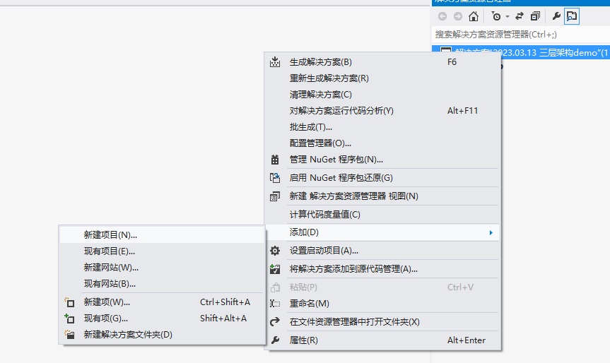

点击完成之后，会弹出一个新的界面，之后我们去选择类库，改一下名字，这个名字要求是三层架构当中所拥有的名称

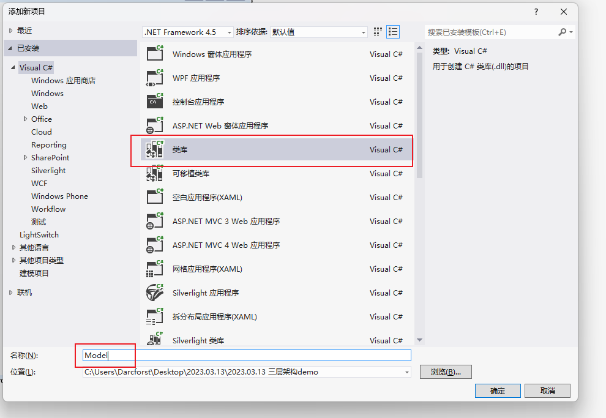

之后重复该步骤创建 Model层，DAL层以及BLL层，创建完成之后，效果如下：

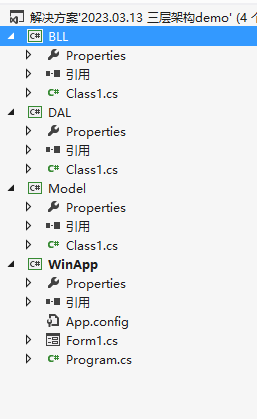

3.  我们需要去名字叫做Model的类库当中，书写对应的数据库映射内容 ----》 封装

写法是找到我们要操作的数据库当中的表，然后按照表名创建一个对应的类，之后在这个类当中封装数据库表里的每一个列

> C# 当中带有2种封装，（1）显示封装 （2）隐式封装
>
> （1）显示封装的语法：
>
>  ``` c#
>  private 数据类型 字段名; //声明字段，微软公司对封装的字段名有要求，要求以_为开头，后面写正常的名字，采用驼峰命名法 _nickName
>  
>  public 数据类型 属性名 //属性要求与字段名相同（不带有下划线，并且采用Pascal命名法 NickName）
>  {
>      set{ 字段名 = value;}
>      get{ return 字段名;}
>  }
>  ```
>
> （2）隐式封装的语法：
>
> ``` C#
> public 数据类型 属性名{ get;set; }
> ```
>
> 

4. 我们去数据访问层DAL当中进行操作，

​		（1）我们需要在DAL类库下，找到引用鼠标右键（References），选择添加引用

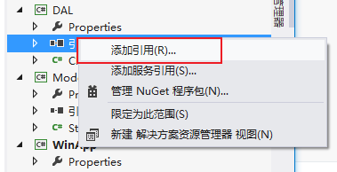

​		它会打开一个新的界面，让我们来选择要添加进这个项目的引用，界面如下：

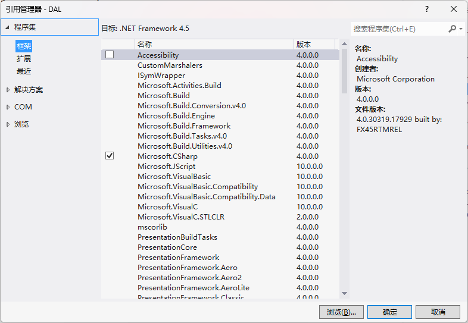

我们需要选中 :

​	a. 程序集里面的 **System.Configuration**

​    b. 解决方案当中的 **Model** 

之后我们点击确定即可，其中System.Configuration 这个是让我们添加系统配置的，这个配置信息一般是存在于WinApp下的App.config文件当中

​		（2）书写每个表的数据库操作内容，例如： 新增操作，修改操作，删除操作，查询操作等

​					（a）创建一个类 SqlHelper ,因为分层了，我们现在要求对这个类进行更新。

​							  去WinApp下的App.config文件当中Configuration标签中添加数据库连接设定

``` xml
  <connectionStrings>
    <add name="自己起的名字" 
         connectionString="Data Source=.;Initial Catelog=数据库名;User Id = sa;PWD=自己的登入密码" 
         providerName="System.Data.SqlClient"/>
  </connectionStrings>
```

​				（b） 在SqlHelper类当中获取上面的配置信息

``` C#
 static string constr = ConfigurationManager.ConnectionStrings["配置语句的名字"].ConnectionString;
```

​				（c） 每个执行方法都添加一个对应的占位符的值

``` C#
// 2. 书写增删改或者查询的方法
        /// <summary>
        /// 增删改方法
        /// </summary>
        /// <param name="sql">要执行的SQL语句</param>
        /// <param name="param">存放要存入的值</param>
        /// <returns></returns>
        public static int ExecuteNonQuery(string sql , SqlParameter[] param) 
        {
            //Parameter 这个单词代表参数，现在S2的写法要求SQL语句不能直接通过“”++进行拼写，因为这种写法
            //容易被SQL注入攻击

            try
            {
                con = new SqlConnection(constr); //创建连接对象
                con.Open(); //打开数据库连接
                cmd = new SqlCommand(sql, con); //创建数据库命令对象
                if (param != null)
                {
                    cmd.Parameters.AddRange(param); //把数据库语句的占位符值，添加到命令对象当中
                }
                return cmd.ExecuteNonQuery();

            }
            catch (Exception)
            {
                throw;
            }
            finally 
            {
                cmd.Dispose();
                con.Dispose();
            }

       }
```

S2新的SqlHelper完整代码如下：

``` C#
using System.Data;
using System.Data.SqlClient;
using System.Configuration; //引入系统配置

namespace DAL
{
    public static class SqlHelper
    {
        // 1. 从系统配置文件（App.config）当中读取对应的数据库连接语句
        static string constr = ConfigurationManager.ConnectionStrings["MySqlStr"].ConnectionString;
        static SqlConnection con = null;
        static SqlCommand cmd = null;
        static SqlDataAdapter sda = null;

        // 2. 书写增删改或者查询的方法
        /// <summary>
        /// 增删改方法
        /// </summary>
        /// <param name="sql">要执行的SQL语句</param>
        /// <param name="param">存放要存入的值</param>
        /// <returns></returns>
        public static int ExecuteNonQuery(string sql , SqlParameter[] param) 
        {
            //Parameter 这个单词代表参数，现在S2的写法要求SQL语句不能直接通过“”++进行拼写，因为这种写法
            //容易被SQL注入攻击

            try
            {
                con = new SqlConnection(constr); //创建连接对象
                con.Open(); //打开数据库连接
                cmd = new SqlCommand(sql, con); //创建数据库命令对象
                if (param != null)
                {
                    cmd.Parameters.AddRange(param); //把数据库语句的占位符值，添加到命令对象当中
                }
                return cmd.ExecuteNonQuery();

            }
            catch (Exception)
            {
                throw;
            }
            finally 
            {
                cmd.Dispose();
                con.Dispose();
            }

        }

        /// <summary>
        /// 查询方法
        /// </summary>
        /// <param name="sql">要执行的SQL语句</param>
        /// <param name="param">SQL语句当中占位符的对应的值</param>
        /// <returns>系统虚表</returns>
        public static DataTable Query(string sql, SqlParameter[] param) 
        {
            try
            {
                sda = new SqlDataAdapter(sql, constr);
                DataTable dt = new DataTable();
                if (param != null)
                {
                    sda.SelectCommand.Parameters.AddRange(param);
                }
                sda.Fill(dt);
                return dt;
            }
            catch (Exception)
            {
                throw;
            }
            finally 
            {
                sda.Dispose();
            }
        }
    
    }
}
```

我们再去创建一个类，这个类起名要求以对应的表名为开头后面加上Dal后缀，代表是数据访问层的类，例如： StudentDal

5. 书写BLL层  ---》 业务逻辑层

​		a. 添加引用，在BLL下选择引用，鼠标右键添加引用，之后直接找解决方案当中Model,DAL，就添加这两个内容。

​        b. 创建一个类，要求以对应的表名开头，以Bll为结尾，例如：StudentBll

​		c.  添加对前面两个层的引用

``` C#
using Model;
using DAL;
```

​        d. 在这个类当中创建一个对应的DAL层的对象

``` C#
StudentDal dal= new StudentDal();
```

​        e. 把对应Dal层的类当中的代码，复制粘贴过来，之后进行修改 

把复制过来的代码，当中所有的方法内容删掉，改为return 创建的对象名.当前方法名(参数名);,例如：

``` C#
    public class StudentBll
    {
        StudentDal dal = new StudentDal();
        public int Add(Student stu) 
        {
            return dal.Add(stu);
        }

    }
```

6.   我们在WinApp下，添加引用，把其他三个层全部引用过来

**注意： 在这个层后台代码当中一定不能出现DAL层的内容** 剩下操作就是正常的画界面，之后在代码页面添加两个引用

``` C#
using Model;
using BLL;
```

接下来在类当中实例化对象，

``` C#
StudentBll bll = new StudentBll();
```

最后在需要的使用通过这个对象来调用对应的方法，即可。

#### 备注

##### 1. SqlHelper当中执行聚合函数的方法

``` C#
public static object ExecuteScalar(string sql,SqlParameter[] param)
{
    try
    {
        con = new SqlConnection(constr); //创建连接对象，存入数据库连接语句
        con.Open();
        cmd = new SqlCommand(sql,con);
        if(param != null)
        {
            cmd.Parameters.AddRange(param);
        }
        return cmd.ExecuteScalar();
    }
    catch(Exception ex)
    {
        throw ex;
    }
    finally
    {
        cmd.Dispose();
        con.Dispose();
    }
}
```

该方法主要是执行只查询聚合函数的sql语句。

##### 2. Winform TreeView控件 

该控件主要制作的是属性图效果，例如，sql server数据库里面对象资源管理器的效果。该控件还可以可以绑定图片。

**常见属性**

| 属性       | 说明                                         |
| ---------- | -------------------------------------------- |
| ImageList  | 用于绑定图片集合，方便给里面的每项来绑定图标 |
| Nodes      | 该属性是用于获取当前位置下的所有节点信息     |
| SelectNode | 该属性是用于获取选中的节点信息               |

我们可以按照下面的语法来进行添加节点：

``` C#
控件名.Nodes.Add("节点内容"); //该内容是为了给当前控件添加一个根节点，节点显示内容是小括号当中的内容
控件名.Nodes[0].Nodes.Add("节点内容"); //该内容是为了给当前控件里的第一个根节点添加一个子节点，节点显示内容为括号当中内容
```

除此之外，我们还需要了解如何进行删除要的节点信息或者删除所有节点信息

``` C#
控件名.Nodes.Remove(节点信息); //删除该节点内容
控件名.Nodes.Clear(); // 删除所有根节点
控件名.Nodes[0].Nodes.Clear(); // 删除第一个根节点下所有节点信息
```


##### 3. 新的数据类型 Guid

这个数据类型是c#当中的编码类型，因为位数较多，基本不可能出现重复值。它在赋值的时候也是不需要我们手动往里存值的，我们只需要调用这个属性的方法即可。

``` c#
Guid id = Guid.NewGuid();
Console.WriteLine(id);
```

运行上面的代码，输出结果如下：


这个数据类型的空值并不是null，它也是通过这个数据类型自己的属性来实现的

``` C#
Guid id = Guid.Empty;
Console.WriteLine(id);
```

效果如下：


该数据类型在Sql Server数据库当中对应的是uniqueidentifier，用于做唯一标识（主键列）进行使用，我们在数据库当中也可以对其进行存值，使用的是 NEWID() 函数。

##### 4. C# using 语句

C#添加引用的时候使用的就是using，但是我们这个地方的using语句并不是用于添加引用的，帮助我们快速的释放资源，需要我们写在类当中的方法里面。

我们在写SqlHelper的时总是需要释放掉连接对象，命令对象，数据适配器对象等等。我们现在可以使用这个语句来帮助我们。

**语法：**

``` C#
using(要进行创建的对象)
{
    这个里面存放的是正常代码    
}
```

语法当中小括号里面创建的对象只能在后面跟着的花括号当中找到。

例如：

``` C#
public static int ExecuteNonQuery(string sql,SqlParameter[] param)
{
    try
    {
        using(SqlConnection con = new SqlConnection(constr))
        {
            con.Open();
            using(SqlCommand cmd = new SqlCommand(sql,con))
            {
                if(param != null)
                {
                    cmd.Parameter.AddRange(param);
                }
                return cmd.ExecuteNonQuery();
            }
        }  
    }
    catch(Exception ex)
    {
        throw ex;
    }
}
```

下面内容是把S2新版的SqlHelper改为用using语句写法实现：

``` C#
using System.Data;
using System.Data.SqlClient;
using System.Configuration; //引入系统配置

namespace DAL
{
    public static class SqlHelper
    {
        // 1. 从系统配置文件（App.config）当中读取对应的数据库连接语句
        static string constr = ConfigurationManager.ConnectionStrings["MySqlStr"].ConnectionString;
        

        // 2. 书写增删改或者查询的方法
        /// <summary>
        /// 增删改方法
        /// </summary>
        /// <param name="sql">要执行的SQL语句</param>
        /// <param name="param">存放要存入的值</param>
        /// <returns></returns>
        public static int ExecuteNonQuery(string sql , SqlParameter[] param) 
        {
            //Parameter 这个单词代表参数，现在S2的写法要求SQL语句不能直接通过“”++进行拼写，因为这种写法
            //容易被SQL注入攻击

            try
            {
                using(SqlConnection con = new SqlConnection(constr))//创建连接对象
                {
                    con.Open(); //打开数据库连接
                    using(SqlCommand cmd = new SqlCommand(sql, con)) //创建数据库命令对象
                    {
                        if (param != null)
                		{
                    		cmd.Parameters.AddRange(param); //把数据库语句的占位符值，添加到命令对象当中		
                		}
                		return cmd.ExecuteNonQuery();
                    }
                } 
            }
            catch (Exception)
            {
                throw;
            }
        }

        /// <summary>
        /// 查询方法
        /// </summary>
        /// <param name="sql">要执行的SQL语句</param>
        /// <param name="param">SQL语句当中占位符的对应的值</param>
        /// <returns>系统虚表</returns>
        public static DataTable Query(string sql, SqlParameter[] param) 
        {
            try
            {
                using(SqlDataAdapter sda = new SqlDataAdapter(sql, constr))
                {
                    DataTable dt = new DataTable();
                    if (param != null)
                    {
                        sda.SelectCommand.Parameters.AddRange(param);
                    }
                    sda.Fill(dt);
                    return dt;
                }
            }
            catch (Exception)
            {
                throw;
            }
        }
    }
}
```


##### 5. MD5加密

让我们对需要安全等级较高的字符串数据进行加密操作的，我们项目当中一般主要对密码进行使用。

**使用步骤：**

（1）添加MD5操作的引用

``` C#
using System.Security.Cryptography; 
```

（2）在对应的代码位置上，去创建一个MD5对象

``` C#
MD5 md5 = MD5.Create();
```

（3）把要进行加密的字符串转换为字节数组

``` C#
byte[] bytes = Encoding.Default.GetBytes(要进行加密的字符串);
```

（4）把上面字节数组当中每个字节都进行加密，并且得到加密后的字节数组

``` C#
byte[] buffers = md5.ComputeHash(bytes,0,bytes.Length);
```

（5）把加密后的字节数组中的每个字节转换为字符串并且组成最终的字符串内容

``` C#
StringBuilder sb = new StringBuilder();
foreach(byte b in buffers)
{
    sb.Append(b.ToString("x2"));
}
```


### 二. WebForm

#### 1. 简介

WebForm是微软公司模仿Winform技术开发出来的一项Web开发技术，也是以拖拽式开发和控件内容为主的一种web开发方式。

WebForm文件的扩展名： .aspx

**WebForm是之前C#主流的开发模式之一，也被称为Asp.Net 开发技术**

#### 2. 创建项目

##### 2.1 创建Web应用

现在创建的项目是Web应用程序，创建完成的项目架构如下：

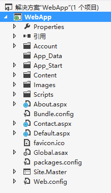

这种创建项目的方式会带有案例内容，所以我们在开发之前需要先去把没有用的内容删除掉，删除内容如下：

Account文件夹，About.aspx,Contact.aspx,Default.aspx,Site.Master


##### 2.2 创建网站

​		因为上面的那种创建方式，我们需要删除文件，当我们删除文件的时候多删了或者删错了都会报错，比较费劲。所以我们现在使用的创建项目方式是新建一个网站，**尤其是与三层架构连用的时候**。

​		该方法创建步骤如下（**带有三层架构**）：

​		（1） 创建一个类库，起名Model,**注意：这个是我们需要把解决方案的名字改为当前项目名（英文或者汉语拼音）**

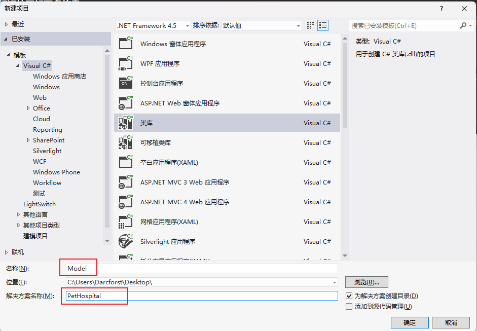

​	（2）在解决方案资源管理里面，选择解决方案。。。,鼠标右键选择添加新建项目

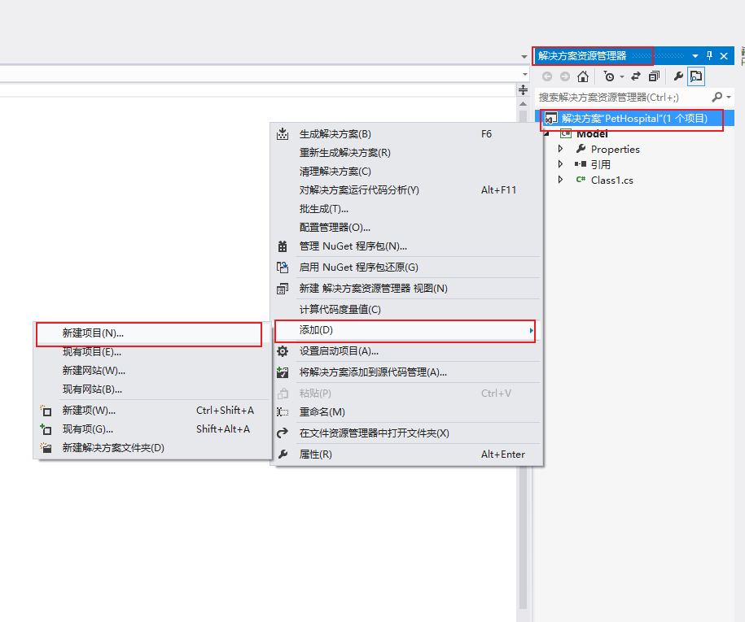

​	（3）在新弹出的创建项目对话框当中，选中类库，项目名叫 DAL

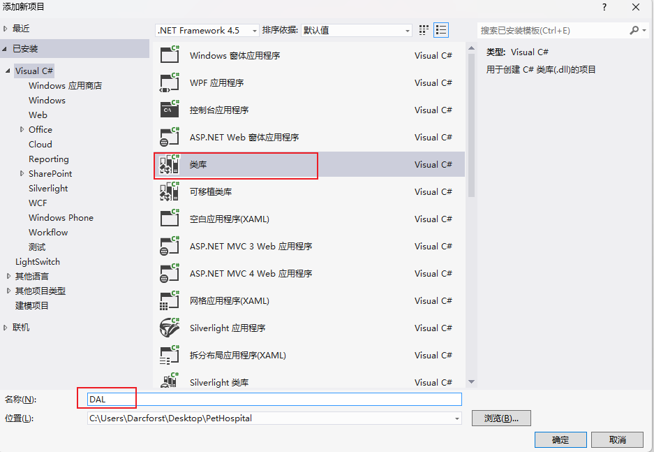

​	（4）重复第二步和第三步，起名叫做BLL

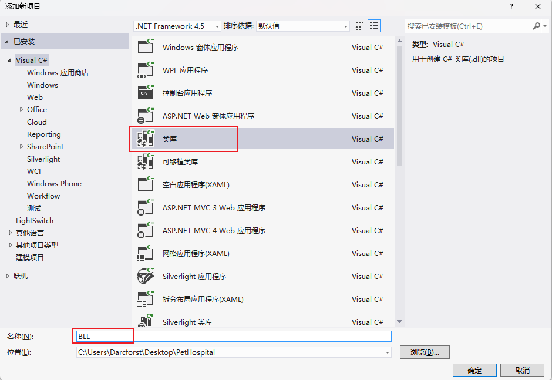

​	（5）之后，我们再次在解决方案管理器里，选中解决方案。。。，鼠标右键选择添加，这次我们选择添加新建网站。

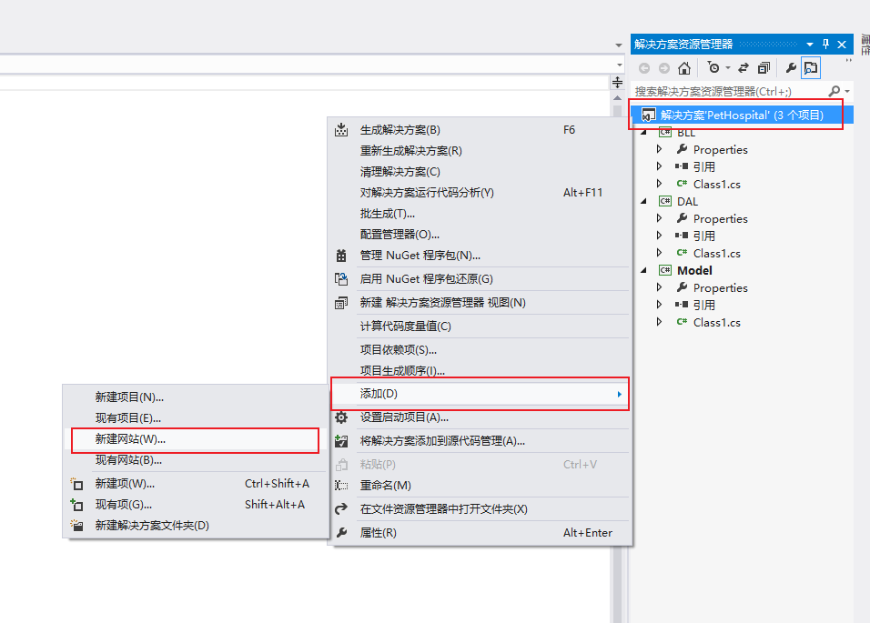

​	（5）在新弹出的对话框当中，我们选择Asp.Net 空网站。

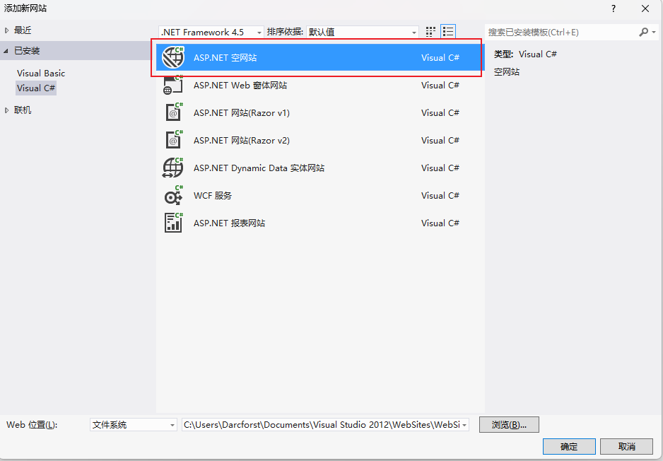

​		选择完成之后，我们在来点击下面的浏览按钮，来选择创建该网站的位置，**注意位置的选择不是随意选择的，一定要选择到我们刚才创建的项目当中，一定要确保能看到刚才看到的Model,DAL,BLL层的文件夹才行。**

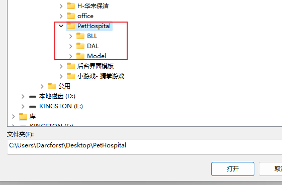

​		之后点击打开按钮，再次回到添加新网站的对话框，在这个时候我们还需要再Web位置的最后添加一个“\”和表示层的名字，例如：WebApp。

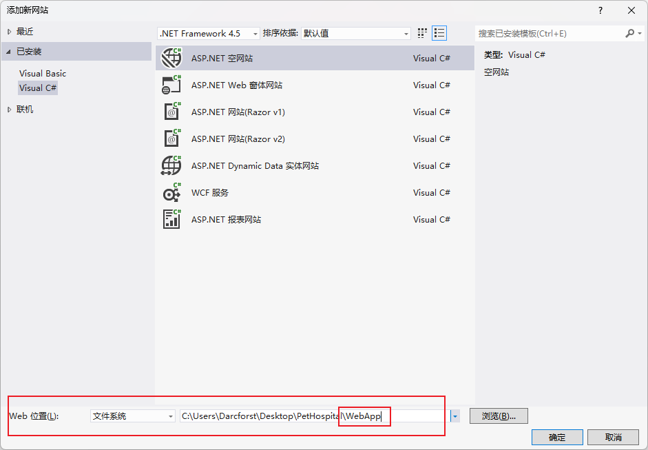

​		之后点击确定就可以了。之后我还需要把当前创建的项目的启动项更改为WebApp,这样我们的三层架构+WebForm的项目就创建完成了。在电脑本地找到我们创建的项目其中的项目结构应该是下图这个样子的，如果不是则代表创建错误。

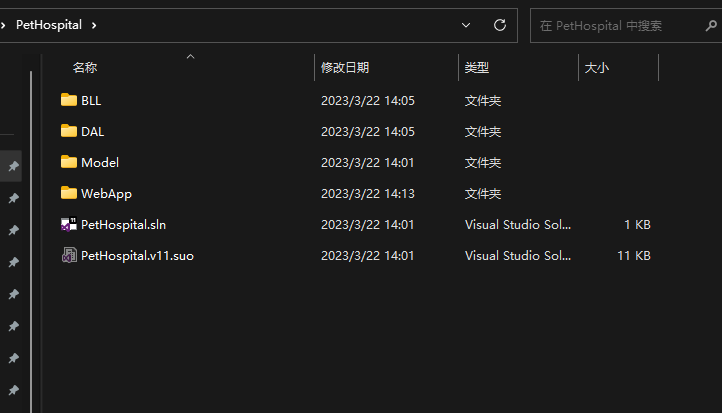

​		剩下的我们就需要按照三层架构的方式来添加引用,具体添加内容如下：


| 层名   | 需要添加的引用               |
| ------ | ---------------------------- |
| Model  | 无                           |
| DAL    | System.Configuration , Model |
| BLL    | DAL,Model                    |
| WebApp | BLL,DAL,Model                |

​		**引用添加完成之后，我们需要在选项卡上选择生成--》重新生成解决方案，来重新生成一次。这次生成是为了让表示层把引用内容添加到项目当中，如果不重新生成则会报错。**

##### 2.3 创建项目之后，展示视图界面


设计： 这个是让我们来进行查看网页效果

拆分： 这个是让我们能够一边手写代码，一边查看页面效果

源： 这个是我们书写页面代码的页面（这个是我们以后基本天天看的界面）


#### 3. 页面代码

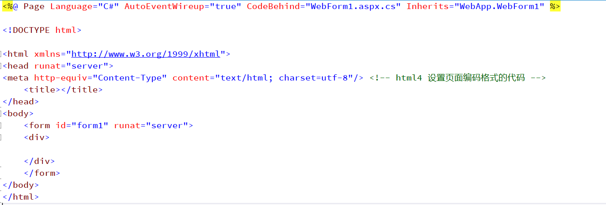

<%%>  我们叫做小脚本写法，经常出现于webform以及JSP当中，这个对符号主要作用就是在HTML页面内允许我们插入一段C#或者Java代码

<%@ %> 这个是我们在html页面内插入一段配置信息，Page代表页面，Language代表当前页面开发语言为C#,AutoEventWireup 这个是配置当前页面是否开启事件自动验证，true代表开启， CodeBehind 用于设定后台编码文件，Inherits 这个用于设定当前页面所在的命名空间

**runat=“server” 属性与值**

 run 代表 运行 ， at 代表 在。。。  runat 代表运行在。。。。， server 代表服务， **我们现在学的webform所有的控件都必须带有这个属性，因为webform的控件都是运行在服务端上的**

**每个web窗体当中都必须带有一个form标签，我们写的所有页面代码都必须写在这对form标签当中**

#### 4. 常见控件

有的人比较喜欢手写控件，控件的固定代码如下：

``` C#
<asp:控件名 Id="" runat="server" Text=""></asp:控件名>
```

> 个人建议：不要手写，去工具箱当中找到控件拖拽到想要存放该控件的位置

##### 4.1 Button控件

``` C#
<asp:Button ID="btnSave" runat="server" Text="Button"></asp:Button>
```

我们在设计视图找到该按钮控件，双击就可以对该控件添加事件，但是不建议这么做。我们最好是记住常见的事件名称。

| 事件名   | 说明                     |
| -------- | ------------------------ |
| OnClick  | 这个是控件单击事件       |
| OnChange | 这个是控件内容的更改事件 |

Webform的控件想要好看都需要通过样式表进行设置。

WebForm的控件想要引入样式（类选择器的）需要使用属性：CssClass 

##### 4.2 TextBox控件

文本框控件

``` C#
<asp:TextBox id="TextBox1" runat="server" Text="" ></asp:Text>
```

我们想要让上面的文本框变为密码框，只需要添加一个属性TextMode，里面属性值选择为Password

我们除了上面的属性以外，还需要多记住一个事件TextChanged,这个是文本更改事件

##### 4.3 RadioButton控件

单选按钮控件

``` C#
<asp:RadioButton ID="RadioButton1" runat="server" Text="男" GroupName="gender" Checked="true" />
```

**常见属性：**

| 属性名    | 属性说明                                                |
| --------- | ------------------------------------------------------- |
| Text      | 设定控件显示的文本信息                                  |
| GroupName | 用于对控件进行分组，同一组当中的单选按钮只能选中一个    |
| Checked   | 设定控件为默认选中，值true 默认选中,false为默认值不选中 |

##### 4.4 CheckBox控件

复选框，让我们选择多项。

``` C#
<asp:CheckBox ID="CheckBox1" runat="server" Text="xxx" Checked="true" />
```

属性内容与单选框相同

##### 4.5 DropDownList控件

这个是下拉列表控件，webform与winform使用方式基本相同。

**（1）不绑定数据库**

``` C#
 <asp:DropDownList ID="DropDownList1" runat="server">
           <asp:ListItem Value="S1">S1</asp:ListItem> <!-- 这个是列表项 -->
           <asp:ListItem Value="S2">S2</asp:ListItem>
           <asp:ListItem Value="S3">S3</asp:ListItem>
</asp:DropDownList>
```

列表项标签中间直接写的内容就是让我们看的，Value属性里面的值是当选中后能够获取到的值

**（2）绑定数据库**

``` C#
<asp:DropDownList ID="DropDownList1" runat="server"></asp:DropDownList>
```

后台代码：

``` C#
DropDownList2.DataSource = 数据源;
DropDownList2.DataTextField = ""; //这个相当于Winform当中DisplayMember
DropDownList2.DataValueField = "";//这个相当于Winform当中ValueMember
DropDownList2.DataBind(); //这个是控件绑定方法，需要通过这个来实现数据绑定
```

##### 4.6 GridView控件

这个相当于Winform当中的DataGridView控件，这个控件也是让我们做查询数据绑定的，它功能比DataGridView强大。

当我们选择三角进行编辑列的时候，该控件包含了多种可用字段

| 字段名         | 说明                                                         |
| -------------- | ------------------------------------------------------------ |
| BoundField     | 这个是我们常规的带有数据绑定的列，里面要求设定两个属性：HeaderText 设置表头信息，DataField用于绑定数据库当中对应的列名 |
| CheckBoxField  | 这个是创建一个带有复选框的列                                 |
| HyperLinkField | 这个是创建一个带有超链接的列                                 |
| ImageField     | 这个是创建一个带有图片的列                                   |

**C#后台绑定代码**

``` C#
控件名.DataSource = 数据源;
控件名.DataBind();
```


> Webform当中有的时候我们更改的数据不会随着我们代码效果进行更改，这个是因为WebForm需要我们做一个页面回调事件的处理，这个是一条语句，需要写在页面加载事件当中的首行。代码如下：
>
> ``` C#
> if(IsPostBack)
>     return;
> ```
>
> 这个代码会阻止我们按钮点击时，触发事件验证导致页面刷新的效果


> GirdView控件的缺点：
>
> （1）只能绑定表格类型的数据，其他类型内容做不到
>
> （2）里面的列的添加并不是完全类似HTML的


##### 4.7 Repeater控件

这个是以后工作，写项目的时候最常用的，最自由的前台数据绑定控件。**哪个地方需要我们重复填充数据（循环展示数据），我们用在哪**

语法：

``` C#
<asp:Repeater id="Repeater1" runat="server"></asp:Repeater>
```

我们还需在这对标签当中插入一个模板标签

| 标签名                  | 说明                                                         |
| ----------------------- | ------------------------------------------------------------ |
| ItemTemplate            | 项模板，用于存放重复数据的，里面写页面当中想要重复绑定数据的html编码 |
| SeparatorTemplate       | 分隔模板，对分隔符进行设定                                   |
| AlternatingItemTemplate | 交替模板，用于做与项模板交替显示数据用的                     |
| HeaderTemplate          | 头部模板，对页眉进行设定，每次加载的时候，只能加载一次       |
| FooterTemplate          | 脚步模板，对页脚进行设定，每次加载的时候，只能加载一次       |


**Eval绑定数据**

这种绑定是与Repeater控件一起使用的，语法如下：

``` C#
<%#Eval("要进行绑定的列名")%>
```

**Repeater控件的使用步骤：**

​	（1）从工具箱里面把Repeater控件拖到想要进行循环绑定数据的位置上

​	（2）在Repeater标签里，创建一个项模板用于循环插入数据，代码如下：

``` C#
<asp:Repeater id="Repeater01" runat="server">
	<ItemTemplate>
    	<!-- 这个里面存放循环的数据 -->
    </ItemTemplate>   
</asp:Repeater>
```

​	（3）在项模板当中使用Eval绑定数据，例如：

``` C#
<asp:Repeater id="Repeater01" runat="server">
	<ItemTemplate>
    	<div>
    		<h3><%#Eval("Title") %></h3>	
    		<p><%#Eval("Content") %></p>
    	</div>
    </ItemTemplate>   
</asp:Repeater>
```

#### 5. 页面传值

我们需要通过HTTP协议进行传递，我们只需要在超链接路径里添加参数即可，语句语法如下:

``` html
<a href="跳转的路径?参数名=值"></a>
```

上面的为传递单个参数，如果传递多个参数则按照下面的方式进行传递：

``` html
<a href="跳转的路径?参数名1=值1&参数名2=值2&参数名3=值3...."></a>
```

例如：

``` html
<a href="edit.aspx?id=1">修改</a>
```

我们在第二个界面当中该如何接收传递过来的值呢？

``` C#
string str = Request.Params["参数名"];
```


### 三. 高级面向对象


## 2. Java OOP


## 3. MySql数据库与JDBC

### 1. 数据库设计（三大范式）

**不会的，出去工作无法晋升**

##### 1. E-R图

E-R图也称为实体-联系图（Entity Relationship Diagram）,它提供了表示实体类型、属性和关系的方法，用来描述现实世界的概念模型。

E-R图中包含三种模型：

| 图形   | 含义                         |
| ------ | ---------------------------- |
| 矩形   | 用来表示实体                 |
| 椭圆形 | 用来表示实体的属性           |
| 菱形   | 用来表示实体与实体之间的关系 |

实体与实体之间的关系包括：

​	（1） 一对一关系

​	（2）一对多关系

​	（3）多对一关系

​	（4）多对多关系

**作图步骤：**

​	（1）确定所有的实体集合。

​	（2）选择实体集应包含的属性

​	（3）确定实体集之间的联系

​	（4）确定实体集的关键字，用下划线在属性上表明关键字的属性组合

​	（5）确定联系的类型，在用线将表示联系的菱形框联系到实体集时，在线旁注明是1或者n(多)来表示联系的类型。


##### 2. 三大范式：

第一范式（1NF）: 每个列都需遵守原子性，原子性指每个列都是最小单元，不可再分

第二范式（2NF）: 每个表只能描述一件事

第三范式（3NF）: 在满足第二范式的前提下，除了主键列能够传递依赖以外，其他列不允许传递，大白话：。主键表只有主键列才可以与外键表的外键列建立关系 


一般我们要进行设计数据库的时候都是从无到有的,设计数据库的步骤：

（1）分析要创建数据的内容，仔细观察，例如该内容共包含的实体都有哪些

（2）创建E-R图，标明实体，以及每个实体包含的属性，实体与实体之间的关系

（3）根据E-R图与三大范式的要求，创建表


## 4. JavaScript与Jquery技术


## 5. 通过JSP和Servlet制作网站


