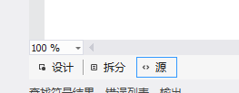
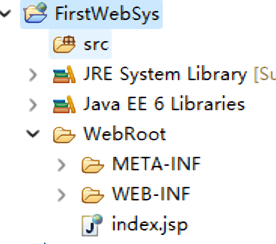

# S2 笔记

[HongRui-Gao/A101CourseDocument: 北大青鸟A101上课笔记 (github.com)](https://github.com/HongRui-Gao/A101CourseDocument)

## 1. C# OOP 

### 一. 三层架构

#### 1.1 三层介绍

> 分层的好处：把原本写在一个项目当中所有内容按照功能进行分类，方便我们日后维护

三层架构包含的三层：

（1）数据访问层： 专门用于创建数据库连接以及进行数据库操作   ---》 DAL

（2）业务逻辑层： 专门用于处理业务上的逻辑操作与判断  ---》 BLL

（3）表示层：         专门用于存放显示效果的    ---》 WinApp


> 除了上面的三层，我们书写项目的时候一般还会多创建一层，用于存放数据库映射关系，这层主要就是根据数据库当中表，创建一个对应的类，在这个类把表当中所有的列以封装的形式进行书写 ,它的起名叫做Model

C#创建项目的项目类型： **类库**

#### 1.2 类库

类库是专门用于存储类文件的仓库，它的结构基本与我们之前学习的控制台程序比较像，与控制台项目不同的是类库是**不带有启动功能**的

#### 1.3 创建现在项目的结构

创建步骤：

	1. 创建一个Windows应用程序，起名为WinApp
	1. 点击解决方案资源管理器当中的解决方案，鼠标右键，选择添加，选择新建项目


点击完成之后，会弹出一个新的界面，之后我们去选择类库，改一下名字，这个名字要求是三层架构当中所拥有的名称


之后重复该步骤创建 Model层，DAL层以及BLL层，创建完成之后，效果如下：


3.  我们需要去名字叫做Model的类库当中，书写对应的数据库映射内容 ----》 封装

写法是找到我们要操作的数据库当中的表，然后按照表名创建一个对应的类，之后在这个类当中封装数据库表里的每一个列

> C# 当中带有2种封装，（1）显示封装 （2）隐式封装
>
> （1）显示封装的语法：
>
>  ``` c#
>  private 数据类型 字段名; //声明字段，微软公司对封装的字段名有要求，要求以_为开头，后面写正常的名字，采用驼峰命名法 _nickName
>  
>  public 数据类型 属性名 //属性要求与字段名相同（不带有下划线，并且采用Pascal命名法 NickName）
>  {
>      set{ 字段名 = value;}
>      get{ return 字段名;}
>  }
>  ```
>
> （2）隐式封装的语法：
>
> ``` C#
> public 数据类型 属性名{ get;set; }
> ```
>
> 

4. 我们去数据访问层DAL当中进行操作，

​		（1）我们需要在DAL类库下，找到引用鼠标右键（References），选择添加引用


​		它会打开一个新的界面，让我们来选择要添加进这个项目的引用，界面如下：


我们需要选中 :

​	a. 程序集里面的 **System.Configuration**

​    b. 解决方案当中的 **Model** 

之后我们点击确定即可，其中System.Configuration 这个是让我们添加系统配置的，这个配置信息一般是存在于WinApp下的App.config文件当中

​		（2）书写每个表的数据库操作内容，例如： 新增操作，修改操作，删除操作，查询操作等

​					（a）创建一个类 SqlHelper ,因为分层了，我们现在要求对这个类进行更新。

​							  去WinApp下的App.config文件当中Configuration标签中添加数据库连接设定

``` xml
  <connectionStrings>
    <add name="自己起的名字" 
         connectionString="Data Source=.;Initial Catelog=数据库名;User Id = sa;PWD=自己的登入密码" 
         providerName="System.Data.SqlClient"/>
  </connectionStrings>
```

​				（b） 在SqlHelper类当中获取上面的配置信息

``` C#
 static string constr = ConfigurationManager.ConnectionStrings["配置语句的名字"].ConnectionString;
```

​				（c） 每个执行方法都添加一个对应的占位符的值

``` C#
// 2. 书写增删改或者查询的方法
        /// <summary>
        /// 增删改方法
        /// </summary>
        /// <param name="sql">要执行的SQL语句</param>
        /// <param name="param">存放要存入的值</param>
        /// <returns></returns>
        public static int ExecuteNonQuery(string sql , SqlParameter[] param) 
        {
            //Parameter 这个单词代表参数，现在S2的写法要求SQL语句不能直接通过“”++进行拼写，因为这种写法
            //容易被SQL注入攻击

            try
            {
                con = new SqlConnection(constr); //创建连接对象
                con.Open(); //打开数据库连接
                cmd = new SqlCommand(sql, con); //创建数据库命令对象
                if (param != null)
                {
                    cmd.Parameters.AddRange(param); //把数据库语句的占位符值，添加到命令对象当中
                }
                return cmd.ExecuteNonQuery();

            }
            catch (Exception)
            {
                throw;
            }
            finally 
            {
                cmd.Dispose();
                con.Dispose();
            }

       }
```

S2新的SqlHelper完整代码如下：

``` C#
using System.Data;
using System.Data.SqlClient;
using System.Configuration; //引入系统配置

namespace DAL
{
    public static class SqlHelper
    {
        // 1. 从系统配置文件（App.config）当中读取对应的数据库连接语句
        static string constr = ConfigurationManager.ConnectionStrings["MySqlStr"].ConnectionString;
        static SqlConnection con = null;
        static SqlCommand cmd = null;
        static SqlDataAdapter sda = null;

        // 2. 书写增删改或者查询的方法
        /// <summary>
        /// 增删改方法
        /// </summary>
        /// <param name="sql">要执行的SQL语句</param>
        /// <param name="param">存放要存入的值</param>
        /// <returns></returns>
        public static int ExecuteNonQuery(string sql , SqlParameter[] param) 
        {
            //Parameter 这个单词代表参数，现在S2的写法要求SQL语句不能直接通过“”++进行拼写，因为这种写法
            //容易被SQL注入攻击

            try
            {
                con = new SqlConnection(constr); //创建连接对象
                con.Open(); //打开数据库连接
                cmd = new SqlCommand(sql, con); //创建数据库命令对象
                if (param != null)
                {
                    cmd.Parameters.AddRange(param); //把数据库语句的占位符值，添加到命令对象当中
                }
                return cmd.ExecuteNonQuery();

            }
            catch (Exception)
            {
                throw;
            }
            finally 
            {
                cmd.Dispose();
                con.Dispose();
            }

        }

        /// <summary>
        /// 查询方法
        /// </summary>
        /// <param name="sql">要执行的SQL语句</param>
        /// <param name="param">SQL语句当中占位符的对应的值</param>
        /// <returns>系统虚表</returns>
        public static DataTable Query(string sql, SqlParameter[] param) 
        {
            try
            {
                sda = new SqlDataAdapter(sql, constr);
                DataTable dt = new DataTable();
                if (param != null)
                {
                    sda.SelectCommand.Parameters.AddRange(param);
                }
                sda.Fill(dt);
                return dt;
            }
            catch (Exception)
            {
                throw;
            }
            finally 
            {
                sda.Dispose();
            }
        }
    
    }
}
```

我们再去创建一个类，这个类起名要求以对应的表名为开头后面加上Dal后缀，代表是数据访问层的类，例如： StudentDal

5. 书写BLL层  ---》 业务逻辑层

​		a. 添加引用，在BLL下选择引用，鼠标右键添加引用，之后直接找解决方案当中Model,DAL，就添加这两个内容。

​        b. 创建一个类，要求以对应的表名开头，以Bll为结尾，例如：StudentBll

​		c.  添加对前面两个层的引用

``` C#
using Model;
using DAL;
```

​        d. 在这个类当中创建一个对应的DAL层的对象

``` C#
StudentDal dal= new StudentDal();
```

​        e. 把对应Dal层的类当中的代码，复制粘贴过来，之后进行修改 

把复制过来的代码，当中所有的方法内容删掉，改为return 创建的对象名.当前方法名(参数名);,例如：

``` C#
    public class StudentBll
    {
        StudentDal dal = new StudentDal();
        public int Add(Student stu) 
        {
            return dal.Add(stu);
        }

    }
```

6.   我们在WinApp下，添加引用，把其他三个层全部引用过来

**注意： 在这个层后台代码当中一定不能出现DAL层的内容** 剩下操作就是正常的画界面，之后在代码页面添加两个引用

``` C#
using Model;
using BLL;
```

接下来在类当中实例化对象，

``` C#
StudentBll bll = new StudentBll();
```

最后在需要的使用通过这个对象来调用对应的方法，即可。

#### 备注

##### 1. SqlHelper当中执行聚合函数的方法

``` C#
public static object ExecuteScalar(string sql,SqlParameter[] param)
{
    try
    {
        con = new SqlConnection(constr); //创建连接对象，存入数据库连接语句
        con.Open();
        cmd = new SqlCommand(sql,con);
        if(param != null)
        {
            cmd.Parameters.AddRange(param);
        }
        return cmd.ExecuteScalar();
    }
    catch(Exception ex)
    {
        throw ex;
    }
    finally
    {
        cmd.Dispose();
        con.Dispose();
    }
}
```

该方法主要是执行只查询聚合函数的sql语句。

##### 2. Winform TreeView控件 

该控件主要制作的是属性图效果，例如，sql server数据库里面对象资源管理器的效果。该控件还可以可以绑定图片。

**常见属性**

| 属性       | 说明                                         |
| ---------- | -------------------------------------------- |
| ImageList  | 用于绑定图片集合，方便给里面的每项来绑定图标 |
| Nodes      | 该属性是用于获取当前位置下的所有节点信息     |
| SelectNode | 该属性是用于获取选中的节点信息               |

我们可以按照下面的语法来进行添加节点：

``` C#
控件名.Nodes.Add("节点内容"); //该内容是为了给当前控件添加一个根节点，节点显示内容是小括号当中的内容
控件名.Nodes[0].Nodes.Add("节点内容"); //该内容是为了给当前控件里的第一个根节点添加一个子节点，节点显示内容为括号当中内容
```

除此之外，我们还需要了解如何进行删除要的节点信息或者删除所有节点信息

``` C#
控件名.Nodes.Remove(节点信息); //删除该节点内容
控件名.Nodes.Clear(); // 删除所有根节点
控件名.Nodes[0].Nodes.Clear(); // 删除第一个根节点下所有节点信息
```


##### 3. 新的数据类型 Guid

这个数据类型是c#当中的编码类型，因为位数较多，基本不可能出现重复值。它在赋值的时候也是不需要我们手动往里存值的，我们只需要调用这个属性的方法即可。

``` c#
Guid id = Guid.NewGuid();
Console.WriteLine(id);
```

运行上面的代码，输出结果如下：


这个数据类型的空值并不是null，它也是通过这个数据类型自己的属性来实现的

``` C#
Guid id = Guid.Empty;
Console.WriteLine(id);
```

效果如下：


该数据类型在Sql Server数据库当中对应的是uniqueidentifier，用于做唯一标识（主键列）进行使用，我们在数据库当中也可以对其进行存值，使用的是 NEWID() 函数。

##### 4. C# using 语句

C#添加引用的时候使用的就是using，但是我们这个地方的using语句并不是用于添加引用的，帮助我们快速的释放资源，需要我们写在类当中的方法里面。

我们在写SqlHelper的时总是需要释放掉连接对象，命令对象，数据适配器对象等等。我们现在可以使用这个语句来帮助我们。

**语法：**

``` C#
using(要进行创建的对象)
{
    这个里面存放的是正常代码    
}
```

语法当中小括号里面创建的对象只能在后面跟着的花括号当中找到。

例如：

``` C#
public static int ExecuteNonQuery(string sql,SqlParameter[] param)
{
    try
    {
        using(SqlConnection con = new SqlConnection(constr))
        {
            con.Open();
            using(SqlCommand cmd = new SqlCommand(sql,con))
            {
                if(param != null)
                {
                    cmd.Parameter.AddRange(param);
                }
                return cmd.ExecuteNonQuery();
            }
        }  
    }
    catch(Exception ex)
    {
        throw ex;
    }
}
```

下面内容是把S2新版的SqlHelper改为用using语句写法实现：

``` C#
using System.Data;
using System.Data.SqlClient;
using System.Configuration; //引入系统配置

namespace DAL
{
    public static class SqlHelper
    {
        // 1. 从系统配置文件（App.config）当中读取对应的数据库连接语句
        static string constr = ConfigurationManager.ConnectionStrings["MySqlStr"].ConnectionString;
        

        // 2. 书写增删改或者查询的方法
        /// <summary>
        /// 增删改方法
        /// </summary>
        /// <param name="sql">要执行的SQL语句</param>
        /// <param name="param">存放要存入的值</param>
        /// <returns></returns>
        public static int ExecuteNonQuery(string sql , SqlParameter[] param) 
        {
            //Parameter 这个单词代表参数，现在S2的写法要求SQL语句不能直接通过“”++进行拼写，因为这种写法
            //容易被SQL注入攻击

            try
            {
                using(SqlConnection con = new SqlConnection(constr))//创建连接对象
                {
                    con.Open(); //打开数据库连接
                    using(SqlCommand cmd = new SqlCommand(sql, con)) //创建数据库命令对象
                    {
                        if (param != null)
                		{
                    		cmd.Parameters.AddRange(param); //把数据库语句的占位符值，添加到命令对象当中		
                		}
                		return cmd.ExecuteNonQuery();
                    }
                } 
            }
            catch (Exception)
            {
                throw;
            }
        }

        /// <summary>
        /// 查询方法
        /// </summary>
        /// <param name="sql">要执行的SQL语句</param>
        /// <param name="param">SQL语句当中占位符的对应的值</param>
        /// <returns>系统虚表</returns>
        public static DataTable Query(string sql, SqlParameter[] param) 
        {
            try
            {
                using(SqlDataAdapter sda = new SqlDataAdapter(sql, constr))
                {
                    DataTable dt = new DataTable();
                    if (param != null)
                    {
                        sda.SelectCommand.Parameters.AddRange(param);
                    }
                    sda.Fill(dt);
                    return dt;
                }
            }
            catch (Exception)
            {
                throw;
            }
        }
    }
}
```


##### 5. MD5加密

让我们对需要安全等级较高的字符串数据进行加密操作的，我们项目当中一般主要对密码进行使用。

**使用步骤：**

（1）添加MD5操作的引用

``` C#
using System.Security.Cryptography; 
```

（2）在对应的代码位置上，去创建一个MD5对象

``` C#
MD5 md5 = MD5.Create();
```

（3）把要进行加密的字符串转换为字节数组

``` C#
byte[] bytes = Encoding.Default.GetBytes(要进行加密的字符串);
```

（4）把上面字节数组当中每个字节都进行加密，并且得到加密后的字节数组

``` C#
byte[] buffers = md5.ComputeHash(bytes,0,bytes.Length);
```

（5）把加密后的字节数组中的每个字节转换为字符串并且组成最终的字符串内容

``` C#
StringBuilder sb = new StringBuilder();
foreach(byte b in buffers)
{
    sb.Append(b.ToString("x2"));
}
```


### 二. WebForm

#### 1. 简介

WebForm是微软公司模仿Winform技术开发出来的一项Web开发技术，也是以拖拽式开发和控件内容为主的一种web开发方式。

WebForm文件的扩展名： .aspx

**WebForm是之前C#主流的开发模式之一，也被称为Asp.Net 开发技术**

#### 2. 创建项目

##### 2.1 创建Web应用

现在创建的项目是Web应用程序，创建完成的项目架构如下：


这种创建项目的方式会带有案例内容，所以我们在开发之前需要先去把没有用的内容删除掉，删除内容如下：

Account文件夹，About.aspx,Contact.aspx,Default.aspx,Site.Master


##### 2.2 创建网站

​		因为上面的那种创建方式，我们需要删除文件，当我们删除文件的时候多删了或者删错了都会报错，比较费劲。所以我们现在使用的创建项目方式是新建一个网站，**尤其是与三层架构连用的时候**。

​		该方法创建步骤如下（**带有三层架构**）：

​		（1） 创建一个类库，起名Model,**注意：这个是我们需要把解决方案的名字改为当前项目名（英文或者汉语拼音）**


​	（2）在解决方案资源管理里面，选择解决方案。。。,鼠标右键选择添加新建项目


​	（3）在新弹出的创建项目对话框当中，选中类库，项目名叫 DAL


​	（4）重复第二步和第三步，起名叫做BLL


​	（5）之后，我们再次在解决方案管理器里，选中解决方案。。。，鼠标右键选择添加，这次我们选择添加新建网站。


​	（5）在新弹出的对话框当中，我们选择Asp.Net 空网站。


​		选择完成之后，我们在来点击下面的浏览按钮，来选择创建该网站的位置，**注意位置的选择不是随意选择的，一定要选择到我们刚才创建的项目当中，一定要确保能看到刚才看到的Model,DAL,BLL层的文件夹才行。**


​		之后点击打开按钮，再次回到添加新网站的对话框，在这个时候我们还需要再Web位置的最后添加一个“\”和表示层的名字，例如：WebApp。


​		之后点击确定就可以了。之后我还需要把当前创建的项目的启动项更改为WebApp,这样我们的三层架构+WebForm的项目就创建完成了。在电脑本地找到我们创建的项目其中的项目结构应该是下图这个样子的，如果不是则代表创建错误。


​		剩下的我们就需要按照三层架构的方式来添加引用,具体添加内容如下：


| 层名   | 需要添加的引用               |
| ------ | ---------------------------- |
| Model  | 无                           |
| DAL    | System.Configuration , Model |
| BLL    | DAL,Model                    |
| WebApp | BLL,DAL,Model                |

​		**引用添加完成之后，我们需要在选项卡上选择生成--》重新生成解决方案，来重新生成一次。这次生成是为了让表示层把引用内容添加到项目当中，如果不重新生成则会报错。**

##### 2.3 创建项目之后，展示视图界面




设计： 这个是让我们来进行查看网页效果

拆分： 这个是让我们能够一边手写代码，一边查看页面效果

源： 这个是我们书写页面代码的页面（这个是我们以后基本天天看的界面）


#### 3. 页面代码


<%%>  我们叫做小脚本写法，经常出现于webform以及JSP当中，这个对符号主要作用就是在HTML页面内允许我们插入一段C#或者Java代码

<%@ %> 这个是我们在html页面内插入一段配置信息，Page代表页面，Language代表当前页面开发语言为C#,AutoEventWireup 这个是配置当前页面是否开启事件自动验证，true代表开启， CodeBehind 用于设定后台编码文件，Inherits 这个用于设定当前页面所在的命名空间

**runat=“server” 属性与值**

 run 代表 运行 ， at 代表 在。。。  runat 代表运行在。。。。， server 代表服务， **我们现在学的webform所有的控件都必须带有这个属性，因为webform的控件都是运行在服务端上的**

**每个web窗体当中都必须带有一个form标签，我们写的所有页面代码都必须写在这对form标签当中**

#### 4. 常见控件

有的人比较喜欢手写控件，控件的固定代码如下：

``` C#
<asp:控件名 Id="" runat="server" Text=""></asp:控件名>
```

> 个人建议：不要手写，去工具箱当中找到控件拖拽到想要存放该控件的位置

##### 4.1 Button控件

``` C#
<asp:Button ID="btnSave" runat="server" Text="Button"></asp:Button>
```

我们在设计视图找到该按钮控件，双击就可以对该控件添加事件，但是不建议这么做。我们最好是记住常见的事件名称。

| 事件名   | 说明                     |
| -------- | ------------------------ |
| OnClick  | 这个是控件单击事件       |
| OnChange | 这个是控件内容的更改事件 |

Webform的控件想要好看都需要通过样式表进行设置。

WebForm的控件想要引入样式（类选择器的）需要使用属性：CssClass 

##### 4.2 TextBox控件

文本框控件

``` C#
<asp:TextBox id="TextBox1" runat="server" Text="" ></asp:Text>
```

我们想要让上面的文本框变为密码框，只需要添加一个属性TextMode，里面属性值选择为Password

我们除了上面的属性以外，还需要多记住一个事件TextChanged,这个是文本更改事件

##### 4.3 RadioButton控件

单选按钮控件

``` C#
<asp:RadioButton ID="RadioButton1" runat="server" Text="男" GroupName="gender" Checked="true" />
```

**常见属性：**

| 属性名    | 属性说明                                                |
| --------- | ------------------------------------------------------- |
| Text      | 设定控件显示的文本信息                                  |
| GroupName | 用于对控件进行分组，同一组当中的单选按钮只能选中一个    |
| Checked   | 设定控件为默认选中，值true 默认选中,false为默认值不选中 |

##### 4.4 CheckBox控件

复选框，让我们选择多项。

``` C#
<asp:CheckBox ID="CheckBox1" runat="server" Text="xxx" Checked="true" />
```

属性内容与单选框相同

##### 4.5 DropDownList控件

这个是下拉列表控件，webform与winform使用方式基本相同。

**（1）不绑定数据库**

``` C#
 <asp:DropDownList ID="DropDownList1" runat="server">
           <asp:ListItem Value="S1">S1</asp:ListItem> <!-- 这个是列表项 -->
           <asp:ListItem Value="S2">S2</asp:ListItem>
           <asp:ListItem Value="S3">S3</asp:ListItem>
</asp:DropDownList>
```

列表项标签中间直接写的内容就是让我们看的，Value属性里面的值是当选中后能够获取到的值

**（2）绑定数据库**

``` C#
<asp:DropDownList ID="DropDownList1" runat="server"></asp:DropDownList>
```

后台代码：

``` C#
DropDownList2.DataSource = 数据源;
DropDownList2.DataTextField = ""; //这个相当于Winform当中DisplayMember
DropDownList2.DataValueField = "";//这个相当于Winform当中ValueMember
DropDownList2.DataBind(); //这个是控件绑定方法，需要通过这个来实现数据绑定
```


**下拉列表的常见事件**

| 事件名                 | 事件说明                                                     |
| ---------------------- | ------------------------------------------------------------ |
| onSelectedIndexChanged | 这个是下拉列表选中的索引改变事件，索引是下拉列表中选项的顺序 |

**下拉列表的常见属性**

| 属性名       | 属性说明                                                 |
| ------------ | -------------------------------------------------------- |
| CssClass     | 用于引入样式表中类选择器的名字                           |
| AutoPostBack | 是否自动启用事件回传，true - 启用 false - 不启用(默认值) |

##### 4.6 GridView控件

这个相当于Winform当中的DataGridView控件，这个控件也是让我们做查询数据绑定的，它功能比DataGridView强大。

当我们选择三角进行编辑列的时候，该控件包含了多种可用字段

| 字段名         | 说明                                                         |
| -------------- | ------------------------------------------------------------ |
| BoundField     | 这个是我们常规的带有数据绑定的列，里面要求设定两个属性：HeaderText 设置表头信息，DataField用于绑定数据库当中对应的列名 |
| CheckBoxField  | 这个是创建一个带有复选框的列                                 |
| HyperLinkField | 这个是创建一个带有超链接的列                                 |
| ImageField     | 这个是创建一个带有图片的列                                   |

**C#后台绑定代码**

``` C#
控件名.DataSource = 数据源;
控件名.DataBind();
```


> Webform当中有的时候我们更改的数据不会随着我们代码效果进行更改，这个是因为WebForm需要我们做一个页面回调事件的处理，这个是一条语句，需要写在页面加载事件当中的首行。代码如下：
>
> ``` C#
> if(IsPostBack)
>     return;
> ```
>
> 这个代码会阻止我们按钮点击时，触发事件验证导致页面刷新的效果


> GirdView控件的缺点：
>
> （1）只能绑定表格类型的数据，其他类型内容做不到
>
> （2）里面的列的添加并不是完全类似HTML的


##### 4.7 Repeater控件

这个是以后工作，写项目的时候最常用的，最自由的前台数据绑定控件。**哪个地方需要我们重复填充数据（循环展示数据），我们用在哪**

语法：

``` C#
<asp:Repeater id="Repeater1" runat="server"></asp:Repeater>
```

我们还需在这对标签当中插入一个模板标签

| 标签名                  | 说明                                                         |
| ----------------------- | ------------------------------------------------------------ |
| ItemTemplate            | 项模板，用于存放重复数据的，里面写页面当中想要重复绑定数据的html编码 |
| SeparatorTemplate       | 分隔模板，对分隔符进行设定                                   |
| AlternatingItemTemplate | 交替模板，用于做与项模板交替显示数据用的                     |
| HeaderTemplate          | 头部模板，对页眉进行设定，每次加载的时候，只能加载一次       |
| FooterTemplate          | 脚步模板，对页脚进行设定，每次加载的时候，只能加载一次       |


**Eval绑定数据**

这种绑定是与Repeater控件一起使用的，语法如下：

``` C#
<%#Eval("要进行绑定的列名")%>
```

**Repeater控件的使用步骤：**

​	（1）从工具箱里面把Repeater控件拖到想要进行循环绑定数据的位置上

​	（2）在Repeater标签里，创建一个项模板用于循环插入数据，代码如下：

``` C#
<asp:Repeater id="Repeater01" runat="server">
	<ItemTemplate>
    	<!-- 这个里面存放循环的数据 -->
    </ItemTemplate>   
</asp:Repeater>
```

​	（3）在项模板当中使用Eval绑定数据，例如：

``` C#
<asp:Repeater id="Repeater01" runat="server">
	<ItemTemplate>
    	<div>
    		<h3><%#Eval("Title") %></h3>	
    		<p><%#Eval("Content") %></p>
    	</div>
    </ItemTemplate>   
</asp:Repeater>
```


**Repeater嵌套**

需要我们通过事件绑定里层的Repeater控件，注意：在Repeater当中存在着其他的服务器控件的时候，我们是无法在后台代码页面当中通过该服务器控件的id属性值直接找到这个控件的，我们需要在Repeater控件的Items当中来进行查找，如果是Repeater嵌套，我们需要再外层的Repeater控件当中添加一个事件：OnItemDataBound，用这个事件来快速查找该Repeater控件里面的其他控件。

``` C#
<asp:Repeater Id="Repeater1" runat="server" OnItemDataBound="Repeater1_ItemDataBound">
	<ItemTemplate>
    	<asp:Label Id="Label1" runat="server" Text='<%#Eval("Id")'></asp:Label>
    	<asp:Repeater Id="Repeater2" runat="server">
            <ItemTemplate>
            	
            </ItemTemplate>
        </asp:Repeater>
    </ItemTemplate>
</asp:Repeater>
```

外层的Repeater控件绑定数据的方式与正常的Repeater没有区别，但是里层的Repeater控件,需要再外层Repeater的ItemDataBound方法中进行绑定，上面代码当中的Label控件适用于记录外层Repeater绑定数据当中的主键数据。

``` C#
protected void RepFatherMenu_ItemDataBound(object sender, RepeaterItemEventArgs e)
        {
            //(1) 通过该事件RepeaterItemEventArgs 参数找到Repeater当中对应的控件
            Label lbl = (Label)e.Item.FindControl("Label1");
            
            Repeater Rep2 = (Repeater)e.Item.FindControl("Repeater2"); //找到里层的Repeater
            sonRep.DataSource = sonList;
            sonRep.DataBind();
        }
```

在这个方法当中，参数e代表了外层的Repeater控件，我们在外层Repeater控件当中的每项内容当中来查找id值为...的控件，之后对其进行强制转换，然后去写对应的设置。

##### 4.8 FileUpload控件

这个控件是用于上传文件的，其中常见属性就一个

**常见属性**

| 常见属性   | 说明                       |
| ---------- | -------------------------- |
| FileName   | 获取上传文件的名字         |
| PostedFile | 获取上传文件的所有详细信息 |

**常见事件**

在PostedFile属性中，带有一个常见事件

| 常见事件 | 说明         |
| -------- | ------------ |
| SaveAs   | 用于保存图片 |

在WebForm当中用于上传图像的步骤如下：

（1）获得当前上传图片名称，并且对其进行更改防止出现同名

``` C#
string fileName = 控件名.FileName;
//更改后的图片名一般用当前时间+随机数字组成
Random r = new Random();
string newName = DateTime.Now.ToString("yyyyMMddHHmmss")+r.Next(最小值,最大值)+fileName.Substring(file.LastIndexOf('.'));
```

（2）设定图片上传后的路径信息，并且与上面的图片新名进行组合，并且转换为绝对路径

``` C#
string path =""; //写一个在项目中想要把图片上传到的位置
string absoPath = Server.MapPath(path+newName);
```

（3）把图片信息进行保存

``` C#
控件名.PostedFile.SaveAs(absoPath);
```


#### 5. 页面传值

我们需要通过HTTP协议进行传递，我们只需要在超链接路径里添加参数即可，语句语法如下:

``` html
<a href="跳转的路径?参数名=值"></a>
```

上面的为传递单个参数，如果传递多个参数则按照下面的方式进行传递：

``` html
<a href="跳转的路径?参数名1=值1&参数名2=值2&参数名3=值3...."></a>
```

例如：

``` html
<a href="edit.aspx?id=1">修改</a>
```

我们在第二个界面当中该如何接收传递过来的值呢？

``` C#
string str = Request.Params["参数名"];
```


#### 6. 母版页

**母版页的扩展名为：** .Master

**母版页的作用：** 把多个页面当中存在相同内容提取出来，存放到该页面内，之后每次创建页面时，勾选母版页，选中这个页面，共有内容就会自动带有，防止我们大量书写相同代码，防止代码冗余。

**母版页页面代码如下：**

``` C#
<%@ Master Language="C#" AutoEventWireup="true" CodeFile="Site.master.cs" Inherits="admin_Site" %>

<!DOCTYPE html>

<html xmlns="http://www.w3.org/1999/xhtml">
<head runat="server">
<meta http-equiv="Content-Type" content="text/html; charset=utf-8"/>
    <title></title>
    <asp:ContentPlaceHolder id="head" runat="server">
    </asp:ContentPlaceHolder>
</head>
<body>
    <form id="form1" runat="server">
        <div>
            <asp:ContentPlaceHolder id="ContentPlaceHolder1" runat="server">

            </asp:ContentPlaceHolder>
        </div>
    </form>
</body>
</html>
```

在这段代码当中，head标签下的id为head的标签与id为ContentPlaceHolder1的标签都是用于占位的，这两个标签所在位置，都会被其他引入母版页的webform窗体当中的代码代替掉。

引入母版页的webform窗体代码，变化如下：

``` C#
<%@ Page Title="" Language="C#" MasterPageFile="~/admin/Site.master" AutoEventWireup="true" CodeFile="Default.aspx.cs" Inherits="_Default" %>

<asp:Content ID="Content1" ContentPlaceHolderID="head" Runat="Server">
</asp:Content>
<asp:Content ID="Content2" ContentPlaceHolderID="ContentPlaceHolder1" Runat="Server">
   
</asp:Content>
```

如果这个页面需要导入一些该页面独有的样式，我们只需要写在id为Content1的标签里就行，这个标签主要是对应母版页中id为head的标签，id为Content2的标签对应的母版页当中的id为ContentPlaceHolder1的标签。

#### 7. Session和Cookie对象

这两个对象都是.net 内置对象，主要用于记录用户信息，一般用于登录的时候，用于记录登入的用户。

> 面试题：
>
> Session和Cookie区别：
>
> Session是把用户信息保存到服务器当中，当用于与服务器断开连接，则该用户的Session信息会消失，当用户重新连接上，服务器会重新配置一个Session。
>
> Cookie是把用户信息保存到我们自己的本地，它能够保存一段时间，一般用于记住用户信息。

##### 7.1 Session对象

语法：

``` C#
Session["自己起个名字"] = 值;
```

注意： Session当中存储的所有值都是Object类型，取值的时候，需要进行强制转换。

##### 7.2 Cookie对象

语法：

``` C#
HttpCookie cookie对象名 = new HttpCookie(自己起个名字,值);
cookie对象名.Expires = DateTime.Now.AddMinutes(数字); //设定过期时间
Response.Cookies.Add(cookie对象名);
```


#### 8. 分页插件

我们采用webform的分页插件，这个分页功能是由其他 写完的，我们只需要导入，并且对其进行配置即可。

##### 8.1 使用步骤：

**（1）在WebApp层下引入分页插件的dll文件**

> 在项目名上鼠标右键，选择添加引用，之后点击浏览按钮，选择本地分页插件dll所在位置，找到文件，之后点击打开

**（2）在样式表文件结尾处添加如下样式**

``` CSS
.pagin{ float:right; position:relative;margin-top:10px;padding:0 12px;}
.pages { color: #999; }
.pages a, .pages .cpb { text-decoration:none;float: left; padding: 0 5px; border: 1px solid #ddd;background: #ffff;margin:0 2px; font-size:11px; color:#000;}
.pages a:hover { background-color: #3c96ca; color:#fff;border:1px solid #3c96ca; text-decoration:none;}
.pages .cpb { font-weight: bold; color: #fff; background: #3c96ca; border:1px solid #3c96ca; display:inline-block;}
.pages .srk { height:13px;font-size:12px;vertical-align:middle}
.pages .btngo { width:26px;height:15px;vertical-align:middle;}
```


**（3）在想要使用分页插件的页面顶端，page配置语句下，添加分页插件的引入语句**

``` C#
<%@ Register Assembly="AspNetPager" Namespace="Wuqi.Webdiyer" TagPrefix="webdiyer" %>
```

Register 代表注册的意思，是让我们在当前页面内注册分页插件

Assembly 这个单词是我们c#高级语法当中反射常用的关键字，用于在项目中找到内容

NameSpace 这个是用于引用分页插件所处在的命名空间

TagPrefix 这个是让我们来设定分页插件控件使用时，插件前缀是什么

**（4）页面在要插入分页的位置上插入如下的分页插件**

``` C#
<div class="pagin">
            <webdiyer:AspNetPager ID="AspNetPager1" CssClass="pages" CurrentPageButtonClass="cpb"
                CustomInfoHTML="共%PageCount%页，当前为第%CurrentPageIndex%页，每页%PageSize%条"  
                CustomInfoTextAlign="Left" HorizontalAlign="Right" PageIndexBoxType="TextBox"  
                ShowCustomInfoSection="Left" ShowMoreButtons="False" ShowNavigationToolTip="True"  
                ShowPageIndexBox="Always" SubmitButtonText="Go"  
                TextAfterPageIndexBox="页" TextBeforePageIndexBox="转到" 
                runat="server" AlwaysShow="True" PageSize="8" ShowInputBox="Always"
                LayoutType="Table" OnPageChanging="AspNetPager1_PageChanging" 
                FirstPageText="首页" LastPageText="尾页" NextPageText="下一页" PrevPageText="上一页" 
                PagingButtonSpacing="2px" SubmitButtonClass="btngo">
            </webdiyer:AspNetPager>
</div>

```

**CurrentPageButtonClass** 这个是客户端分页按钮的样式，里面写的也是类选择器的名字

**CustomInfoHTML** 这个是客户端页面代码

其他属性暂时略过...

这个插件当中带有一个事件==OnPageChanging==，这个事件是分页更改事件，代表当我们跳转到第二个页面的时候触发的内容，这个里面我们需要重新绑定一下Repeater控件当中的数据。

``` C#
    protected void AspNetPager1_PageChanging(object src, Wuqi.Webdiyer.PageChangingEventArgs e)
    {
        AspNetPager1.CurrentPageIndex = e.NewPageIndex; //这个代表是用于更新分页插件当中页码值的
        // 下面的是正常的绑定数据代码
        //(略...)
    }
```


**（5） 后台绑定代码**

``` C#
PagedDataSource pds = new PagedDataSource(); //创建分页数据源
pds.DataSource = 查询出来的数据; // 绑定数据源 
pds.AllowPaging = true; // 是否允许分页
AspNetPager1.RecordCount = 查询出来的总数; //绑定现有总共的数据条数
pds.CurrentPageIndex = AspNetPager1.CurrentPageIndex - 1; // 获取当前页面的页码
pds.PageSize = AspNetPager1.PageSize; //获取每页分页的条数
this.Repeater控件名.DataSource = pds; // 把分页设置的数据内容，存入到Repeater控件中
this.Repeater控件名.DataBind(); //绑定数据源
```


#### 9. 富文本框插件

这个插件是让我们能够在Web界面上做类似于Word的编辑文本信息的插件。

##### 9.1 使用步骤：

（1）把富文本插件添加到我们项目的Web层当中，并且在想要使用这个插件的页面上通过script标签进行引入。


引入语法如下：

``` html
    <script src="../../ueditor/ueditor.config.js" charset="utf-8" type="text/javascript"></script>
    <script src="../../ueditor/ueditor.all.min.js" charset="utf-8" type="text/javascript"></script>
    <script src="../../ueditor/lang/zh-cn/zh-cn.js" charset="utf-8" type="text/javascript"></script>
```

> 需要注意的是 路径的返回层数需要自己更改

（2）在想要使用富文本框的地方添加一个“HiddenField”服务器控件，这个控件是隐藏域，用于存储我们输入的值 


（3）在上面添加的控件下，写一个script标签用于设定富文本框

``` html
<script id="editor" type="text/plain" style="width:80%; height:400px;">
	<%=neirong %>
</script>
```

其中<%=neirong %> 这个是在做修改的时候，能够把我们之前存储的值显示在富文本框当中的设定

（4）我们需要在form结束标签上面添加一个脚本，用于创建富文本框，并且再去创建一个方法用于把其中存储的值，存入到隐藏域当中。

``` html
<script type="text/javascript">
        var res = UE.getEditor('editor');//实例化编辑器
        function getContent() { // 这个是获取编辑器的值并且存入到隐藏域当中
            $("#HiddenField1").val(res.getContent());
        }
 </script>
```

（5）我们还需要再提交按钮当中追加一个客户端点击事件，用于触发上面代码中getContent()方法。


**注意现在我们的富文本框插件已经配置完成，但项目当中的请求验证会被触发，因为我们富文本框当中会自动添加html标签，再往数据库当中存值的时候，这个验证会报错。**

关闭请求验证：

打开Web.config,找到其中system.web的标签，在这个标签内添加一个配置


##### 9.2 去除HTML标签元素

因为富文本框添加内容时候会自带样式，所以在显示的时候需要我们去除掉这些标签之后再显示，去除html标签的代码如下：

``` C#
    #region  清除标签
    public string xxHTML(string html)
    {

        html = html.Replace("(<style)+[^<>]*>[^\0]*(</style>)+", "");
        html = html.Replace(@"\] \>", "");
        html = html.Replace(@"<p>", "");
        html = html.Replace(@"</p>", "");


        System.Text.RegularExpressions.Regex regex0 =
        new System.Text.RegularExpressions.Regex("(<style)+[^<>]*>[^\0]*(</style>)+", System.Text.RegularExpressions.RegexOptions.Multiline);
        System.Text.RegularExpressions.Regex regex1 = new System.Text.RegularExpressions.Regex(@"<script[\s\S] </script *>", System.Text.RegularExpressions.RegexOptions.IgnoreCase);
        System.Text.RegularExpressions.Regex regex2 = new System.Text.RegularExpressions.Regex(@" href *= *[\s\S]*script *:", System.Text.RegularExpressions.RegexOptions.IgnoreCase);
        System.Text.RegularExpressions.Regex regex3 = new System.Text.RegularExpressions.Regex(@" on[\s\S]*=", System.Text.RegularExpressions.RegexOptions.IgnoreCase);
        System.Text.RegularExpressions.Regex regex4 = new System.Text.RegularExpressions.Regex(@"<iframe[\s\S] </iframe *>", System.Text.RegularExpressions.RegexOptions.IgnoreCase);
        System.Text.RegularExpressions.Regex regex5 = new System.Text.RegularExpressions.Regex(@"<frameset[\s\S] </frameset *>", System.Text.RegularExpressions.RegexOptions.IgnoreCase);
        System.Text.RegularExpressions.Regex regex6 = new System.Text.RegularExpressions.Regex(@"\] \>", System.Text.RegularExpressions.RegexOptions.IgnoreCase);
        System.Text.RegularExpressions.Regex regex7 = new System.Text.RegularExpressions.Regex(@"</p>", System.Text.RegularExpressions.RegexOptions.IgnoreCase);
        System.Text.RegularExpressions.Regex regex8 = new System.Text.RegularExpressions.Regex(@"<p>", System.Text.RegularExpressions.RegexOptions.IgnoreCase);
        System.Text.RegularExpressions.Regex regex9 = new System.Text.RegularExpressions.Regex(@"<[^>]*>", System.Text.RegularExpressions.RegexOptions.IgnoreCase);
        html = regex1.Replace(html, ""); //过滤<script></script>标记
        html = regex2.Replace(html, ""); //过滤href=javascript: (<A>) 属性 
        html = regex0.Replace(html, ""); //过滤href=javascript: (<A>) 属性 


        //html = regex10.Replace(html, "");
        html = regex3.Replace(html, "");// _disibledevent="); //过滤其它控件的on...事件
        html = regex4.Replace(html, ""); //过滤iframe
        html = regex5.Replace(html, ""); //过滤frameset
        html = regex6.Replace(html, ""); //过滤frameset
        html = regex7.Replace(html, ""); //过滤frameset
        html = regex8.Replace(html, ""); //过滤frameset
        html = regex9.Replace(html, "");
        //html = html.Replace(" ", "");
        html = html.Replace("</strong>", "");
        html = html.Replace("<strong>", "");
        html = html.Replace("&nbsp;", "");
        return html;
    }
    #endregion
```


#### 10. baidu地图插件


***


**注意： 从2023年03月27日开始我们开始一边书写实战项目，一边讲解知识点，实战项目我会上传到Gitee上进行开源，有需要的可以去Gitee上进行下载，仓库路径为：**

[https://gitee.com/hongrui_gao/s2-project](https://gitee.com/hongrui_gao/s2-project)

### 三. C# OOP

**面向对象三大要素：封装、继承、多态。**

#### 1. 继承

##### 1.1 简介以及使用

代码当中存在着现实生活当中一样的继承关系,我们需要明确什么是父类什么是子类。

用于存储其他类共有的内容这个类我们叫做父类，它还叫做基类

我们调用上面父类的内容这种类叫做子类，它还叫做派生类

一个类想要实现继承，我们只需要按照下面语法写即可。

``` C#
public class Dog
{
    public string Name{get;set;}
    public string Gender{ get;set;}
    ...
 	public void Eat(){
        
    } 
    
    public void Drink(){
        
    }
}


public class JinMao : Dog  // 这个代表继承JinMao这个类继承了Dog类当中所有的属性和方法
{
    
    
}
```

> 继承并不是所有的内容都可以继承的，需要看 权限修饰符
>
> 权限修饰符：
>
> public            公开的            在所有的位置上都可以找到
>
> protected     受保护的        带有这个权限修饰的内容不可以被继承
>
> internal        内部的             带有这个权限修饰的内容可以被继承
>
> private          私有的            只有在自己这个本类当中才能找到
>
> 上面四个权限修饰符权限大小的优先级顺序是：
>
> public > internal > protected > private 


> 我们在C#当中创建的所有类默认都带有一个继承关系，这个继承是隐式的，每个类都继承自Object类，当我们手动去让一个类继承自其它类的时候，这个类就不会再去继承Object类了


##### 1.2继承特性：

​	（1）单根性： 一个类只能继承一个父类

​	（2）传递性： 子类能够继承父类所继承的所有内容

##### 1.3 重载

**概念：** 在同一个类中，方法名相同，参数列表不同，与返回值无关。

参数列表不同:

（1） 当参数个数相同时，参数的类型不能全部一致

（2）参数列表个数不同


##### 1.4 抽象

关键字：abstract,这个是修饰符，一般用于修饰类，带有这个修饰符的类，我们管他叫做抽象类，抽象类当中的抽象方法可以不写方法体。

> 方法体：指的是方法当中花括号内容，用于实现方法具体操作

例如：

``` C#
public abstract class Plane
{
    public abstract void Fly(); ---> 这个是抽象方法   
}
```


这个抽象类当中抽象方法，需要在其他类继承这个类的时候进行实现，实现的方式是重写该抽象方法，例如：

``` C#
public class BoYin : Plane
{
    public override void Fly()
    {
        
    }	    
}
```


上面这个类当中的重写方法，不是我们手动书写的，是点击出来的。

> 抽象类与普通类的区别：
>
> 普通类当中只有正常的方法，要求每个方法必须写方法，并且普通类允许实例化来创建对象
>
> 抽象类当中允许有普通方法和抽象方法，其中抽象方法不需要书写方法体来实现方法的内容，抽象类无法实例化创建对象，它只允许被继承来进行调用。


##### 1.5 重写

**重写：** 在继承关系类中，子类当中存在着父类里面有的方法，要求这个权限修饰符，返回值类型，方法名，参数列表都完全相同，这种写法我们叫做重写。C#当中一般在修饰符的位置上用关键字override来描述。


#### 2. 集合

我们之前写的查询返回的内容是DataTable ， 这是一个系统虚表，它里面存储的内容与 数据库当中结构是完全一样的，这种情况下会暴露我们数据库内容，所以不安全。

##### 2.1 ArrayList

这个内容在使用的时候需要先添加引用：

``` C#
using System.Collections;
```

接下来进行创建这个集合对象：

``` C#
ArrayList 集合名 = new ArrayList();
```

该集合存储值的方式为，调用该集合自带的Add方法，语法如下：

``` C#
集合名.Add(要进行存储的值);
```

这个集合存储的值没有任何要求什么类型的内容都可以存储。

查看集合当中存储的值时，与查看数组的方式一样，但是不同的是数组是通过数组名.Length获取它的长度，ArrayList是通过集合名.Count来获取长度的。

> 数组与ArrayList之间的区别：
>
> （1） 数组当中要求存储的值，类型必须统一，ArrayList里面可以存储任意类型的值
>
> （2） 数组是有长度限制，集合不带有长度限制，可以随意存储
>
> （3） 数据长度获取是通过Length属性，集合长度获取是通过Count属性

ArrayList当中可以存储任意值，但是当这个值是数组或者对象的时候，循环输出的时候，这个值输出的是数组或者对象的命名空间，这个是因为我们同Add方法存值导致的，数组的解决方案为把Add方法改为AddRange方法

> Add 与 AddRange 之间的区别：
>
> Add是存储单一值的，如果碰到数组，这会把整个数组都存储到里面，但是 AddRange存储的是多个值，它会把数组当中每一位上的值进行单独存储。

**插入值**

``` C#
集合名.Insert(要插入到的位置,要插入的值);
```

**修改值**

``` C#
集合名[下标] = 值;
```

**删除值**

（1）根据下标进行删除

``` C#
集合名.RemoveAt(要删除内容的下标);
```

（2）根据内容进行删除

``` C#
集合名.Remove(要删除的内容);
```

（3）清除集合当中的所有内容

``` C#
集合名.Clear();
```

这个集合不常用，因为这个集合也有缺点，存储的值没有规范，这个集合属于线程不安全的。


ArrayList集合当中会把你存入的值类型进行强制转换，转换成object类型

> 为什么所有类型都可以转换为Object类型？
>
> 因为： Object类型是所有类的父类


**装箱和拆箱**

装箱： 把任意类型转换为object类型的过程叫做装箱

拆箱：把object类型的值转换回该值的原本类型的过程我们叫做拆箱


##### 2.2 List

这个是我们代码开发当中最主要的，也是使用率最高的集合，这个属于线程安全的集合。

这个集合在使用的时候，也是通过实例化来创建的，使用这个集合的时候，系统已经把它的命名空间引入了，

``` C#
using System.Collections.Generic;
```

创建语法如下：

``` C#
List<T> 集合名 = new List<T>();
```

其中\<T>这个内容的专业术语叫做 “泛型”。

**泛型：是用于规定这个集合当中要求存储的值的数据类型的**，例如：

``` C#
List<string> list = new List<string>();
```

这个就是创建一个List集合，集合名叫做list，要求里面存储的值必须是string类型的值。

**它的使用方式与ArrayList一样。**


**现在我们为了以后写的项目安全，要求把查询多条数据的内容返回值换成List集合内容，查询单条数据的返回值类型换成对象。**

例如：现在有Student表，Model层封装完成，SqlHelper已经书写完成，DAL里面书写的查询代码需要更改为下面效果：

``` C#
public class StudentDal
{
        public List<Student> GetAll() 
        {
            string sql = "select * from Student";
            var dt = SqlHelper.Query(sql, null); //查询数据，得到DataTable类型的值

            //需要把上面的DataTable转换为List
            List<Student> list = new List<Student>(); //创建要返回的集合内容

            for (int i = 0; i < dt.Rows.Count; i++) 
            {
                Student stu = new Student(); // 创建student对象
                // 给对象当中每个属性进行存值
                stu.Id = int.Parse(dt.Rows[i]["Id"].ToString()); 
                stu.Name = dt.Rows[i]["Name"].ToString();
                stu.Age = int.Parse(dt.Rows[i]["Age"].ToString());
                list.Add(stu); //把这个对象存入到集合当中
            }
            return list;
        }

        public Student GetDataById(int id) 
        {
            string sql = "select * from Student where Id = @Id";
            SqlParameter[] param = 
            {
                new SqlParameter("@Id",id)
            };

            var dt = SqlHelper.Query(sql, param);
            if (dt.Rows.Count > 0) //判断系统虚表当中有值
            {
                Student stu = new Student();
                stu.Id = int.Parse(dt.Rows[0]["Id"].ToString());
                stu.Name = dt.Rows[0]["Name"].ToString();
                stu.Age = int.Parse(dt.Rows[0]["Age"].ToString());
                return stu;
            }
            else
            {
                return null;
            }
        }
}
```


> 多表联查怎么办？ 
>
> （1）碰到这种情况，再封装一个第三个类，之后查询多表联查的时候泛型写第三个封装类的名
>
> （2）把带有外键列的表的封装进行修改一下，多封装一个主键表类型的封装。例如：
>
> 主键表如下：
>
> ``` C#
> public class BookCategory
> {
>    public Guid Id { get; set; }
>    public string CategoryName { get; set; }
> }
> ```
>
> 外键表如下：
>
> ``` C#
> public class Books
> {
>     public Guid Id { get; set; }
>     public string BookName { get; set; }
>     public string Author { get; set; }
>     public string Press { get; set; }
>     public decimal Price { get; set; }
>     public Guid CategoryId { get; set; } //这个是外键列
>     public BookCategory CategoryList { get; set; } //改为主键表封装的那个类的对象
> }
> ```


##### 2.3 Hashtable

这个是一个键值对集合，再给它存值的时候需要一次存储2个内容，第一个位置上的值代表的叫做Key,第二个位置上的值代表的是Value,这种集合没有下标，无法通过顺序来进行查找，想到得到其中的value只能通过key来查找。

使用方式：

(1) 创建Hashtable对象

``` C#
Hashtable 集合名 = new Hashtable();
```

这个对象需要添加引用，引用是using System.Collections;

**存值语法：**

``` C#
集合名.Add(key，value);
```

当我们存值的时候，如果key相同了，运行时会报错。

**遍历集合**

这种集合我们需要foreach循环来进行遍历

``` c#
foreach(var item in 集合名.Keys){}  //这个是遍历集合当中所有键

foreach(var item in 集合名.Values){} // 这个是遍历集合当中所有值
```

**找到集合当中对应的值**

``` C#
集合名[key]
```

当如果集合里不存在这个key，返回一个空值，如果存在则返回这个key对应的value值

**删除**

删除集合当中key所对应的值

``` C#
集合名.Remove(key)；
```

如果key的值在集合当中不存在，它也不会报错。

``` C#
集合名.Clear();
```

这个是删除集合当中所有的内容。

##### 2.4 Dictionary

这个集合使用方式与上面的Hashtable是一样的，它两的不同类似于ArrayList与List集合的不同

Dictionary是带有泛型的集合

**集合的创建：**

``` C#
Dictionary<K,V> 集合名 = new Dictionary<K,V>();
```

例如：

``` C#
Dictionary<int,string> dict = new Dictionary<int ,string>();
```

**其他使用方式与Hashtable一致**

#### 3. 构造函数

用于声明我们每个类在实例化的时候需要使用的方式，每次类在创建对象的时候，首先被执行的代码就是这个，每个类上来自动带有一个无参构造，但是当我们手动书写构造时候，系统自带的这个构造就会覆盖掉。

**语法**

``` C#
public 类名([参数列表])
{
    
}
```

例如：Student类

``` C#
public class Student
{
    public Student(){} // 系统自带的
    
    public Student(int id,string name){} //这个是带参构造
}
```


调用Student类的代码：

``` C#
public class Program
{
    static void Main(string[] args)
    {
        Student stu = new Student(); //这个实例化调用的就是学生类当中无参的构造函数
        Student stu1 = new Student(1,"张三"); //这个是调用学生类当中带参的构造函数
    }
    
}
```

#### 4. 多态


#### 5. IO


#### 6. 进程和线程

## 2. Java OOP

面向对象三大特性： 继承、封装、多态。

### 2.1 封装

封装的作用：  用于确保对象存值时数据的安全性。

Java的封装是把一个属性封装成set和get两个方法。

步骤：

（1）私有化属性:

``` java
private 数据类型 属性名;
```

（2）对上面的属性进行设定get和set方法

``` java
public 数据类型 get属性名(){ // 这个方法的作用是让我们来获取上面属性当中的存值
    return 属性名；
}


public void set属性名(数据类型 参数名){ // 一般这个地方的参数名与上面的属性名相同
    this.属性名 = 参数名; //这个方法的作用是用于给上面的方法进行赋值操作。
}
```

**要求set方法和get方法当中的数据类型必须与私有化属性的数据类型相同**


this关键字用于标明那个变量是类成员变量


### 2.2 构造函数

构造函数的作用：用于规范对象实例化时，创建对象的语法 ，它的作用就是让我们来创建对象的。

语法：

``` java
public 类名([参数列表]){
    
}
```

当我们新建一个类的时候，系统会自动带有一个无参的构造函数，这个构造是隐藏起来的，我们看不到 ，但是当我们手动书写一个新的构造函数时，这个我们手动创建的构造函数会覆盖掉 系统自带的。

**方法重载：** 在同一个类中，方法名相同，参数列表不同，与返回值无关。

参数列表不同是指：

（1）参数个数不同

（2）参数数据类型不同

``` java
public class Test{
    
    public void show(){ //1
        
    }
    
    public void show(int a ,double b){ //2
        
    }
    
    public void show(int c,double e){ //3 , 这个不是重载，参数列表与第2个相同
        
    }
    
    public void show(double a,int b){ //4
        
    }
    
}
```

### 2.3 继承

继承的作用：把每个类当中都包含的内容我们进行抽象提取，存入到一个父类当中，让其他有这些内容的类来引入这个父类，这个引入的过程就是继承。

继承的优点：减少重复代码，提升代码的复用。

继承当中的关键词：

父类： 用于存储共有内容，这个内容我们还可以叫做： 基类

子类：这个内容我们还可以叫做：派生类。

例如： 现在创建中国人类，美国人类，法国人类等等。。。

``` C#
public class Person{
    public string Name{get;set;}
    public DateTime BornDate{get;set;}
}

public class Chinese : Person{ // 这个是C#继承的写法
    
}
```

Java当中与C#的写法不同：

``` java
public class Person{
    public String name;
    public String bornDate;
}

public class Chinese extends Person{ // Java的继承，通过关键字 extends来实现
    
}
```


继承的特性：

（1）单根性：一个类只能继承一个父类，Java也是单继承语言

（2）传递性：子类当中能够继承父类所继承的内容。


> 子类能够继承父类当中的所有内容，这句话是否正确？
>
> 答： 不对， 下面的内容不能被继承：
>
> （1）被private修饰的内容
>
> （2）如果子类和父类不在同一个包下，protected修饰的内容也无法被继承
>
> （3）构造函数

在继承当中，子类构造函数当中用于调用父类构造的关键字是 super，使用方式：

``` java
public class Chinese extends Person{ // Java的继承，通过关键字 extends来实现
    public Chinese(){
        super(); //这个是调用父类当中的无参构造
    }
}
```

### 2.4 多态

多态的作用：用父类来声明对应的子类对象。

想要使用多态只有创建对象上发生了改变，我们以后写项目的时候基本也是这么写的。

**好处是让我们的代码能够降低耦合。**

使用多态来创建的对象，因为是由父类指向子类，所以子类当中独有的内容，这种创建对象方式是找不到的。

当我们由父类来指向子类创建对象的时候，如果父类和子类当中共有某个方法，我们再调用这个方法时，以**子类**为主，因为子类的方法**重写**了父类的方法，这种重写叫做隐式重写。

例如：

``` java
public class Person{
    public void show(){
        System.out.print("aaa");
    }
}
public class Chinese extends Person{
    public void show(){
        System.out.print("bbb");
    }
}

public class Test{
    public static void main(String[] args){
        Person p = new Chinese();
        p.show(); // 这个地方的输出结果为 “bbb”
        
        Person p1 = new Person();
        p1.show(); // 这个地方输出结果为 “aaa”
        
        Chinese c = new Chinese();
        c.show(); // 这个地方输出结果为 “bbb”
        
        Chinese c1 = new Person();
        c1.show(); // 这个会报错，上面的实例化写法报错，它不是多态
    }
}
```


**重写：** 在继承关系类中， 方法名相同，参数列表相同，返回值相同这样写法的方法叫做重写

**抽象：**

关键字： abstract

我们可以把父类声明成为一个抽象类，之后里面的方法可以设定成抽象方法。

> 类与抽象类的区别：
>
> （1）抽象类当中可以存在抽象方法和普通方法，抽象方法是没有方法体的，普通类当中只能存在普通方法。
>
> > 方法体： 就是指 参数列表后面的花括号内容，抽象类需要去掉方法体更改为英文分号。
>
> （2）抽象类不能进行实例化，但是普通类可以


**向上转型：** 由父类创建子类对象的过程，我们叫做向上转型，其中数据类型的转换是 “自动转换”。

**向下转型：** 把子类转换为父类对象的过程，我们叫做向下转型，其中数据类型的转换是 “强制转换”。


> 小练习： 创建一个ShuMa类，要求带有 开机，关机方法，创建一个Iphone类,继承前面的数码类，并且重写其中的方法，能够输出 “Iphone正在开机” 与 “Iphone正在关机”


**接口:**

接口是为了解决java当中只能单继承的问题，接口主要是用于描述这个内容能做到的事情。

接口关键字： interface

接口本身就是抽象的，所以我们在里面可以直接书写抽象方法。

接口如下：

``` java
public interface 接口名{
    
    public 返回值 方法名([参数列表]);
}
```


接口主要的作用就是用于描述一个功能，谁需要这个功能，谁就去实现一下这个功能。

下面的为需要使用接口的类

``` java
public class 类名 [extends 父类名] implements 接口名[,接口名2，....]{
    
}
```


### 2.5 集合

#### 2.5.1 List集合

这个集合是带有泛型的集合，我们现在想要使用这个集合首先需要先去导入两个包：

``` java
import java.util.List;
import java.util.ArrayList;
```

创建这个集合的语法是：

``` java
List<T> 集合名 = new ArrayList<T>();
```

常见的操作方法：

| 方法         | 说明                                        |
| ------------ | ------------------------------------------- |
| add()        | 这个是用于往集合当中添加值的                |
| get(n)       | 这个是让我们用于获取集合当中第n个位置上的值 |
| size()       | 这个方法是用于获取集合的长度                |
| remove(下标) | 这个是根据下标所在的位置来进行删除          |
| remove(值)   | 这个是根据传递的值来进行删除                |


## 3. MySql数据库与JDBC

### 1. 数据库设计（三大范式）

**不会的，出去工作无法晋升**

##### 1. E-R图

E-R图也称为实体-联系图（Entity Relationship Diagram）,它提供了表示实体类型、属性和关系的方法，用来描述现实世界的概念模型。

E-R图中包含三种模型：

| 图形   | 含义                         |
| ------ | ---------------------------- |
| 矩形   | 用来表示实体                 |
| 椭圆形 | 用来表示实体的属性           |
| 菱形   | 用来表示实体与实体之间的关系 |

实体与实体之间的关系包括：

​	（1） 一对一关系

​	（2）一对多关系

​	（3）多对一关系

​	（4）多对多关系

**作图步骤：**

​	（1）确定所有的实体集合。

​	（2）选择实体集应包含的属性

​	（3）确定实体集之间的联系

​	（4）确定实体集的关键字，用下划线在属性上表明关键字的属性组合

​	（5）确定联系的类型，在用线将表示联系的菱形框联系到实体集时，在线旁注明是1或者n(多)来表示联系的类型。


##### 2. 三大范式：

第一范式（1NF）: 每个列都需遵守原子性，原子性指每个列都是最小单元，不可再分

第二范式（2NF）: 每个表只能描述一件事

第三范式（3NF）: 在满足第二范式的前提下，除了主键列能够传递依赖以外，其他列不允许传递，大白话：。主键表只有主键列才可以与外键表的外键列建立关系 


一般我们要进行设计数据库的时候都是从无到有的,设计数据库的步骤：

（1）分析要创建数据的内容，仔细观察，例如该内容共包含的实体都有哪些

（2）创建E-R图，标明实体，以及每个实体包含的属性，实体与实体之间的关系

（3）根据E-R图与三大范式的要求，创建表

### 2. MySql的基础是使用

**学校的MySql因为还原卡的存在密码基本都是过期的，所以每次使用时，做的第一件事都是更改密码**


#### 2.1 简介

MySQL是Oracle公司旗下的一个数据库，这个数据库在全球的使用量是最多的，现在数据库使用量从高到低是:

MySQL>PostgreSQL>Oracle>SQL Sever


#### 2.2创建数据库

``` sql
create database 数据库名;
```

> MySQL语句要求的是每个语句结束后必须带有英文的分号.

#### 2.3 删除数据库

``` sql
drop database 数据库名;
```


#### 2.4 查询当前有哪些数据库

``` sql
show databases;
```


#### 2.5 切换正在使用的数据库

``` sql
use 要进行使用的数据库名字;
```


#### 2.6 创建表

``` sql
create table 表名
(
	列名 数据类型 约束,
    ....
    列名n 数据类型 约束
);
```


#### 2.7 删除表

``` sql
drop table 表名;
```


#### 2.8 查看当前数据库下所有表

``` sql
show tables;
```


#### 2.9 修改表结构

##### 2.9.1 新增列

``` sql
alter table 表名 add column 新增的列名 数据类型 约束;
```

##### 2.9.2 删除列

``` sql
alter table 表名 drop column 要删除的列名;
```

> 给数据库当中某个列添加约束
>
> 语法：
>
> ``` sql
> alter table 表名 add constraint 约束名 约束内容
> ```
>
> * 其中约束名是 我们自己起的名字，要求起名的规范，要求约束的缩写名开头+_+对应的表名+对应的列名
>
> 约束的缩写名如下：
>
> | 约束名                | 缩写名 |
> | --------------------- | ------ |
> | primary key(主键约束) | pk     |
> | foreign key(外键约束) | fk     |
> | default(默认约束)     | df     |
>
> 例如： 
>
> (1)添加一个外键约束
>
> ``` sql
> alter table 表名 add constraint fk_表名_外键列名 foreign key(外键列名) references 主键表(主键列名);
> ```
>
> (2) 添加主键约束
>
> ``` sql
> alter table 表名 add constraint pk_表名_主键列名 primary key 表名(主键列名,主键列名2,...)
> ```
>
> 给数据库当中的表删除约束
>
> 语法：
>
> ``` sql
> alter table 表名 drop constraint 约束名
> ```
>
> **数据库当中的约束名是唯一的**
>
> 


#### 2.10 操作数据库的四大语句

##### 2.10.1 新增语句

``` sql
insert into 表名(列名,列名1，...，列名n) values(值,值1，....,值n);
```


##### 2.10.2 修改语句

``` sql
update 表名 set 列 = 值,列1=值1,....,列n=值n where 条件
```


##### 2.10.3 删除语句

``` sql
delete from 表名 where 条件
```


##### 2.10.4 查询语句

###### （1） 全查询

``` sql
select * from 表名;
```


###### （2） 条件查询

``` sql
select * from 表名 where 条件;
```

> 特殊的条件查询——模糊查询
>
> 因为模糊查询要求条件当中的那个列必须是 字符串类型
>
> ``` sql
> select * from 表名 where 列名 like '通配符与值的组合内容';
> ```
>
> **通配符**
>
> | 符号 | 含义                 |
> | ---- | -------------------- |
> | _    | 下划线，代表单个字符 |
> | %    | 代表多个字符         |
> | []   | 包含                 |
> | [^]  | 不包含               |
>
> 

###### （3）排序查询

``` sql
select * from 表名 [where 条件] order by 列名 asc | desc;
```

###### （4）多表联查

**（1）内连接查询**

``` sql
select * from 表名1 inner join 表名2 on 表1与表2之间的关系  [where 条件] [order by 列名 asc|desc];
```

**（2） 外连接查询**

**a. 左连接查询**

``` sql
select * from 表名1 left join 表名2 on 表1与表2之间的关系  [where 条件] [order by 列名 asc|desc];
```


**b. 右连接查询**

``` sql
select * from 表名1 right join 表名2 on 表1与表2之间的关系  [where 条件] [order by 列名 asc|desc];
```


> **当我们连接的表不止两个表的时候，每多一个表就需要多写一个 关键字 join 表 on 表之间的关系**

###### （5）分组查询

``` sql
select 分组的列名或者聚合函数内容 from 表名 [where 条件] group by 分组的列名 [having 分组的条件] [order by 分组的列名或者聚合函数内容 asc|desc]
```

###### （6）子查询

一个查询语句当中包含了另外的一个查询语句，这种查询我们叫做子查询。

子查询需要注意的：

（1）子句当中查询的内容必须是某一个列的值

（2）如果子句查询出来的结果是单个的结果 我们可以用 “=”或者“!=”或者“<>” 来连接主句与子句，若果我们子句查询出来的值为多条，则需要用关键字“in"或者“not in” 来连接主句与子句

``` sql
select * from 表名 where 列名 = |in | not in (select 列名 from 表名);
```

要求主句查询出来的内容必须与子句对应。


##### 2.10.5 MySQL与SQL Server的不同

###### （1）自增长的不同

SQL Server 的自增长关键字是 identity

MySQL的自增长关键字是 auto_increment

###### （2）查询前几条数据的语法不同

SQL Server 语法

``` sql
select top 3 * from 表名
```

MySQL 需要使用关键字来进行查询

``` sql
select * from 表名 limit 3
```

limit关键字需要注意：

(1) 该关键字必须写在查询语句的最后面，尤其order by存在的时候，limit需要写在order by 的后面

(2) 分页查询 

SQL Server 当中的分页查询需要通过子查询进行实现

``` sql
select top pageSize * from 表名 where 主键列 not in(
	select top pageSize*(pageIndex -1) 主键列 from 表名
)
```

pageSize 代表每页展示的数据条数

pageIndex 代表当前的页码

MySQL当中的分页查询写法：

``` sql
select * from 表名 limit 要跳过多少条数据,显示多少条数据
```

 ```sql
 select * from 表名 limit pageSize*(pageIndex -1), pageSize
 ```

（3）数据库导出

SQL Server 根据软件进行点击操作就行，但是MySQL不允许,MySQL是通过语句操作实现的，导出的是.sql文件。

语句使用步骤：

1. 需要我们先去退出mysql 

``` sql
exit;
```

2.  在退出的cmd界面里输入下面的命令

``` shell
mysqldump -u root -p 要导出的数据库名 > 导出后文件所在的路径以及导出后的文件名
```

例如：

``` shell
mysqldump -u root -p myschooldb > d:\2023.04.20\first.sql
```


#### 4.4 JDBC技术

JDBC指的是java连接数据库，操作步骤:

##### 1. 导入jar包

需要给项目导入一个java用于连接数据库的jar包，没有这个包，java没有连接数据库功能。


选中自己的项目，鼠标右键，选则里面的build path，之后点击里面的Add External ...，这个是让我们来导入外部jar包。

之后会打开一个新的界面，让我们来找到jar所在位置，如下图：


之后选择打开即可。项目架构会发生改变，如下图：


##### 2. 在项目当中实现数据库连接操作

创建一个包，包名为utils，之后在这个包下创建一个名字叫做DataUtils的类，里面来实现数据库连接的搭建及数据库操作对象的释放。


在这个类当中首先我们需要先去添加三个包的引用。

``` java
import java.sql.Connection;
import java.sql.Statement;
import java.sql.ResultSet;
```

之后在类当中我们需要添加一个静态的用于创建数据库连接的方法，如下：

``` java
public static Connection getConneciton(){
    try {
		  //1。 加载数据库连接的驱动，其实就是导入刚才引入的jar包
		  Class.forName("com.mysql.jdbc.Driver");
		  //2. 创建我们的数据库连接并且返回连接内容
		  Connection con =	DriverManager.getConnection("jdbc:mysql://localhost:3306/数据库名","数据库登录账号","数据库登录密码"); //第一个参数为数据库链接语句  2. 数据库登录账号  3. 数据登录密码
		  return con;
	  } catch (ClassNotFoundException e) {
			// TODO Auto-generated catch block
		 e.printStackTrace();
	  } catch (SQLException e) {
			// TODO Auto-generated catch block
		 e.printStackTrace();
	  }
	  return null;
}
```

接下来写一个用于关闭所有对象的方法：

``` java
public static void closeAll(Connection con , Statement stm,ResultSet rs){
		if(rs != null){
			try {
				rs.close();
			} catch (SQLException e) {
				// TODO Auto-generated catch block
				e.printStackTrace();
			}
		}
		if(stm != null){
			try {
				stm.close();
			} catch (SQLException e) {
				// TODO Auto-generated catch block
				e.printStackTrace();
			}
		}
		if(con != null){
			try {
				con.close();
			} catch (SQLException e) {
				// TODO Auto-generated catch block
				e.printStackTrace();
			}
		}
	}
```

注意： 关闭的顺序，一定是先去关闭结果集，之后关闭状态，最后关闭连接

剩下来的就是创建一个操作类，在这个操作类里面实现对表的增删改查操作。代码如下：

``` java
// 新增学生信息
public void AddStudent() {
		// TODO Auto-generated method stub
		System.out.println("请输入学生姓名");
		String name = input.next();
		System.out.println("请输入学生年龄");
		int age = input.nextInt();
		System.out.println("请输入学生性别");
		String gender = input.next();
		
		String sql = "insert into students(name,age,gender) values(?,?,?)"; // ? 这个是java的占位符
		// 获取得到数据库的链接对象
		Connection con = DataUtils.getConnection();
		PreparedStatement pstm = null;
		if(con == null){
			System.out.println("数据库连接断开！！");
		}else{
			try {
				pstm = con.prepareStatement(sql); //创建预处理状态
				// 下面给占位符赋值
				pstm.setString(1, name); // 第一个参数用于声明是第几个占位符，这个顺序是从1开始统计
				pstm.setInt(2, age);
				pstm.setString(3, gender);
				
				int rs = pstm.executeUpdate(); //这个是执行增删改的方法，得到最后的受影响行数
				System.out.println(rs > 0 ? "新增成功" : "新增失败");
				
			} catch (SQLException e) {
				// TODO Auto-generated catch block
				e.printStackTrace();
			}
		}
	}
// 全查询学生信息
public void ShowAllStudent() {
		// 书写要执行的sql语句
		String sql = "select * from students";
		// 获取得到数据库的链接对象
		Connection con = DataUtils.getConnection();
		Statement stm = null;
		ResultSet rs = null;
		if(con == null){
			System.out.println("数据库连接断开！！");
		}else{
			try {
				stm = con.createStatement();//创建状态对象
				rs = stm.executeQuery(sql); // 通过状态对象来执行查询操作，并且得到最后的结果集
				System.out.println("编号\t\t姓名\t\t年龄\t\t性别");
				// 下面开始执行遍历结果集得到数据库当中每一行的数据
				while(rs.next()){ //判断是否存在下一条数据，如果有进入下一条数据
					System.out.println(rs.getInt("id")+"\t\t"+rs.getString("name")+"\t\t"+rs.getInt("age")+"\t\t"+rs.getString("gender"));
				}
			} catch (SQLException e) {
				// TODO Auto-generated catch block
				e.printStackTrace();
			}finally{
				DataUtils.closeAll(con, stm, rs);
			} 
		}
		
		
	}

```


根据之前书写的内容，我们可以把增删改和查询方法提取出来，存放到BaseDao类当中，当作C#里的SqlHelper来进行使用，具体代码如下：

``` java
import java.sql.Connection;
import java.sql.PreparedStatement;
import java.sql.ResultSet;
import java.sql.SQLException;
import utils.DataUtils;
public class BaseDao {

	//这个类就是做 C#当中SqlHelper 一样的功能的
	Connection con = null;
	PreparedStatement pstm = null;
	ResultSet rs = null;

	public int executeUpdate(String sql, Object... obj){
		// 1. 书写sql语句
		// 2. 获取数据库链接
	    con = DataUtils.getCon();
		int result = 0;
		
		try {
			// 3. 创建预处理对象，并且传入sql语句
			pstm = con.prepareStatement(sql);
			// 4. 给语句当中的占位符赋值
			if(obj != null){
				for(int i= 0 ; i < obj.length;i++){
					pstm.setObject(i+1, obj[i]);
				}
			}
			result = pstm.executeUpdate(); // 执行sql语句，得到受影响行数
		} catch (SQLException e) {
			// TODO Auto-generated catch block
			e.printStackTrace();
		}finally{
			DataUtils.closeAll(con, pstm, null); 
		}
		return result;
	}
	// 执行查询的方法  
	public ResultSet executeQuery(String sql,Object... obj){
	    con = DataUtils.getCon();
		try {
			// 3. 创建预处理对象，并且传入sql语句
			pstm = con.prepareStatement(sql);
			// 4. 给语句当中的占位符赋值
			if(obj != null){
				for(int i= 0 ; i < obj.length;i++){
			        pstm.setObject(i+1, obj[i]);
				}
			}
			
			rs = pstm.executeQuery();
		} catch (SQLException e) {
			// TODO Auto-generated catch block
			e.printStackTrace();
		}
		//ResultSet 与 SqlDataReader一样在读取数据时，它是一行一行的进行读取，在读取的过程当中
		// 要求数据库的链接不能断开，断开了则读取失败
		return rs;
	}
}
```

上述代码当中Object... 与 Object[ ] 是一样的 代表可以存储多个值，与 C#当中的参数修饰符里面的params对应，使用时要求，这种参数必须写在参数列表的最后一位，再使用这种参数的时候，它其实就是一个数组的类型

##### 3 . java分层

三层架构：

| 层名       | C#             | Java    |
| ---------- | -------------- | ------- |
| 数据访问层 | DAL            | dao     |
| 业务逻辑层 | BLL            | service |
| 表示层     | WinApp，WebApp | win,web |

模型层                                                   Model                                                                                      entity,pojo

分成后项目架构如下：


(1) DataUtils里面主要存放数据库的连接和关闭方法。


（2）entity包下需要对应数据库当中表来实现对应的封装

（3）dao包下首先需要先去创建一个基类BaseDao，里面用于存放对应数据库的增删改查方法。


BaseDao类书写完成之后需要去创建对应数据库当中表的数据操作类，要求起名必须是数据库表名+Dao，代码如下：


（4） service层里面要求直接创建一个以表名+Service结尾的类，代码如下：


（5）最后我们来实现表现层的内容，基础的要求书写： 新增，修改，删除，全查询，模糊查询，id查询，这个层里面现在只有一个带有主方法的类，如果以后写的是web项目，这个里面存放的是网页页面。


## 4. JavaScript与Jquery技术

JavaScript是我们前期学习网站开发基础三件套当中的最后一环，也是前端开发必会内容。

**JavaScript 不是 Java **

网站开发开发的三件套：

（1）HTML5   -----》用于设定页面上的元素

（2）CSS3     -----》用于美化页面，实现网页的布局

（3）JavaScript ----》 这个是实现网页上动态效果的

### 4.1 JavaScript 组成

JavaScript 简称js,它由下面三个内容组成：

（1）ECMAScript: 这个是对js当中的语法规定的约束，它里面包含所有js的基础语法以及约定，现在最新版 es6

（2）DOM : Document Object Model(文档对象模型)

（3）BOM：Browser Object Model(浏览器对象模型)


### 4.2 JavaScript的使用

​	步骤： 在HTML页面内容添加一对\<script>标签，在这对标签内写js语法即可

js的引入方式与样式表的引入方式一样，有3种：

（1）行内引入：我们需要在对应的标签当中添加一个事件属性或者使用该标签原有属性，属性值当中通过javascript：开头，后面存放对应的事件内容即可，例如：

``` html
 <button onclick="javascript:alert('点击按钮');">点击我</button>
```

（2）内部引入：通过一对\<script>标签进行引入,这个标签一般存放于body标签的结束标签的上面

（3）外部引入：我们需要创建一个扩展名为.js的文件，在这个文件里书写对应的JavaScript代码，之后页面通过语句进行引入，语句如下：

``` html
<script src="文件路径"></script>
```

**三种引入方式的优先级：**

行内 > 内部 > 外部

**我们书写js代码时，主要采用的引入方式为内部和外部，行内基本没有**

> CSS的引入方式：
>
> （1）行内：写在标签内部的，通过style标签进行引入
>
> ``` html
> <p style="color:red;">这个是段落标签</p>
> ```
>
> （2）内部： 在head标签内部，通过一对style进行引入
>
> ``` html
> <head>
>     <style>
>     	/*样式内容*/
>         选择器{ 样式属性名:属性值; }
>     </style>
> </head>
> ```
>
> （3）外部：创建一个扩展名为.css的文件，文件里按照内容样式的写法进行书写，之后在页面内通过 link语句来进行引入文件

### 4.3 基本语法

#### 4.3.1 弹窗

##### （1）简单弹窗

语法：

``` js
alert(想要弹出的内容);
```

例如：

``` html
<!DOCTYPE html>
<html lang="en">
<head>
    <meta charset="UTF-8">
    <meta http-equiv="X-UA-Compatible" content="IE=edge">
    <meta name="viewport" content="width=device-width, initial-scale=1.0">
    <title>Document</title>
</head>
<body>
    <script>
		alert('Hello World')；    
    </script>
</body>
</html>
```

##### （2）确定框

带有确定功能的弹窗，语法：

``` js
var 变量名 = confirm(提示信息);
```

前面声明的变量结果只能是 真 或者 假，当我们在弹窗当中点击确定按钮则会把真(true)这个值存入到变量，点击否则存入假（false）

##### （3）带有输入内容的弹窗

语法：

``` js
var 变量名 = prompt(提示的信息,输入框默认显示的内容);
```

#### 4.3.2 页面跳转

语法：

下面的语法是一个缩写的语法

``` js
location.href = '要跳转到的路径'
```

它的全写语法如下：

``` js
window.location.href = '要跳转到的路径'
```

除此之外，还有如下的简写方式：

``` js
window.location = '要跳转到的路径'
```


#### 4.3.3 往页面内写入内容

语法如下：

``` js
document.write(要写入的内容)
```

这个语法用的较少，因为它只会在页面的最上面进行写入，如果页面内容本身带有内容，之后通过这个语法写入信息，则它会在script标签所在的位置上填入这个内容。

#### 4.3.4 往页面的控制台当中进行写入

这个一般是用于调试，判断我们通过js传递的值是否正确采用使用的语法，语法如下：

``` js
console.log(要写入的内容)
```


#### 4.3.5 ECMAScript 语法

##### （1）数据类型

###### a. 数值类型（number）

js当中的数值类型包括整数，小数

###### b. 字符串（string）

js当中没有字符类型，只有字符串类型，所以在js里给字符串变量进行存值的时候可以使用单引号也可以使用双引号，进行包裹。

###### c. 布尔类型（boolean）

这个里面也是让我们来用于存储真或者假


> 如何在js当中查看某个变量的数据类型
>
> ``` js
> console.log(typeof 要查看的变量名)
> ```


###### d. 未声明类型（undefined）

这个数据类型常见于报错，一般代表某个内容在对应的文档中并不存在。

###### e. 无（Non）

这个代表某个数值类型的变量没有值

###### f. 日期类型(date)

创建变量：

``` js
var a = new Date(); //这个变量当中存储的值是当前时间
```

**我们想要指定对应的格式，需要分别获取每一项的值**

| 方法名        | 说明                                                         |
| ------------- | ------------------------------------------------------------ |
| getFullYear() | 用于获取日期类型值的年份                                     |
| getMonth();   | 用于获取日期类型值的月份，但是注意月份当中的值是从0开始计算的，与我们正常的月份不一致 |
| getDate()     | 用于获取当前日期类型值的天数                                 |
| getDay()      | 用于获取当前日期类型值是星期几                               |
| getHours()    | 用于获取当前日期类型值是几点                                 |
| getMinutes()  | 用于获取当前日期类型值是多少分                               |
| getSeconds()  | 用于获取当前日期类型值是多少秒                               |

##### （2）声明变量

JS当中的声明变量的方式如下：

**(1)**

``` js
var 变量名 = 值
```

**(2)**

``` js
let 变量名 = 值
```

**(3)**

``` js
const 变量名 = 值
```


三种声明方式的区别：

第一种我们一般管他叫做全局声明，如果在全局与局部当中出现了相同名称的变量则不会报错，会以就近原则来判断你书写的变量是哪个，let声明的变量一般不会允许这么书写，它会出现报错，const 这个关键字来自于C#,用于声明常量，这种变量在初始化之后里面的值不允许发生更改。


**强制转换**

``` js
parse要转换后的数据类型(要转换的变量);
```

例如：

``` js
let a = "12345";
let b = parseInt(a); //这个是把string类型的变量转换为number
```


js当中变量的数据类型可以任意更改，因为js里面创建的类型都是弱类型，没有固定

##### （3）选择结构

###### a. if选择结构

**基础if**


**多重if**


**if嵌套**


###### b. switch选择结构

``` js
switch(n)
{
    case num1:
        代码块
        break;
    case num2:
        代码块
        break;
    ....
    default:
        代码块
        break;
}
```


##### （4）循环结构

###### a. while循环


###### b. do-while循环


###### c. for循环


> 通过上面的js语法实现打印99乘法表：


##### （5）数组

声明数组:

第一种方式：

``` js
let 数组名 = new Array();
```

第二种方式：

``` js
let 数组名 = [];
```


**JS当中的数组是没有长度限制的，JS当中的数组可以存储任意类型的值**

数组的存值方式为

``` js
数组名.push(值);
```


循环遍历数组，可以使用for循环进行遍历：

（1）常规for循环


（2）高级for循环

``` js
for(let i in 数组名){
    
}
```

这个循环当中i的值是下标，而不是java或者C#当中对应数组当中存储的值

**JS当中的数组因为里面可以存储任意类型的值，所以没办法进行排序，但是如果一个数组当中存储的内容都是number类型，那么我们可以采用冒泡排序进行排序**

##### （6）函数

这个也被称为方法，用于给标签当中的事件进行调用的，函数的声明方式：

``` js
function 函数名([参数列表]){
    代码块
    [return 值；//如果带有返回值则直接写return 返回对应的值]
}
```

声明函数之后，我们需要到想要使用这个函数的标签上通过事件来进行引入这个函数，例如：按钮的点击事件

``` js
<button onclick="函数名()"></button>
```


| 常见事件     | 事件说明                                         |
| ------------ | ------------------------------------------------ |
| onclick      | 标签的单击事件                                   |
| onload       | 这个事件只存在于body标签代表页面加载时触发的事件 |
| onchange     | 这个是标签更改事件                               |
| onfocus      | 这个是标签获得焦点事件                           |
| onblur       | 这个是标签失去焦点事件                           |
| onmouseover  | 这个是鼠标经过事件                               |
| onmouseenter | 这个是鼠标进入事件                               |
| onmouseout   | 这个是鼠标移开事件                               |
| onmouseleave | 这个是鼠标离开事件                               |


#### 4.3.6 DOM

这个是文档对象模型，主要用于在网页文件当中查找某个元素或者设置某个网页元素的，主要就是在页面当中找到某个标签之后对其进行设置。

##### （1）查找元素

| 语法                                               | 说明                                                         |
| -------------------------------------------------- | ------------------------------------------------------------ |
| document.getElementById(对应的id属性值)            | 根据标签的id属性值来进行查找标签内容，返回单个标签内容       |
| document.getElementsByName(对应的name属性值)       | 根据标签的name属性值来查找标签内容，返回的是元素数组         |
| document.getElementsByTagName(对应的标签名)        | 根据标签名来查找标签内容，返回元素数组                       |
| document.getElementsByClassName(对应的class属性名) | 根据类选择的名字来进行查找元素，返回元素数组                 |
| document.querySelector("选择器内容")               | 根据输入的选择器内容来进行查找元素，返回单个标签的内容（返回找到的第一个元素内容） |
| document.querySelectorAll("选择器内容")            | 根据输入的选择器内容来进行查找元素，返回元素数组             |

**选择器内容为S1讲过的CSS选择器所有内容**


##### （2）设定样式

当我们查找到了元素之后，可以进行设置样式，通过我们找到的**单个元素**调用它的**style**属性之后进行设定样式，例如：

``` js
let ele = document.getElementById("haha");
ele.style="color:red";
// 上面的写法还可以写成下面的这种
ele.style.color = "red";
```


##### （3）设定或者获取某个元素当中的文本

常见属性共有2个

| 属性名    | 说明                                                   |
| --------- | ------------------------------------------------------ |
| innerText | 用于设定或者获取某个元素当中的文本信息                 |
| innerHTML | 用于设定或者获取某个元素当中所有内容，能够识别html代码 |

##### （4）给某个元素设定属性

根据我们找到的内容使用下面的方法进行设置

| 属性名                   | 说明                                                 |
| ------------------------ | ---------------------------------------------------- |
| setAttribute(name,value) | 用于设定属性，第一个参数为属性名，第二个参数为属性值 |
| removeAttribute(name)    | 用于移出标签当中的某个属性，参数为要移除的属性名     |

##### （5）查找父级元素

| 属性名        | 说明                                             |
| ------------- | ------------------------------------------------ |
| parentElement | 用于查找父级元素的属性，会得到父级元素           |
| parentNode    | 用于查找父级节点，得到父级节点当中包含的所有内容 |

##### （6）查找子元素

| 属性名     | 说明                                               |
| ---------- | -------------------------------------------------- |
| childNodes | 用于查找所有的子节点，这个子节点当中包含空格文本的 |

#### 4.3.7 BOM

##### （1） 组成


##### （2）History

这个属性代表历史，主要让我们来实现后退，刷新，前进等操作

| 方法名    | 说明               |
| --------- | ------------------ |
| forward() | 这个是前进的方法   |
| back()    | 这个是后退的方法   |
| go(1)     | 这个也是前进方法   |
| go(-1)    | 这个也是后退的方法 |

语法：

``` js
history.对应的方法()
```


##### （3）window

用于获取当前浏览器的信息

| 属性名   | 说明                       |
| -------- | -------------------------- |
| screen   | 用于获取当前的屏幕信息     |
| location | 获取或者设置当前网页的路径 |

| 方法名  | 说明                                                       |
| ------- | ---------------------------------------------------------- |
| open()  | 这个是让我们打开一个新的页面，在浏览器当中打开一个新的页面 |
| close() | 这个是关闭当前页面                                         |

> 注意： 之前讲的弹窗也是window对象当中的方法

**延迟某个事件的触发**

语法：

``` js
setTimeout(方法名，延迟的时间（毫秒为单位）)
```


**多长时间触发一次**

语法：

``` js
setInterval(方法名,多长时间进行刷新(毫秒为单位))
```


> 上面两个方法当中的方法名是不包含小括号的


##### （4）location

用于获取或者设置当前网页的链接，或者实现网页跳转的

``` js
location.href="要跳转到的路径"
```


### 5. jQuery

jQuery是JavaScript 当中的库文件，这个里面是由其他程序员把js当中的原生代码进行了封装，方便我们进行使用的一种文件，jQuery简称 jq,我们想要使用这个内容做的第一件事，去下载jq文件。

官方网址：[https://www.jquery.com](https://www.jquery.com)

jquery文件分为两个版本，开发版和生产版

开发版用的是：未压缩版的文件，文件名一般都是jquery-版本号.js

生产版用的是：压缩版的文件，文件名一般都是jquery-版本号.min.js

有上面文件之后，我们还需要在想要使用jq的文件里，先去引入jq文件，例如：在js文件夹下存在jquery-3.6.4.js文件，引入方式为：

``` js
<script src="js/jquery-3.6.4.js"></script>
```

现在网页项目架构如下：


jquery存在一个特殊对象，对象名是：$,这个符号就代表jquery本身

#### 5.1 页面加载事件

正常的js代码当中页面加载事件是 window.onload(),这个加载事件**一个页面当中只能存在一个**，但是Jquery的页面加载事件可以写多个

页面加载事件的语法(写全的状态下)：

``` js
$(document).ready(function(){
    
})
```

页面加载事件的缩写：

``` js
$(function(){
    
})
```

**只要我们以后在HTML页面当中想要使用jquery代码，最好是先写加载事件，之后在事件内写正常要使用的代码，防止页面加载时，找不到对应的标签内容**


#### 5.2 jquery的选择器

jquery当中想要找到某一个标签时，采用的方式是我们S1的选择器查找，语法如下：

``` js
$("选择器内容")
```

这个内容我们正常叫做工厂函数

#### 5.3 更改元素的样式

``` js
$("选择器内容").css(样式名,样式值)
```

上面的内容是一次只更改一个样式，如果我们想要更改多个样式，语法如下：

``` js
$("选择器内容").css({ 样式名:值,样式名2:值2，... })
```


**如何给某个标签增加或者移除类选择器的内容**

**增加类选择器的内容**

``` js
$("选择器内容").addClass("类选择器的名字")
```

**删除类选择器的内容**

``` js
$("选择器内容").removeClass("类选择器的名字")
```


#### 5.4 让元素显示或者隐藏的方法

##### （1）普通的显示和隐藏

**显示**

``` js
$("选择器内容").show(速度);
```

**隐藏**

``` js
$("选择器内容").hide(速度);
```

##### （2）渐显和渐隐

**渐显**

``` js
$("选择器").fadeIn(速度)；
```

**渐隐**

``` js
$("选择器").fadeOut(速度);
```

**其中速度的单位是 毫秒**


#### 5.5 更改元素内的内容

用于设置元素的文本信息

``` js
$("选择器").text([值])
```

这个方法与js当中的document.getElementById("id值").innerText 用法一致


用于设置元素内html内容

``` js
$("选择器").html([值])
```

这个方法与js当中的document.getElementById("id值").innerHTML用法一致


#### 5.6 Jquery的Ajax方法

这个是让我们用于与后台进行连用，让我们可以使用html页面来访问数据库当中数据信息，以及操作数据库。

语法：

``` js
$.ajax({
    url:'要进行请求的路径',
    data:{ key : value}, // 这个是设定我们要传递的数据
    type: '', //这个是设定我们请求 一般处理程序时，以哪种方式进行请求，请求方式：Get，Post
    dataType:'', // 这个是让我们设定响应时数据的格式是什么？ 数据格式分为：（1）xml (2) text (3)json
    success:function(data){
        // 这个是响应成功时的回调函数，其中data就是响应回来的内容
    },
    error:function(data){
        // 这个是响应失败时的回调函数，一般不写
    }
})
```


> 我们现在学习的内容用Ajax请求的时候是往一般处理程序当中进行请求的，我们需要再项目当中创建一个文件夹，文件夹名为Handler，里面存放我们想要使用的一般处理程序。
>
> ``` c#
> public class GetAllHandler : IHttpHandler
>     {
>         /*
>          这个文件当中我们要做数据查询操作并且根据Ajax请求时，要求传递的数据类型内容来进行返回对应类型的数据
>          */
>         
>         /// <summary>
>         /// 这个方法是请求时，进入的方法，我们需要再这个方法内实现数据的获取及数据的返回
>         /// </summary>
>         /// <param name="context">这个是我们现在项目当中数据上下文，通过这个上下文来操作.Net的内置对象</param>
>         public void ProcessRequest(HttpContext context)
>         {
>             context.Response.ContentType = "text/plain"; // 做设置响应时数据的格式
>             context.Response.Write("Hello World"); //这个是向页面内进行写入，或者向请求的地方进行写入值           
>         }
> 
>         public bool IsReusable
>         {
>             get
>             {
>                 return false;
>             }
>         }
>     }
> ```
>
> 我们返回的内容一般都是以json或者text来进行书写的，要求返回的内容必须是一个符合json字符串格式的内容。
>
> json字符串分为单条数据以及多条数据
>
> 单条数据：
>
> ``` json
> {key:value,key1:value1,.....,keyn:valuen}
> ```
>
> 多条数据：
>
> ``` json
> [
>      {key:value,key1:value1,.....,keyn:valuen},
>      {key:value,key1:value1,.....,keyn:valuen},
>      ....
>     {key:value,key1:value1,.....,keyn:valuen}
> ]
> ```
>
> 其中需要我们注意的：
>
> **我们传递数据时，要求key的两边带有单引号，值如果不是number类型的，也必须在两边带有单引号,一般key都是数据库当中表对应的列并且命名时是驼峰命名法**


## 6. 通过JSP和Servlet制作网站

Java Web 项目的开发，这个技术与之前我们学习的Webform是对应关系，其中Servlet与一般处理程序对应。

创建项目时，我们选择的内容是Web Project,之后会弹出一个新的窗体， 让我们来配置信息，如下：


我们在这个界面只需要输入一个项目名称，例如：FirstWebSys，把项目架构的版本改为Java EE 6.0即可，最后点击Finish创建出这个Web项目。项目结构如下：




结构当中的src文件夹是让我们书写java后台代码的，WebRoot文件夹里面存放的都是Web内容，java开发网站时，网页文件的扩展名为.jsp。

该项目的启动方式：

（1）编译项目，web项目的编译需要使用Tomcat来进行编译，因为MyEclipse当中自带一个虚拟的Tomcat所以不需要我们额外安装，但是如果你用的是IDEA，IDEA当中没有需要自己电脑里面来进行单独安装Tomcat,该步骤略。

选择点击下面的图标：


之后会弹出一个新的弹窗，如下:


我们只需要点击Add按钮，选择myeclipse自带的tomcat即可。之后我们想要运行这个项目，需要点击下面的这个图标：


之后以MyEclipse Tomcat来运行，点击之后，控制台会显示一堆代码，代码没有保错，并且最后是Server Startup in xxxms就是正常运行了，接下我们需要去浏览器当中输入下面的网址进行启动项目：

localhost:8080/项目/要进行启动的文件名。


#### 6.1 Servlet

这个是Java开发网站应用程序的一种请求文件，我们所有功能都可以以servlet来执行操作，它与C#里面的一般处理程序所对应。

**JSP是一种特殊的servlet**

servlet文件其实还是一个普通的java类文件，我们创建的时候需要在src文件夹下创建一个用于存储servelt的包，包名就是servlet，之后选择这个包，鼠标右键新建一个Servlet文件。


点击下一步，之后会弹出下面的界面：


Servlet文件起名的时候有要求：

（1）它的命名规则必须符合Java类的命名规则

​			Java类命名的规则：

​			a. 只能由英文字母，数字，下划线组成

​			b. 数字不能开头，也不能是全数字

​			c. 采用Pascal命名法，要求每个单词的首字母都大写

（2）在上面的起名结尾加上Servlet后缀


**doGet() : ** 用于处理接收到Get请求内容，get请求只适用于查询功能

**doPost() : ** 用于处理接收到的Post请求内容，post请求用于新增数据，修改数据，删除数据。

**Constrructors from superclass ：** 创建一个构造函数，并且在其中调用父类构造函数 

> Servlet类继承了 HttpServlet类

**init( ) : ** 初始化，在Servlet这个类被创建时，调用，只有在第一次创建时才会被调用

**destroy( ) :** 销毁，当Servlet这个类的生命周期走到结束的时候通过这个方法可以销毁掉

我们真正去写Servlet类的时候只去写要进行处理请求的那个方法就行

当我们点击Finish按钮之后，会默认打开两个文件

（1） web.xml

（2）当前创建的Servlet文件

**web.xml**

这个文件是对当前web项目进行配置的配置文件，它的功能与Webform当中的web.config文件相同，在这个里面存放着对Servlet文件的配置项。

``` xml
 <servlet>
    <servlet-name>AddPetServlet</servlet-name>   
    <servlet-class>servlet.AddPetServlet</servlet-class>
</servlet>  
<servlet-mapping>
    <servlet-name>AddPetServlet</servlet-name>
    <url-pattern>/abc</url-pattern>
</servlet-mapping>
```

servlet-name ： 这对标签用于设定当前Servlet类文件的名称， 要求里面存储的值必须与Servlet文件名一致

servlet-class : 这个是让我们来指明当前这个Servlet类所在的路径

servlet-mapping : 这对标签当中的内容主要是让我们来设定Servlet文件的映射路径的

url-pattern : 这个就是让我们设置Servlet文件的访问路径的。要求第一位置上的斜线必须存在，后面写我们自己起的名字，一般是以功能来命名。

**Servlet文件的代码**

``` java
package servlet;

import java.io.IOException;
import java.io.PrintWriter;

import javax.servlet.ServletException;
import javax.servlet.http.HttpServlet;
import javax.servlet.http.HttpServletRequest;
import javax.servlet.http.HttpServletResponse;

public class GetAllServlet extends HttpServlet {


	public void doGet(HttpServletRequest request, HttpServletResponse response)
			throws ServletException, IOException {

		response.setContentType("text/html");
		PrintWriter out = response.getWriter();
		out.println("<!DOCTYPE HTML PUBLIC \"-//W3C//DTD HTML 4.01 Transitional//EN\">");
		out.println("<HTML>");
		out.println("  <HEAD><TITLE>A Servlet</TITLE></HEAD>");
		out.println("  <BODY>");
		out.print("    This is ");
		out.print(this.getClass());
		out.println(", using the GET method");
		out.println("  </BODY>");
		out.println("</HTML>");
		out.flush();
		out.close();
	}

	public void doPost(HttpServletRequest request, HttpServletResponse response)
			throws ServletException, IOException {

		response.setContentType("text/html");
		PrintWriter out = response.getWriter();
		out.println("<!DOCTYPE HTML PUBLIC \"-//W3C//DTD HTML 4.01 Transitional//EN\">");
		out.println("<HTML>");
		out.println("  <HEAD><TITLE>A Servlet</TITLE></HEAD>");
		out.println("  <BODY>");
		out.print("    This is ");
		out.print(this.getClass());
		out.println(", using the POST method");
		out.println("  </BODY>");
		out.println("</HTML>");
		out.flush();
		out.close();
	}


}

```

我们需要根据前台代码的请求来书写对应请求的方法（get/post）,上面方法当中第一行代码

``` java
resposne.setContentType("text/html");
```

这行代码的作用是设置响应时的内容类型，默认都是“text/html”,我们还需要对这个类型设置字节编码，需要在html后面添加一个英文分号，之后书写 charset=utf-8


> utf-8                国际编码，允许世界各地查看中文时不出乱码
>
> gb2312            国内编码
>
> gbk                  国内编码，支持繁体

第二行代码：

```  java
PrintWriter out = response.getWriter();
```

通过响应对象创建一个用于往页面内写入内容的对象，对象名叫做out,我们只需要调用这个对象的print方法即可往页面内写入内容

``` java
out.flush(); // 这个方法是用于刷新这个对象
```

``` java
out.close(); // 关闭out这个对象
```


## 7. 扩展

### 1. Echarts

官网：https://echarts.apache.org/zh/index.html

Apache 公司旗下的用于制作报表的一种前端库，这种技术叫做“水晶报表”。常见的报表就有三种：

（1）柱形图

（2）折线图

（3）饼图


#### 1.1  折线图

首先需要我们到官网配置下载echarts需要的js文件。

(1)我们在静态页面需要创建一个div标签，用于存储echarts表格

``` html
<!DOCTYPE html>
<html lang="zh-cn">
<head>
    <meta charset="UTF-8">
    <meta http-equiv="X-UA-Compatible" content="IE=edge">
    <meta name="viewport" content="width=device-width, initial-scale=1.0">
    <title>Document</title>
    <script src="js/echarts.min.js"></script> <!-- 引用echarts的js文件 -->
</head>
<body>
    <div id="myEchartsShow" style="width:800px;height:800px;"></div>	
</body>
</html>    
```

（2）在body结束标签的上面写上一对script，里面用于存储echarts初始化时，把内容创建到我们的div当中。

``` html
<script>
	var myEcharts = echarts.init(document.querySelector("#myEchartsShow"));
</script>
```

（3）设定我们图形的配置，包括X轴（xAxis），Y轴(yAxis)，以及数值(series)

``` js
var myOptions ={
    xAxis:{
        type:'category', //这个是用于标明x轴是哪种类型的数据。
        data:[] //这个里面放的是x轴对应的坐标点上的名字，x轴上的点显示的内容是什么
    },
    yAxis:{
        type:'value'  //代表Y轴上的坐标的含义
    },
    series:{
        data:[], //这个是实际的值，用于在图形上设定点之后进行连线
        type:'line' //这个是设定当前图形为线形图（折线图）
    }
};
```

（3）把我们上面书写的配置信息存入到自己的图形对象当中

``` js
myEcharts.setOption(myOptions);
```


例如下面代码：

``` html
<!DOCTYPE html>
<html lang="en">
<head>
    <meta charset="UTF-8">
    <meta http-equiv="X-UA-Compatible" content="IE=edge">
    <meta name="viewport" content="width=device-width, initial-scale=1.0">
    <title>Document</title>
    <script src="js/echarts.min.js"></script>
</head>
<body>
    <div id="show" style="width: 800px; height: 800px;"></div>

    <script>

        var  myEcharts = echarts.init(document.querySelector("#show"));

        var myOptions={
            xAxis:{
                type:'category',
                data:['语文','数学','英语']
            },
            yAxis:{
                type:'value'
            },
            series:{
                data:['95','86','10'],
                type:'line'
            }
        };
        myEcharts.setOption(myOptions);

    </script>
</body>
</html>
```


上面代码运行之后的效果图如下：


